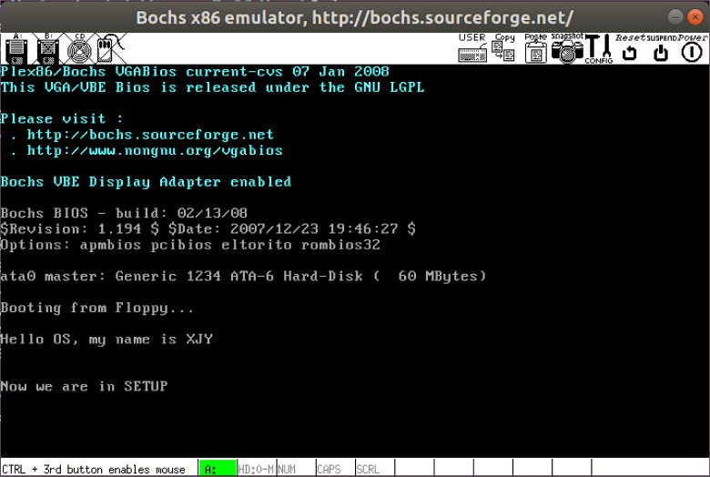

# 实验项目1 控制系统启动

## 实验内容

阅读[参考书籍](../books/) 《操作系统原理、实现与实践》第1章的内容和《Linux 内核完全注释》第6章的内容。

按照要求改写 0.11 的引导程序 bootsect.s 和进入保护模式前设置程序 setup.s。

改写 bootsect.s 主要完成如下功能：

1. 修改目前在屏幕上显示的开机Logo信息，在屏幕上打印："XXX is booting..."，其中"XXX"是给操作系统的名字。

这部分的关键在于修改 bootsect.s 中的 "Loading system..."部分，核心是实践 0x10号 BIOS中断的使用，需要修改显示字符串的内容和相应的参数。

改写 setup.s 主要完成如下功能：

1. bootsect.s 能完成 setup.s 的载入，并跳转到 setup.s 开始地址执行，在开始执行时向屏幕输出一行 "Now we are in SETUP" 信息，表示已经进入了 setup 部分。

要显示 "Now we are in SETUP" 信息，则需要再次调用 0x10号 BIOS中断。

2. setup.s 能获得至少一个基本硬件参数（如内存参数、显卡参数、硬盘参数等），将其存放在内存的特定地址，并输出到屏幕上。

获取硬件参数就是调用相应的 BIOS中断，显示信息时需要谨慎，因为返回的硬件信息是 16进制数，需要转换成相应的 ASCII 码信息才能调用 int 0x10 来输出。

3. "setup.s"不再加载 linux 内核，保持上述信息显示在屏幕上停下即可。

这个修改的关键是修改 Makefile 和 build.c。

## 实验流程

> 注：本实验中所有提到的代码修改和文件，都是 linux-0.11 中的代码/文件。

### 1 改写 bootsect.s 完成屏幕输出功能

1. 原代码的解释说明

原代码中字符串的输出代码在 bootsect中的第 92-102行，字符串位置在第 244-247行。

```C
 92 ! Print some inane message
 93
 94    mov ah,#0x03    ! read cursor pos
 95    xor bh,bh       ! 首先读光标位置，返回位置值在dx中
 96    int 0x10
 97
 98    mov cx,#24      ! 显示的字符数
 99    mov bx,#0x0007  ! page 0, attribute 7 (normal)
100    mov bp,#msg1    ! es：bp 寄存器对指向要显示的字符串
101    mov ax,#0x1301  ! write string, move cursor
102    int 0x10        ! 写字符串并移动光标到串结尾处

244 msg1:
245    .byte 13,10     ! 回车、换行的ASCII码
246    .ascii "Loading system ..."
247    .byte 13,10
248
249 .org 508
250 root_dev:
251    .word ROOT_DEV
252 boot_flag:
253    .word 0xAA55
254
```

说明：显示信息"Loading system ...'回车 换行'"，共显示包括回车和换行控制字符在内的 24个字符。

94-96行：BIOS中断 0x10功能号 ah=0x03，读光标位置。
输入：bh=页号。
返回：ch=扫描开始线；cl=扫描结束线；dh=行号（0x00为顶端）；dl=列号（0x00为最左边）。

98-102行：BIOS中断 0x10功能号 ah=0x13，显示字符串。
输入：al=放置光标的方式及规定属性；0x01 表示使用 bl中的属性值，光标停在字符串的结尾处；es:bp 此寄存器对指向要显示的字符串起始位置处；cx=显示的字符串数；bh=显示页面号；bl=字符属性；dh=行号；dl=列号。

249行开始表示下面的语句从地址 508开始，所以 root_dev在启动扇区的起始地址为 508开始的两个字节处（509-510），boot_flag在启动扇区的起始地址为 510开始的两个字节处（511-512）。

251行：这里存放根文件系统所在的设备号，在 init/main.c中会使用。

252-253行：是启动盘具有有效引导扇区的标志，仅供 BIOS中的程序加载引导扇区时识别使用，它必须位于引导扇区的最后两个字节中。

2. 修改

读入光标的代码不变，即 94-96行代码不变。

假设要输出的字符串为："Hello OS, my name is XJY"。一共 24个字符。加上前面一个回车换行，后面两个回车换行共 6个字符，一共是 30个字符。因此 98行代码要更改相应数值，代码修改为`mov cd,#24`。

第 244-247行的字符串`msg1`也要更改。

将`.org 508`修改为`.org 510`，因为这里不需要`root_dev: .word ROOT_DEV`，为了保证`boot_flag`一定在最后两个字节，所以需要修改`.org`。

在`linux-01../boot`目录下新建一个 bootsect.s 文件（先将原 bootsect.s文件改名保存）。文件内的完整代码如下：

```C
entry _start
_start:
    mov ah,#0x03
    xor bh,bh
    int 0x10

    mov cx,30
    mov bx,#0x0007
    mov bp,#msg1
    
    mov ax,#0x07c0
    mov es,ax
    mov ax,#0x1301
    int 0x10

inf_loop:
    jmp inf_loop

msg1:
    .byte 13,10
    .ascii "Hello OS, my name is XJY"
    .byte 13,10,13,10

.org 510
boot_flag:
    .word 0xAA55
```

`org`：编译器把其后的指令代码放到该指令指定的偏移地址处。

**这种方法是重新编写一个 bootsect.s文件，文件内容只需要满足完成实验内容即可，而不是在原有的 bootsect.s文件内更改（当然也可以）。**

注意到：原代码中是`.org 508`，新代码是`.org 510`因为不管是原先的 bootsect.s文件还是重新编写的文件，经汇编链接之后其大小都要是 512字节，刚好一个扇区的大小。原代码在`org`指令后面还有两个 word类型的变量，一个是`ROOT_DEV`，一个是`0xAA55`。在新编写的代码中不需要`ROOT_DEV`（因为这个实验只需要显示字符串，不需要加载后续的内容），但二者都要`0xAA55`作为启动盘具有有效引导的标志，为了保证`boot_flag`在扇区中的最后两个字节，所以新代码中这个标志的起始地址为 510字节处，这个标志占两个字节，共 512字节，满足要求。

在新代码中需要新增对`es`寄存器的处理，因为原代码在输出之前已经处理了`es`寄存器，但新代码中没有处理（因为新代码本身就只有几行，所以需要处理）。

3. 编译运行

接下来将完成屏幕显示的代码在开发环境中的编译，并将编译后的目标文件做成 Image文件。

进入`~oslab/linux-0.11/boot`目录，执行下面两条命令进行编译和链接，如果这两个命令都没有任何输出，说明编译和链接都通过了。

```bash
as86 -0 -a -o bootsect.o bootsect.s
ld86 -0 -s -o bootsect bootsect.o
```

说明：`-0`参数表示生成 8086的 16位目标程序，`-a`表示生成与 GNU as、ld部分兼容的代码，`-s`告诉链接器 ld86去除最后生成的可执行文件中的符号信息。

之后，查看文件的信息：


注意到文件 bootsect的大小是 544字节，而引导程序必须正好占用一个扇区大小即 512字节。造成多了 32个字节的原因是 ld86产生的 Minix可执行文件格式，这样的可执行文件除了文本段、数据段等部分之外，还包括一个 Minix可执行文件头部，它的结构如下：

```C
struct exec {
    unsigned char a_magic[2];  //执行文件魔数
    unsigned char a_flags;
    unsigned char a_cpu;       //CPU标识号
    unsigned char a_hdrlen;    //头部长度，32字节或48字节
    unsigned char a_unused;
    unsigned short a_version;
    long a_text; long a_data; long a_bss; //代码段长度、数据段长度、堆长度
    long a_entry;    //执行入口地址
    long a_total;    //分配的内存总量
    long a_syms;     //符号表大小
};
```

接下来要去掉这 32字节的文件头部，原代码中`tools/build.c`会去除，但我们自己编写的文件需要手动去除：

```bash
dd bs=1 if=bootsect of=Image skip=32
```

生成的 Image文件就是去掉头部的 bootsect文件，之后将 Image文件拷贝到 linux-0.11目录下（名字一定是 Image），然后就 run即可：

```bash
# 当前的工作路径在 ~oslab/linux-0.11/boot/ 下
# 复制
cp ./Image ../Image
# 运行 oslab目录下的 run脚本
../../run
```


运行结果如下：


### 2 改写 setup.s

1. setup.s 向屏幕显示信息

首先编写一个 setup.s文件（先将原 setup.s文件改名保存），setup.s文件向屏幕中输出 "Now we are in SETUP"。

setup.s 的代码如下：

```C
entry start
start:
    mov ah,#0x03
    xor bh,bh
    int 0x10
    mov cx #25
    mov bx,#0x0007
    mov bp,#msg2
    mov ax,cs
    mov es,ax
    mov ax,#0x1301
    int 0x10
inf_loop:
    jmp inf_loop
msg2:
    .byte 13,10
    .ascii "Now we are in SETUP"
    .byte 13,10,13,10
.org 510
boot_flag:
    .word 0xAA55
```

2. bootsect.s 读入 setup.s

接下来需要在 bootsect.s中编写载入 setup.s的代码（**下面的代码解释了 bootsect一些数值的由来**）：

```C
load_setup:
! 设置驱动器和磁头(drive 0, head 0): 软盘 0 磁头
    mov dx,#0x0000
! 设置扇区号和磁道(sector 2, track 0): 0 磁头、0 磁道、2 扇区
    mov cx,#0x0002
! 设置读入的内存地址：BOOTSEG+address = 512，偏移512字节
    mov bx,#0x0200
! 设置读入的扇区个数(service 2, nr of sectors)，
! SETUPLEN是读入的扇区个数，Linux 0.11 设置的是 4，
! 我们不需要那么多，我们设置为 2（因此还需要添加变量 SETUPLEN=2）
    mov ax,#0x0200+SETUPLEN
! 应用 0x13 号 BIOS 中断读入 2 个 setup.s扇区
    int 0x13
! 读入成功，跳转到 ok_load_setup: ok - continue
    jnc ok_load_setup
! 软驱、软盘有问题才会执行到这里。我们的镜像文件比它们可靠多了
    mov dx,#0x0000
! 否则复位软驱 reset the diskette
    mov ax,#0x0000
    int 0x13
! 重新循环，再次尝试读取
    jmp load_setup
ok_load_setup:
! 接下来要干什么？当然是跳到 setup 执行。
! 要注意：我们没有将 bootsect 移到 0x9000，因此跳转后的段地址应该是 0x7ce0
! 即我们要设置 SETUPSEG=0x07e0
```

bootsect.s 整体代码如下：

```bash
SETUPLEN=2
SETUPSEG=0x07e0
entry _start
_start:
    mov ah,#0x03
    xor bh,bh
    int 0x10
    mov cx,#36
    mov bx,#0x0007
    mov bp,#msg1
    mov ax,#0x07c0
    mov es,ax
    mov ax,#0x1301
    int 0x10
load_setup:
    mov dx,#0x0000
    mov cx,#0x0002
    mov bx,#0x0200
    mov ax,#0x0200+SETUPLEN
    int 0x13
    jnc ok_load_setup
    mov dx,#0x0000
    mov ax,#0x0000
    int 0x13
    jmp load_setup
ok_load_setup:
    jmpi    0,SETUPSEG
msg1:
    .byte   13,10
    .ascii  "Hello OS world, my name is LZJ"
    .byte   13,10,13,10
.org 510
boot_flag:
    .word   0xAA55
```

3. ~~setup.s 至少获得一个硬件参数~~

4. 不再加载 linux内核，保持上述信息显示在屏幕上即可

去掉之前 bootsect.s中的死循环，在 setup.s中加入一个死循环。

现在有两个文件都要编译和链接，所以借助 Makefile文件。修改 Makefile文件，在如下位置加上：

```bash
BootImage: boot/bootsect boot/setup tools/build
    tools/build boot/bootsect boot/setup none $(ROOT_DEV)>Image
    sync
```


在 linux-0.11目录下，执行：

```bash
make BootImage
```

显示：

```bash
Unable to open 'system'
make: *** [BootImage] Error 1
```

这是因为 make根据 Makefile的指引执行了 tools/build.c，它是为生成整个内核的镜像文件设计的，没考虑到我们只要 bootsect.s和 setup.s的情况，它在向我们要操作系统的核心代码。

build.c从命令行参数得到 bootsect、setup和 system内核的文件名，将三者整理后一起写入 Image。其中 system是第三个参数(argv[3])，当 "make all"的时候，这个参数传过来是正确的文件名，build.c会打开它，将内容写入 Image，而 "make BootImage"的时候，传过来的字符串是 "None"，所以修改 build.c的思路是当第三个参数是 "None"的时候，只写 bootsect和setup，忽略与system有关的工作。

修改 build.c的地方在这个文件的尾部，将尾部下列行全部注释：


然后在 `linux-0.11`目录下：

```bash
cd ~oslab/linux-0.11
make BootImage
../run
```


运行结果：


