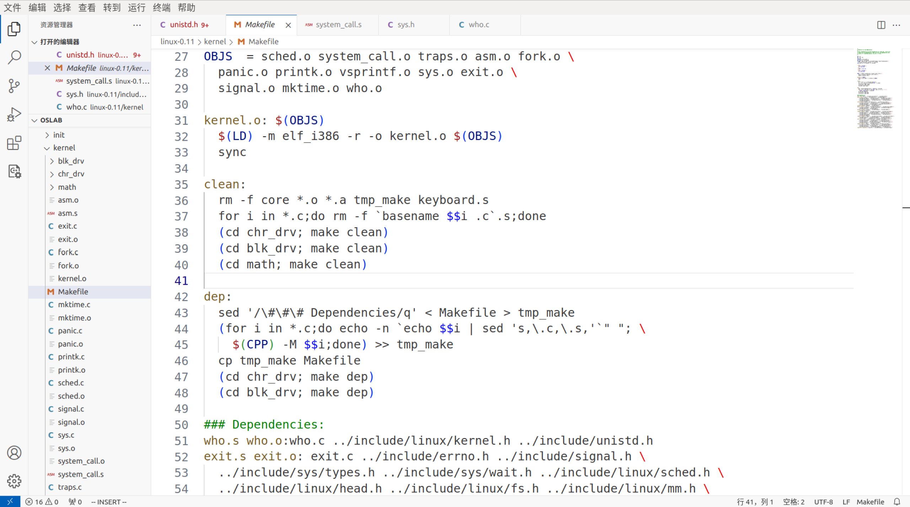
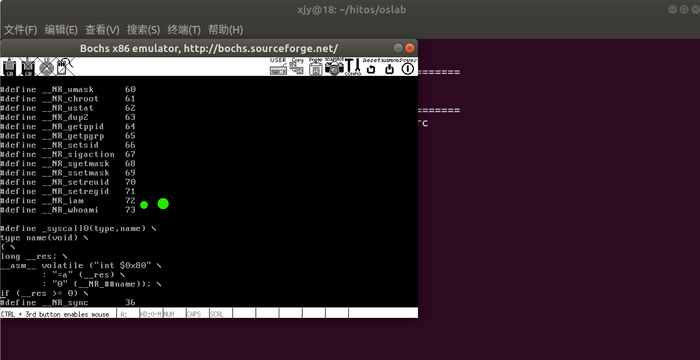
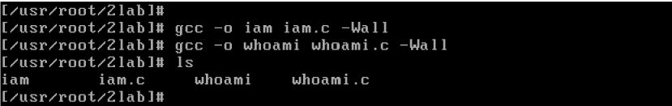
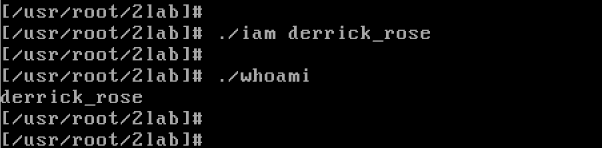

# 添加系统调用

## 实验内容

添加两个系统调用`iam`和`whoami`，并编写简单的应用程序进行测试。

添加系统调用 iam，其函数原型为：`int iam(const char* name);` 完成的功能是将字符串参数 name的内容复制到内核中并保存下来。要求 name的长度不超过 23个字符，返回值是实际复制的字符数。如果 name的字符个数超过了 23则返回 -1，并置 errno为 EINVAL。

添加系统调用 whoami，其函数原型是：`int whoami(char* name,unsigned int size);` 该系统调用将内核中由 iam()保存的名字复制到 name指向的用户空间中，同时确保不会对 name越界访问（name的大小由 size说明）。返回值是复制的字符个数，如果 size小于需要的空间则返回 -1，并置 errno为 EINVAL。

测试程序是编写两个用户态测试程序 iam.c和 whoami.c，其中 iam.c要通过系统调用 iam设置内核中的一个字符串，而 whoami.c则通过系统调用 whoami来取出这个内核字符串，并用 printf在屏幕上输出，最终的运行结果是：

```bash
[usr/root]# ./iam xxx
[usr/root]# ./whoami
xxx
```

系统调用函数首先要展开成一段代码：把系统调用的编号存入寄存器eax中；把函数参数存入其它通用寄存器；再触发 0x80号中断，而这个功能是依靠 C函数库提供的 syscall宏展开的，所以 int iam(const char* name)这个系统调用也需要用这个宏展开成触发 0x80中断的一段代码。

```C
// iam系统调用声明代码和宏展开
#define __NR_iam 72
syscall1(int,iam,const char*,name)
```

宏__NR_iam用来定义系统调用编号，将来要存入eax中（linux0.11本身有 72个系统调用，但从 0开始编号）。上面两句 iam系统调用申明代码可以放在 iam.c文件头部也可以放在 include/unistd.h文件中，不管是哪一种，现在 iam.c中的 main()函数可以调用 iam()了，因为已经有了 iam函数的实现，即 int iam(const char* name){...;int 0x80;...}。

现在 iam()可以变成 "int 0x80" 进入内核了，接下来就是 int 0x80触发后内核中的中断处理了，中断处理过程最终跳转到 system_call函数。system_call的第一句是一个宏定义 nr_system_call=72，表示有多少个系统调用，显然现在这里应该改成73。system_call的核心作用是通过 call sys_call_table(,%eax,4)跳转到函数地址表 sys_call_table中的某个项，这里应该是 eax=73对应的那一项。找到函数表 fn_ptr sys_call_table[]={......}，在这个函数表的第 73项添加内核函数 sys_iam()的地址后，就可以从用户态的 iam()来调用 sys_iam()了。

接下来要在内核中实现函数 sys_iam()，操作系统中有很多这样的实现函数可以学习模仿，如 fs/open.c中的 sys_close(int fd)的代码。创建一个操作系统文件 kernel/who.c，在其中实现内核函数 sys_iam()，核心代码如下：

```C
// sys_iam 核心代码
char kernel_name[23];
int sys_iam(char* name){
    ......
    char c=get_fs_byte(&name);
    kernel_name[0]=c;
    ......
}
```

sys_iam()的工作是：用 get_fs_byte()从 name指向的内存缓存区中获取数据，然后将这些数据按字节逐个存放到内核缓存区 kernel_name中。用 get_fs_byte()来获取数据而不是用 c=*(name+i)获取 name数组中的第 i个数据的原因是：操作系统中的每个地址都由 "段：偏移" 构成，如果只写 name+i，则只给出了偏移，会使用默认的段寄存器DS，而 system_call的代码中 DS=0x10，对应的是内核段，这样在内核中没有 name这个地址。name中存放的 "xxx" 是一段用户态内存缓存区，所以这里只能使用 FS作为段寄存器才能找到这个用户态内存缓存区（FS被设置成 0x17）。

get_fs_byte()用来从用户态内存缓存区中取出一个字节，放到内核缓存区中，其代码实现为：

```C
// get_fs_byte 代码实现
extern inline unsigned char get_fs_byte(const char* addr){
    unsigned register char _v;
    __asm__("movb %%fs:%1,%0":"=r"(_v):"m"(*addr));
    return _v;
}
```

现在在相应位置有了系统调用 iam的声明，sys_call_table[]表里增加了 sys_iam的地址，在 kernel/who.c中实现了 sys_iam()（内核函数、系统调用），接下来需要修改 Makefile，让新添加的操作系统文件可以和其它文件编译链接到一起。然后重新编译操作系统源码，生成一个新的操作系统镜像文件，用这个镜像文件启动 Bochs引导出操作系统，在这个操作系统上编写一个 iam.c用户态程序，在其中加上 #define __NR_iam 72和宏展开 _syscall1(int,iam,const char*,name)（_syscall*宏展开系统调用，提供用户态的系统调用接口），并在 iam.c的 main()函数中调用 iam系统调用，就能实现实验项目的要求了。

系统调用 whoami的实现流程和位置与系统调用 iam相同。从内核缓存区获取数据放到用户缓存区的函数是`put_fs_byte(FROM,TO)`。

## 实验流程

1. 修改 linux-0.11 源文件

>所有文件路径均在 linux-0.11 目录下

在文件 include/unistd.h中的 72个系统调用声明后面添加系统调用 iam和 whoami的声明代码：

```C
// （有72个，但从0开始编号）
#define __NR_iam    72
#define __NR_whoami 73
```

在文件 kernel/system_call.s中，将：

```C
nr_system_calls=72
# 改为
nr_system_calls=74
```

在文件 include/linux/sys.h中，在72个系统调用函数声明后面加入两行：

```C
extern int sys_iam();
extern int sys_whoami();
```

并在函数指针表 sys_call_table[]的末尾加入：`sys_iam` 和 `sys_whoami`（注意顺序和上面的声明要相同）。

新建一个文件 kernel/who.c，在其中实现系统调用 iam和 whoami。即实现内核函数 sys_iam()和 sys_whoami()。

```C

// linux/kernel/who.c
#include <string.h>
#include <errno.h>
#include <asm/segment.h>    // for function get_fs_byte() and put_fs_byte()

// 用全局变量存储
char _k_name[24];   // 23 + '\0' = 24
int _k_length;

int sys_iam(char* name){
    // printk("sys_iam\n"); // 内核中只能用printk（而非printf）
    int name_len=0;
    while(get_fs_byte(&name[i])!='\0'){
        name_len++;
    }
    if(name_len>23){
        // _syscall*中会对出错时的返回值取反，所以这里先取反，否则会得到相反值
        return -EINVAL; 
    }
    int i=0;    // Bochs 不支持在for循环中定义变量
    for(;i<name_len;i++){
        _k_name[i]=get_fs_byte(&name[i]);
    }
    _k_length=name_len;
    return name_len;
}

int sys_whoami(char* name,unsigned int size){
    // printk("sys_whoami\n");
    if(_k_length>size){
        return -EINVAL;
    }
    int i=0;
    for(;i<_k_length;i++){
        put_fs_byte(_k_name[i],&name[i]);
    }
    return _k_length;
}

```

接下来修改 kernel/Makefile：在`OBJS`中添加依赖`who.o`；在`Dependencies`中添加`who.s`和`who.o`的依赖产生条件。



接下来按照之前的方式`make all`，再执行`./run`运行 linux0.11子系统。

2. 在 Bochs内

> 所有修改运行都在运行 linux0.11的 Bochs中进行

在文件`usr/include/unistd.h`中增加`iam`和`whoami`的宏定义：



接下来编写测试文件`iam.c`和`whoami.c`

```C
// 测试文件 iam.c的代码
#define __LIBRARY__     // for _syscall*
#include<unistd.h>      // for 编译器获知自定义的系统调用的编号

_syscall1(int,iam,char*,name);  // 宏展开

int main(int argc,char** argv){
    iam(argv[1]);
    return 0;
}
```

```C
// 测试文件 whoami.c的代码
#define __LIBRARY__     // for _syscall*
#include<unistd.h>      // for 编译器获知自定义的系统调用的编号
#include<stdio.h>人们

_syscall2(int,whoami,char*,name,unsigned int,size); // 宏展开

int main(){
    char s[24];
    whoami(s,24);
    printf("s\n",s);
    return 0;
}
```

在运行 linux0.11的 Bochs中编译`iam.c`和`whoami.c`。

```bash
gcc -o iam iam.c -Wall
gcc -o whoami whoami.c -Wall
```



运行`iam`和`whoami`：



🆗 (\^_^) 🆗
