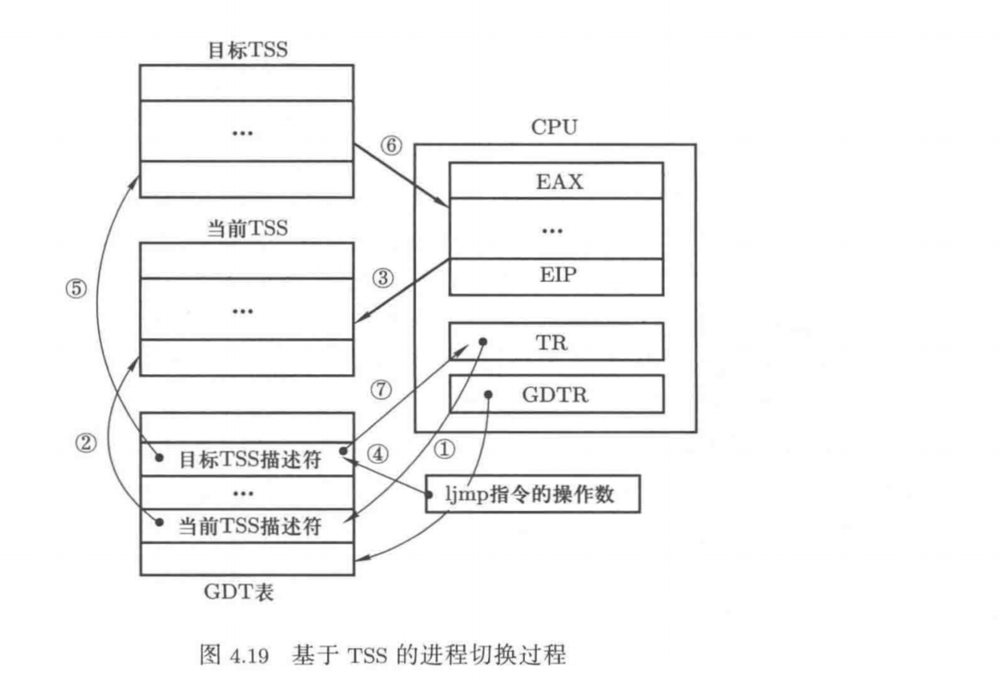
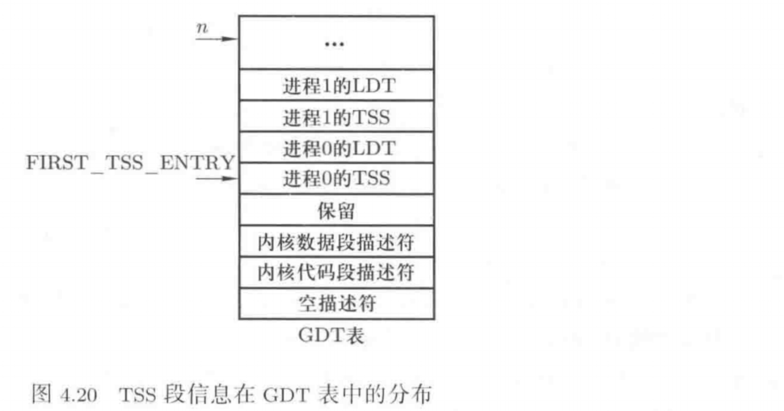
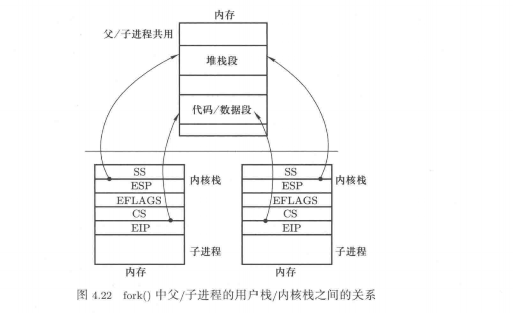

# 基于内核栈完成进程切换

## 实验内容

Linux 0.11中的进程切换是依靠任务状态段（task state segment，TSS）的切换来完成的，本实验项目要修改Linux 0.11实现基于内核栈的进程切换。

在Intel架构（x86体系结构）中，每个任务（进程或线程）都对应一个独立的TSS，TSS是内存中的一个结构体，里面包含了几乎所有的CPU寄存器的映像。其中有一个任务寄存器（task register，TR）指向当前进程对应的TSS结构体。所谓的TSS切换就是将CPU中的寄存器值都复制到TR指向的内存TSS结构体中保存起来，同时找到要切换的下一进程对应的目标TSS，将其中存放的寄存器映像“覆盖在”CPU上，这就完成了执行现场的切换。



Intel架构不仅提供TSS来实现任务切换，而且只要一条指令就能完成这样的切换：`ljmp`指令。ljmp指令的具体工作过程为：1）首先根据TR寄存器在GDT表中找到当前TSS的内存位置，由于TSS是一个段，所以TR寄存器中存放的是和CS、DS类似的段索引信息；2）在找到当前TSS段对应的内存区域以后，将物理CPU中的寄存器值存放到这段内存区域中，即保存当前进程的执行现场；3）保存当前进程的执行现场以后，接下来要找到目标进程的执行现场，即目标TSS段，寻找时也是根据给出的段索引号信息在GDT表中查找；4）找到后根据其中的信息恢复目标进程的执行现场，恢复时将目标TSS段中保存的寄存器值赋值给CPU中的各个物理寄存器；5）恢复目标进程的执行现场后就切换到了目标进程，也需要将TR寄存器修改为目标TSS段在GDT表中的位置。

上述工作是使用一句长跳转指令`ljmp 段选择子: 段内偏移`完成的，在解释执行该指令时，如果发现指令参数对应的段描述符是TSS段时就会执行上述CPU切换工作，所以基于TSS进行进程/线程切换的switch_to()函数实际上就是一句ljmp指令，代码为：

```C
// 基于TSS的进程/线程切换代码
#define switch_to(n){
    struct {long a, b;} tmp;
    __asm__("movw %%dx,%1" "ljmp %0" ::"m"(*&tmp.a), "m"(*&tmp.b), "d"(TSS(n)))
}
#define FIRST_TSS_ENTRY 4
#define TSS(n) ((((unsigned long) n)<<4)+(FIRST_TSS_ENTRY<<3))
```

要知道TSS段的寻址方式，需要知道TSS段信息在GDT表中的分布情况，GDT表如下图所示。每个进程对应一个TSS和一个LDT，共计16个字节，第一个TSS表项即0号进程的TSS段描述符出现在第4个（从0开始）位置上，即0号进程的TSS信息在GDT表中的开始位置是第32字节，所以`TSS(n) = n x 16 + 4 x 8`，得到的是目标进程n的TSS段选择子，将其通过DX寄存器存放在64位的结构体tmp中，因此ljmp指令可以找到进程n的TSS段描述符。



虽然这条指令能完成任务切换，但这条指令在实现任务切换时需要200多个时钟周期，而通过堆栈来实现任务切换需要更少的时钟周期，且采用堆栈的切换还可以使用指令流水等并行优化技术。所以在现在的Linux和Windows中，进程或线程的切换都是通过堆栈实现的，并没有使用Intel提供的TSS切换方式。

本次实验项目的工作是将linux0.11中采用的TSS切换部分去掉，替换成基于堆栈的切换程序。具体来说，就是将linux0.11中的switch_to()实现去掉，改写成一段基于堆栈切换的代码，要实现基于内核栈的任务切换，主要完成三件工作：（1）重写switch_to，（2）将重写的switch_to和schedule()拼接在一起，（3）修改现在的fork()。

首先分析工作（2）将重写的switch_to和schedule()函数拼接在一起。目前Linux0.11中工作的schedule()函数是首先找到下一个进程的TSS在GDT表中的位置next，这个next就是上图中的`n`，一旦获得了这个next值，直接调用上面的`switch_to(next)`宏展开就能完成进程切换了。

现在，我们不用TSS进行切换，而是采用内核栈切换的方式，所以在新的switch_to中要用到当前进程的PCB、目标进程的PCB、当前进程的内核栈、目标进程的内核栈等信息。由于在Linux0.11中PCB用一个称为task_struct的数据结构体来定义（现在二者表达的含义视为相同），二者常常互换使用。Linux0.11进程的内核栈和该进程的task_struct在同一页内存上，即一块4KB大小的内存上，其中PCB位于这页内存的低地址处，内核栈位于这页内存的高地址处。

另外，由于当前进程的task_struct用一个全局变量current指向，所以只需要告诉新的switch_to()函数一个指向目标进程的task_struct的指针即可。同时仍要将next也传递进去，虽然TSS(next)不再需要了，但是LDT(next)仍然是需要的，也就是说，现在每个进程不再有自己的TSS了，因为已经不再采用TSS进程切换了，但是每个进程都需要有自己的LDT，地址分离机制还是必须要有的，进程切换要引起LDT的切换。综上所述，需要将目前的schedule()函数做稍许修改，即将下面的代码修改为：

```C
// 原代码
if((*p)->state == TASK_RUNNING && (*p)->counter > c){
    c=(*p)->counter;
    next=i;
    ......
    switch_to(next);
}
// 修改为
if((*p)->state == TASK_RUNNING && (*p)->counter >c){
    c=(*p)->counter;
    next=i;
    pnext=p;
    ......
    switch_to(pnext,LDT(next));
}
```

现在开始完成工作（1）重写switch_to，由于要对内核栈做精细操作，所以要用汇编语言来编写switch_to。这个新的switch_to依次要完成如果工作：首先要在汇编中处理栈帧，即处理EBP寄存器，这是由于此处是C语言调用了汇编函数；接下来要取参数得到切换目标进程的task_struct，和current做比较，如果等于current，则不需要切换直接退出，如果不等于current就开始进程切换，要依次完成task_struct的切换、TSS中的内核栈指针的重写、内核栈的切换、LDT的切换以及PC指针的切换。

```C
// 基于内核栈的switch_to实现
switch_to:
    pushL %ebp
    movl %esp, %ebp
    pushl %ecx
    pushl %ebx
    pushl %eax
    movl 8(%ebp), %ebx
    cmpl %ebx, current
    je 1f
    切换PCB
    TSS中的内核栈指针的重写
    切换内核栈
    切换LDT
    movl $0x17, %ecx
    mov %cx, %fs
    cmpl %eax,last_task_used_math   // 和后面的clts配合来处理协处理器，和主题关系不大
    jne 1f
    clts
1:
    popl %eax
    popl %ebx
    popl %ecx
    popl %edx
    ret
```

对上述代码进行分析，首先是PCB的切换，用两条指针可以完成task_struct的切换，其中EBX寄存器是从参数中获取的目标进程的task_struct的指针：

```C
movl %ebx, %eax
xchgl %eax, current
```

执行这两条指令以后，EAX寄存器指向未完成切换的当前进程，EBX指向切换的目标进程，全局变量current也指向目标进程。

接下来是TSS中内核栈指针的重写，由于中断处理时需要寻找当前进程的内核栈，否则中断处理过程无法完成，内核栈的寻找是借助当前进程TSS中存放的信息完成的，当前TSS是借助TR寄存器找到的，虽然现在不使用TSS进行进程切换了，但Intel的中断处理机制还要保持，所以每个进程仍然需要有一个TSS，操作系统中需要有一个当前TSS。我们采用的方案是让所有进程都共用一个TSS，这里使用0号进程的TSS，因此需要定义一个全局指针变量tss来指向0号进程的TSS，用这个TSS充当所有进程的TSS，这个TSS的作用只有一个，就是在中断发生时能找到当前进程的内核栈位置。因此任务切换时TSS不再需要变化，TR也不会发生变化，一直指向0号进程的TSS描述符在GDT表中所在的位置。

```C
struct tss_struct *tss = &(init_task.task.tss);
```

TSS中的内核栈指针的重写可用下面三条指令完成，其中宏ESP0=4，定义ESP0=4的原因是TSS中内核栈指针esp0就放在偏移为4的地方，这是TSS结构体的定义。

```C
movl tss, %ecx
addl $4096, %ebx
movl %ebx, esp0(%ecx)
```

再接下来是内核栈的切换，完成内核栈的切换也非常简单，将物理寄存器ESP的值保存到当前task_struct中，再从目标task_struct中取出目标内核栈的栈顶位置放入物理ESP寄存器。这样处理完以后，再使用内核栈时使用的就是目标进程的内核栈了。

由于现在的Linux0.11的task_struct结构体的定义中没有保存内核栈指针的域，为此需要在这个结构体中加上域kernelstack，再用宏KERNEL_STACK给出这个域对应的位置。为了减少部分汇编文件的汇编硬编码的修改，所以域kernelstack放置在位置12处，这里需要的改动很少。

```C
// task_struct 结构体中 kernelstack 域的增加及其处理代码
KERNEL_STACK = 12
movl %esp, KERNEL_STACK(%eax)
movl 8(%ebp), %ebx // 再取一下ebx，因为前面修改过ebx的值
movl KERNEL_STACK(%ebx),%esp
struct task_struct{
    long state;
    long counter;
    long priority;
    long kernelstack;
    ......
}
```

这里改变了task_struct结构体的定义，所以0号进程的task_struct初始化时也要跟着一起改变，在task_struct的第四项中增加了关于内核栈栈指针的初始化操作，即需要将原来的

```C
#define INIT_TASK{0,15,15,0,{{},},0,...}
```

修改为

```C
#define INIT_TASK{0,15,15,PAGE_SIZE+(long)&init_task,0,{{},},0,...}
```

接下来还有LDT的切换，指令`movl 12(%ebp),%ecx`负责取出参数"LDT(next)"，指令`lldt %cx`可以完成LDTR寄存器的修改，一旦修改了LDTR，目标进程执行起来时用户程序使用的映射表就是自己的LDT表，实现了地址空间的分离。

最后一个切换是PC的切换，和用户级线程中给出的论述一致，依靠的就是switch_to的最后一个指令`ret`，这一条指令背后发生的事情有：1）由于是在schedule()函数的最后调用了switch_to函数，所以"ret"执行后会跳到目标进程schedule()函数的末尾去执行，接下来会遇到schedule()函数中的 "}"，2）这个 "}"会继续产生一个"ret"，从而回到调用schedule()的地方，由于是中断处理过程中调用了schedule()函数，所以现在又会回到中断处理程序中，具体是中断返回那一部分程序，3）中断返回的核心是"iret"指令，执行"iret"就会到目标进程的用户态程序去执行，和之前论述的内核级线程的切换的五个阶段完全一致。

此外，switch_to代码中在完成LDT的切换后要重置FS寄存器，即：

```C
切换LDT
movl $0x17, %ecx
mov %cx, %fs
```

这两句代码的含义是重新设置段寄存器FS的值为0x17，这两句代码必须出现在切换完LDT之后。FS的作用是：操作系统通过FS访问进程的用户态内存。LDT切换完成意味着切换到了新的用户态内存地址空间，所以重置FS。

现在讨论第三项工作修改fork()，和前面论述的原理一致，现在需要将新建进程的用户栈、用户程序地址和其内核栈关联在一起，因为使用TSS切换时没有做这样的关联。fork()要求让父子进程共享用户代码、用户数据和用户堆栈，现在虽然是使用内核栈完成任务切换，但fork()的基本含义不应该发生变化，修改以后的fork()其核心工作是要形成下图所示的子进程内核栈结构。



对fork()修改的核心是对子进程内核栈的初始化，在fork()的核心实现copy_process中，代码`p=(struct task_struct*) get_free_page();`用来完成申请一页内存作为子进程的task_struct，而p指针加上一个页面的大小就是子进程的内核栈的位置，所以语句`krnstack=(long*)(PAGE_SIZE+(long)p);`就可以找到子进程的内核栈的位置，接下来就是初始化krnstack中的内容了。

```C
// 进程新建是内核栈的设置
*(-krnstack) = ss & 0xffff;
*(-krnstack) = esp;
*(-krnstack) = eflags;
*(-krnstack) = cs & 0xffff;
*(-krnstack) = eip;
```

这五条语句就构建完成了上图所示的重要关联，因为其中ss、esp等内容是copy_process()函数的参数，这些参数来自调用copy_process()的进程的内核栈，也就是父进程的内核栈。所以上述设置就是将父进程内核栈中的前五项内容复制到子进程内核栈中的前五项，正好完成上图所示的关联复制。

接下来的工作需要和switch_to连在一起考虑，应该从switch_to代码中完成“切换内核栈”的时刻开始，现在切到子进程的内核栈开始执行，switch_to接下来要做的四次弹栈以及ret都要使用子进程内核栈。

```C
// switch_to 完成内核栈切换后开始执行的代码
1:  popl %eax
    popl %ebx
    popl %ecx
    popl %ebp
    ret
```

因此为了能够顺利完成这些弹栈工作，子进程的内核栈中应该初始化相应内容：

```C
*(-krnstack) = ebp;
*(-krnstack) = ecx;
*(-krnstack) = ebx;
*(-krnstack) = 0;
```

现在到ret指令了，这条指令要从内核栈中弹出一个32位数作为EIP跳转去执行，显然要对应一段程序，根据内核级线程切换的五个阶段，内核栈已经切换完成，现在该中断返回了。

因此就是那个`first_return_fron_kernel`汇编程序，语句`*(-krnstack) = (long)first_return_from_kernel`可以将这个地址初始化到子进程的内核栈中，现在执行ret以后就会跳转到汇编程序first_return_from_kernel去执行了。

first_return_from_kernel要完成的工作应该是内核级线程切换的五个阶段中的最后一个阶段的切换，即完成用户栈和用户代码的切换，这个切换主要依靠"iret"完成，在切换到用户态程序之前还应该恢复用户态程序的执行现场，主要就是EAX、EBX、ES、DS等寄存器的恢复。下面给出了first_return_from_kernel的核心代码，当然EDX等寄存器的值也应该先初始化到子进程内核栈，即krnstack中。

```C
// first_return_from_kernel
first_return_to_kernel:
    popl %edx
    popl %edi
    popl %esi
    pop %gs
    pop %fs
    pop %es
    pop %ds
    iret
```

最后，还需要将存放在task_struct中的内核栈地址修改为初始化完成时的内核栈的栈顶位置，即

```C
p->kernelstack = krnstack;
```

## 实验流程
