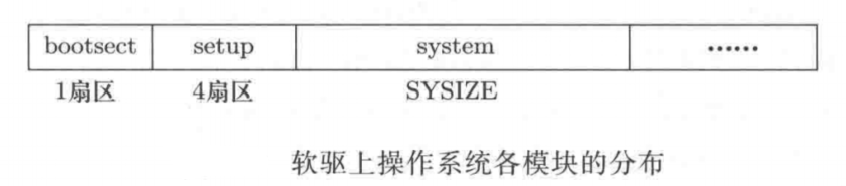

## 系统启动

### 1.1 操作系统镜像的生成

操作系统的源码文件编译链接之后形成一个二进制文件，也即操作系统镜像（mirror）文件。Makefile 文件控制源码文件生成满足特定格式的镜像文件，包括顺序、大小等。

启动磁盘上的模块分布如图：

bootsect 由 bootsect.s 汇编生成，setup 由 setup.s 汇编生成，system 由进程模块、内存模块、设备驱动、初始化模块等部分组成。Makefile 文件中的节点 Image 依赖于 boot/bootsect，boot/setup，tools/system，tools/build。build 程序会依次读入文件 bootsect、setup、system，并保证它们的大小依次为 1个扇区、4个扇区、SYSSIZE 字节长度，最后将读入的全部内容拼接成上图所示的形式写入到文件 Image 中。

产生了操作系统镜像文件后，把这个镜像文件写入到软盘上就可以启动操作系统了。

### 1.2 操作系统启动过程

#### 1.2.1 第一阶段

计算机加电以后，硬件电路会初始化设置 PC 寄存器的值，对 IBM PC 而言，电路设置为将 PC 寄存器的值设置为 0xFFFF0，物理实现是设置 CS 和 IP 两个寄存器的值：CS=0xFFFF，IP=0x0000。未加电时，RAM（random access memory）不会存放任何内容，硬件厂商在 ROM（read-only memory）中开辟一块空间，PC 的 0xFFFF0 指向这个区域，这段 ROM 被称为 BIOS。

CPU 从这段 ROM 中取出指令执行，完成硬件测试，测试正常，就利用 BIOS 的输入功能将启动磁盘上的启动扇区中的内容（bootsect 文件，大小为 1 个扇区，512 个字节）读入到内存的 0x7C00 地址处（此时地址 0x7C00 处往后的 512B 的内容为 bootsect）。

程序 bootsect 将内存中开始地址为 0x7C00（31KB）的 256 个字（512 个字节，刚好一个扇区的大小）移动到开始地址为 0x90000（576KB）处。然后调用 BIOS 的 0x13 号中断，将启动扇区后面的 4 个扇区读入到 0x90200（576.5KB，刚好在 bootsect 后面）处，这 4 个扇区内存放的内容是 setup。

程序 bootsect 的代码接着在显示器上输出信息。接着从磁盘上的第六个扇区开始读取操作系统的主体部分：system，放置在起始地址为 0x10000（64KB）处。system 的长度不会超过 512KB，因此不会影响 0x90000 地址处的内容。

完成这些内容后执行指令`jmpi 0, SETUPSEG`，这条指令会设置 CS=0x9020，IP=0x0000，因此 PC=0x90200，即 setup 起始地址处，准备开始执行 setup 的第一条指令。

#### 1.2.2 第二阶段

首先 setup 要获得一些硬件参数，如扩展内存大小、磁盘信息等，方法还是（只能）使用 BIOS 中断，并将得到的结果放置在地址 0x90000 处，将来系统初始化时可以读取这些值（因为 bootsect 的代码已执行完毕，所有这段内存可以被覆盖掉转而存放其它内容）。

到目前为止，系统还是运行在 16 位实模式下，setup 的下一项核心工作是启动保护模式，让程序代码可以寻址到 32 位地址空间。将 A20 号地址线选通，并将寄存器 CR0 最后一位置为 1，内存寻址方式会采用另外一套电路--保护模式电路。

["实模式和保护模式内存寻址方式的不同之处"](../notes2/1.内存寻址.md)

保护模式启动后，取出来的第一条指令是`jmpi 0, 8`，指令的执行结果是设置 CS=8，EIP=0。

