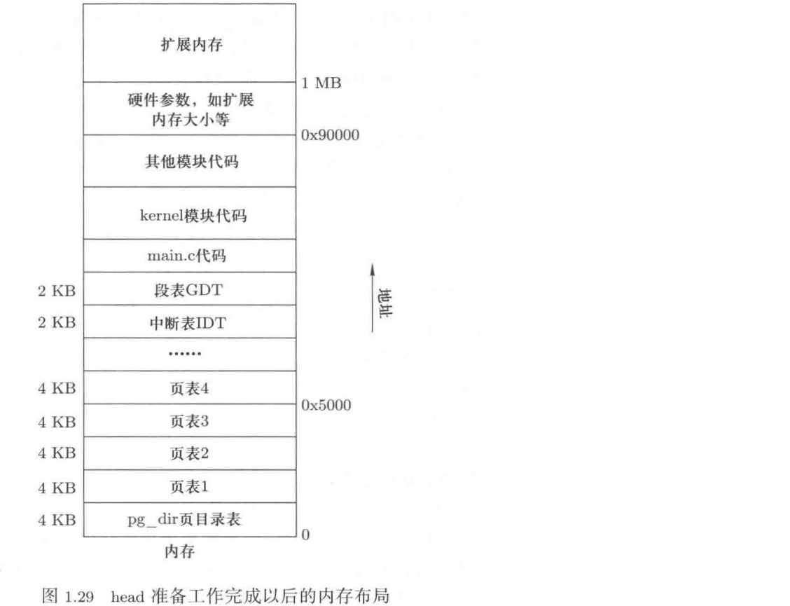

## 系统启动

### 1.1 操作系统镜像的生成

操作系统的源码文件编译链接之后形成一个二进制文件，也即操作系统镜像（mirror）文件。Makefile 文件控制源码文件生成满足特定格式的镜像文件，包括顺序、大小等。

启动磁盘上的模块分布如图：


bootsect 由 bootsect.s 汇编生成，setup 由 setup.s 汇编生成，system 由进程模块、内存模块、设备驱动、初始化模块等部分组成。Makefile 文件中的节点 Image 依赖于 boot/bootsect，boot/setup，tools/system，tools/build。build 程序会依次读入文件 bootsect、setup、system，并保证它们的大小依次为 1个扇区、4个扇区、SYSSIZE 字节长度，最后将读入的全部内容拼接成上图所示的形式写入到文件 Image 中。

产生了操作系统镜像文件后，把这个镜像文件写入到软盘上就可以启动操作系统了。

### 1.2 操作系统启动过程

#### 1.2.1 第一阶段

计算机加电以后，硬件电路会初始化设置 PC 寄存器的值，对 IBM PC 而言，电路设置为将 PC 寄存器的值设置为 0xFFFF0，物理实现是设置 CS 和 IP 两个寄存器的值：CS=0xFFFF，IP=0x0000。未加电时，RAM（random access memory）不会存放任何内容，硬件厂商在 ROM（read-only memory）中开辟一块空间，PC 的 0xFFFF0 指向这个区域，这段 ROM 被称为 BIOS。

CPU 从这段 ROM 中取出指令执行，完成硬件测试，测试正常，就利用 BIOS 的输入功能将启动磁盘上的启动扇区中的内容（bootsect 文件，大小为 1 个扇区，512 个字节）读入到内存的 0x7C00 地址处（此时地址 0x7C00 处往后的 512B 的内容为 bootsect）。

程序 bootsect 将内存中开始地址为 0x7C00（31KB）的 256 个字（512 个字节，刚好一个扇区的大小）移动到开始地址为 0x90000（576KB）处。然后调用 BIOS 的 0x13 号中断，将启动扇区后面的 4 个扇区读入到 0x90200（576.5KB，刚好在 bootsect 后面）处，这 4 个扇区内存放的内容是 setup。

程序 bootsect 的代码接着在显示器上输出信息。接着从磁盘上的第六个扇区开始读取操作系统的主体部分：system，放置在起始地址为 0x10000（64KB）处。system 的长度不会超过 512KB，因此不会影响 0x90000 地址处的内容。

完成这些内容后执行指令`jmpi 0, SETUPSEG`，这条指令会设置 CS=0x9020，IP=0x0000，因此 PC=0x90200，即 setup 起始地址处，准备开始执行 setup 的第一条指令。

#### 1.2.2 第二阶段

首先 setup 要获得一些硬件参数，如扩展内存大小、磁盘信息等，方法还是（只能）使用 BIOS 中断，并将得到的结果放置在地址 0x90000 处，将来系统初始化时可以读取这些值（因为 bootsect 的代码已执行完毕，所有这段内存可以被覆盖掉转而存放其它内容）。

bootsect 引导程序将 system模块读入到 0x10000(64KB)开始的位置，并且长度不会超过0x800000(512KB)，即末端不会超过内存地址0x9000。setup 会把整个 system模块移动到 0x0地址处，即将内存地址 0x100000 ~ 0x900000之间的全部内容移动到地址 0x00000 ~ 0x800000 处。

此后将会遇到 32位保护模式的操作，在进入保护模式中运行之前，首先需要设置段描述符表，这里需要设置全局描述符表和中断描述符表(IDT)。

到目前为止，系统还是运行在 16 位实模式下，setup 的下一项核心工作是启动保护模式，让程序代码可以寻址到 32 位地址空间。将 A20 号地址线选通，并将寄存器 CR0 最后一位置为 1，内存寻址方式会采用另外一套电路--保护模式电路。（显然，还有许多其它有关硬件的设置）

["保护模式内存管理"](../notes2/11.保护模式内存管理.md)

保护模式启动后，取出来的第一条指令是`jmpi 0, 8`，指令的执行结果是设置 CS=8，EIP=0。此时寻址方式显然不再是16位实模式下的先左移4位再加偏移了。32位保护模式下寻址方式是：用段寄存器的值作为索引在全局描述符表(GDT)中找到对应的表项，从中得到32位的基址，再和偏移寄存器中的值相加，形成最终的地址放到地址总线上去选定内存（未考虑开启分页机制）。

为了能够执行指令`jmpi 0, 8`，setup 需要临时建立一个GDT表，构建及其初始化过程很简单，只要按照 GDT表的格式手动初始化一段内存内容即可。setup 在其代码中初始化了具有三个表项的 GDT表，其中表项0 没有使用，表项1 用来表示操作系统内核 代码段，表项2 表示操作系统内核数据段。

`jmpi 0, 8`：jmp offset 0 of segment 8(cs)。段选择符8 表示GDT中的 第2个（从 1 开始数）段描述符项，即内核代码段，偏移量是 0。所以这条指令跳转到了system 中的 head 程序开始处继续执行下去。

setup 程序执行完毕后，当前内存映像如图：


此时临时全局描述符表中有三个描述符，第一个是 NULL 不使用，另外两个分别是代码段描述符和数据段描述符，它们都指向系统模块的起始处，也即物理地址 0x0000处。

### 1.2.3 第三阶段

现在进入操作系统启动的第三阶段，这是进入32位保护模式以后执行的第一段代码（程序）：head。bootsect将操作系统读入了内存，setup读取了一些硬件参数并且启动了保护模式，现在可以对操作系统管理资源的关键数据结构进行初始化了。但在初始化之前准备工作还没有做完：1）设置中断表，因为从现在开始操作系统不再使用BIOS中断，实际上将system从0x10000移动到0x0地址处，BIOS中断就没法使用了，因为BIOS中断向量表放在0地址处；2）设置GDT表，在setup中建立的GDT表是为了执行`jmpi 0, 8`临时建立的，进入system模块后需要重新建立；3）设置页表，进入32位保护模式后，寻址方式更加复杂，即 GDT[CS]+EIP 得到的地址仍然不能直接输出到地址总线上，通常还要用这个地址再去查一次页表才能得到真正的物理地址。

在 head 中设置 IDT表和 GDT表的方法是设计两个包含连续 8B 的内存数组，每个数组项占 8B，分别作为中断描述符表(interrupt descriptor table，IDT)和 GDT表。再用 lidt和lgdt 指令将表的起始地址和长度限制放到关键的寄存器IDTR/GDTR中。目前IDT表项全部初始化为0，即现在所有的中断都不可用，要等到后面给各个模块初始化时，会设置相应的中断处理程序入口地址到各个表项中，所以idt要被设置为“全局变量”。GDT表的初始化和setup 阶段一样，只是表的位置发生了变化，同时GDT表变长，要为后面的局部描述符表(local descriptor table，LDT)预留空间。

现在 head 可以开始设置页表工作了。段页式机制在内存管理中介绍。假设现在页表已经建立，并且就存放在从内存 0地址开始处的 5个长度为 0x1000(4KB)的内存中。head 代码建立这个页表的核心工作主要包括填写那 5个长度为 4KB的页表、设置页表寄存器 CR3以及启动页表电路这三部分。CR3 就指向页表的初始地址，就是 0x0地址。启动分页机制是将 CR0寄存器的第一位设置为1。



实际上，操作系统启动涉及的所有工作都是为了形成上面那张内存图，操作系统的准备工作完成了，之后，操作系统可以开始初始化了，操作系统的初始化是要初始化一些数据结构，如数组、链表等。

head 的最后一段代码负责跳转到操作系统的初始化代码处，这个从汇编语言到C语言的跳转实际上就是函数跳转，由于栈是函数跳转的基础，所以在跳转之前首先要设置栈，`lss stack_start, %esp`命令用来设置栈。
这条指令将一个6字节内存中的前4个字节赋给ESP寄存器，后两个字节赋给SS寄存器，这6个字节内存在 kernel模块中的一个C语言文件定义为：`long user_stack[1024]; struct long* a;short b; stack_start=&user_stack[1024],0x10;`。
因此lss命令就是将SS寄存器设置为0x10，ESP寄存器设置为user_stack地址加上1024。根据保护模式寻址方式，SS=0x10表示查GDT表中的第三项，再综合 "user_stack+1024" 就是将栈地址(SS:ESP)设置在user_stack[1024]这段内存的最高处，现在栈地址可以从高地址到低地址工作了。

### 1.2.4 第四阶段

前三个阶段的工作完成后，操作系统终于可以初始化并开始运转了，C语言函数main()的主要功能就是初始化各种管理软硬件资源的数据结构，可以调用各种初始化函数来完成相应的工作。

mem_init()用来初始化内存，它的两个参数表示要管理的起始内存地址和结束内存地址，此处的起始地址为 4MB，因为 0-1MB分配给了系统内核system，1-4MB将分配给磁盘高速缓存，4MB之后的内存才是用户应用程序可用的。结束地址由0x90000处取出的内容决定，管理时还要取整为 4KB的整数倍，因为操作系统要按照页来管理内存。

......

在关键性的各种数据结构初始化好以后，操作系统终于可以开始运转了。main()函数中的最后四条语句让操作系统开始运转：

```shell
void amin(void){
    ......
    sti();
    move_to_user_mode();
    if(!fork()){init();}
    for(;;){pause();}
}
```

到这里，操作系统终于启动了，main()函数代码中的 init()会启动一个shell。


