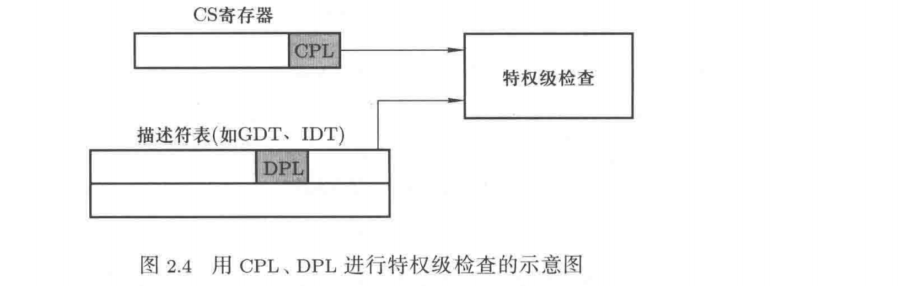
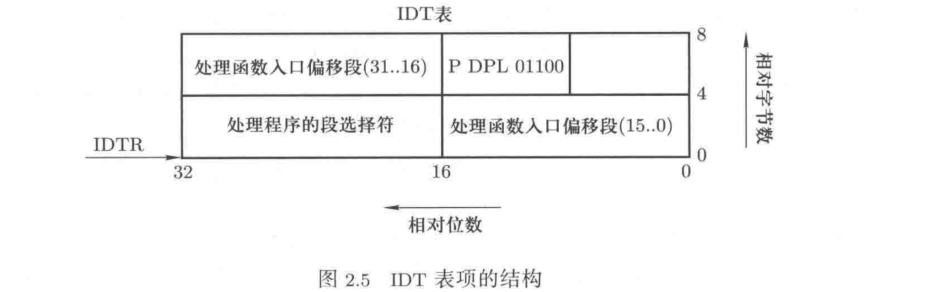
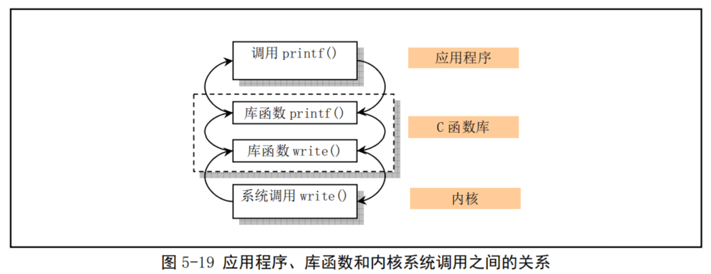

## 系统接口——通向操作系统内核的大门

### 1 系统接口和系统调用

系统接口时用户使用操作系统的基本入口，也是通向操作系统内核的窗口，很多关于内核模块的理解都要通过这扇大门走进去。

接口函数（如 fork()、open()）是应用程序在使用计算机时要调用的函数，由于这些函数是系统提供的，又以函数调用的形式出现，所以这些函数对应一个非常重要的概念--系统调用(system call)。

### 2 基本系统调用及其应用

#### 2.1 fork、exec、wait、exit

1. fork

系统调用fork() 用来创建进程，其函数原型定义为：`int fork();`，这个函数没有参数，调用该函数的进程会再创建一个进程，新创建的进程是原进程的子进程。两个进程都从 fork()这个地方继续往下执行，并且执行“同样”的代码。但是父进程执行 fork()会返回子进程的ID，而子进程调用 fork()会返回0，父子进程是通过对这个返回值的判断（用 if语句）来决定分别执行哪段代码。

2. exec

系统调用exec() 的功能是在当前进程中执行一段新程序，进程的PID 保持不变。可以理解为：一个进程就像一个壳子，在这个壳子里可以装各种可执行代码。fork()创建了这个壳子，并且将父进程的代码装在这个壳子中执行，而 exec()是用从磁盘上载入的可执行程序（exec()的参数告诉操作系统是哪个可执行程序）替换了这个壳子里原有的内容。exec()函数分为两类：execl和execv。

```C
void execl(const char* filepath,const char* arg1,char* arg2,...);
void execlp(const char* filename,const char* arg1,char* arg2,...);
void execv(const char* filepath,char* argv[]);
void execvp(const char* filename,char* argv[]);
```

execl中对应的可执行程序入口函数的参数是一个一个列举出来的，而 execv是将这些参数组织成一个数组告诉操作系统。可执行程序入口函数的参数就是可执行程序的`main(int argc,char* argv[])`函数中的参数argv，这些参数都是通过命令行输入的，如`ls -l`中的`-l`。由此可见，命令行中的参数实际上是用系统调用 execl/execv函数中的参数传进去的。

3. exit 和 wait

系统调用exit() 用来终止一个进程，在进程中可以显式调用exit 来终止自己，也可以隐式调用exit。exit函数的原型定义为：`void exit(int status);`。参数`status`是退出进程返回给父进程的退出码。同时退出的进程会向其父进程发送一个`SIGCHILD`信号，一个进程执行 wait系统调用时就会暂停自己的执行来等待这个信号。所以用 wait和 exit合在一起可以完成这样一种进程间的同步合作：父进程启动一个子进程，调用 wait等待子进程执行完毕；子进程执行完毕以后调用 exit给父进程发送一个信号SIGCHILD，父进程被唤醒继续执行。

调用wait的进程会等到子进程退出时才继续执行，其函数原型定义为：`int wait(int* stat_addr)`。其返回值是exit子进程的PID，stat_addr是进程中定义的一个变量，用来存放子进程调用exit时的退出码，即exit系统调用的参数status。

#### 2.2 open、read、write

open、read、write是典型的操纵文件的系统调用，它们的函数原型定义为：

```C
int open(char* filename,int mode);
int read(int fd,char* buf,int count);
int write(int fd,char* buf,int count);
```

open系统调用用来打开文件，参数filename 是要打开的文件名，参数mode 是打开方式，返回值fd 是打开文件后产生的句柄，以后就用这个句柄来操作打开的文件。
read系统调用用来将句柄fd 对应的文件读入到内存缓存区buf中，并且要读入 count个字节，而真正读入的字节数会由read返回。
write系统调用用来向句柄fd 对应的文件写内容，即从内存缓存区buf中取出count个字节写出到文件中，当然真正写出的字节数由write返回。

### 3 系统调用的实现机理

#### 3.1 内核态和用户态

系统调用除了要给上层用户提供“统一接口”来方便使用以外，还有一个作用是作为操作系统的“门”，上层应用只能通过这个大门才能进入操作系统。“门里”和“门外”的概念在操作系统中就是内核态和用户态的概念。内核态是操作系统代码执行时的状态，用户态是应用程序代码执行时的状态。

无论是操作系统内核代码还是应用程序代码都是装入内存后执行的，因此内核态代码和用户态代码在内存中放置的区域不同。建立系统调用这扇门的意图是让执行在用户态区域的代码不能进入到内核态区域。

很多指令在执行时要进行特权级检查，例如要进行跨段跳转的jmp指令，就会取出两个重要的数值：当前特权级（current privilege level，CPL，表示当前执行指令的特权级）和描述符特权级（descriptor privilege level，DPL，表示一个目标段的特权级）。CPL放置在CS寄存器中，DPL存放在段描述符中。



#### 3.2 系统调用和`int 0x80`

在操作系统初始化 GDT时，会将系统内核所处内存区域的 DPL设置为0，而对在用户态执行的指令，操作系统会让其 CPL=3。但是操作系统给上层应用留了一个进入操作系统的入口：中断。操作系统给上层应用提供了 0x80号中断，应用程序通过`int 0x80`指令进入对应的中断处理程序，并在 eax寄存器中指定系统调用的功能号，处理系统调用中断`int 0x80`的过程是程序 kernel/system_call.s中的 system_call。

操作系统利用这个中断处理程序来实施各种检查，让上层应用只能按照系统规定的格式来使用系统，不过通常应用程序都是使用具有标准接口定义的 C函数库中的函数间接的使用内核的系统调用。在linux内核中，系统调用的功能号定义在文件 include/unistd.h中，实际上对应于 include/linux/sys.h中定义的系统调用处理程序指针数组表sys_call_table[]中项的索引值。

在 kernel/system_call.s中的 system_call中有语句`call sys_call_table(,%eax,4)`，会根据 eax寄存器提供的系统调用号间接调用指定功能的 C函数。

32位机器的中断工作过程是：执行完每条指令都要查看 INTR寄存器，如果发现其中某一位被设为1，就根据 1所在的位去查 IDT表中对应的表项。`int 0x80`指令就是将 INTR中的 0x80位设为1，执行完后，CPU查看 INTR寄存器以后就去找 IDT表中对应 0x80那个表项。



在系统初始化的 sched_init()函数中（在 kernel/sched.c）设置了 0x80对应的 IDT表项：
`void sched_init(void){set_system_gate(0x80,&system_call);}`
其中 set_system_gate是一个完成 IDT表设置的宏（在 include/asm/system.h），定义为：
`#define set_system_gate(n,addr) set_gate(&idt[n],15,3,addr);`
其中 idt是 head.s中初始化定义的那个中断向量表的首地址，而且是一个全局变量。set_gata(&idt[n],15,3,addr)会往 IDT表项 idt[n]中填写内容，即将 system_call函数地址写到 0x80对应的中断描述符中，在中断 0x80发生后，自动调用函数 system_call。

#### 3.3 printf的完整故事

语句 printf("Hello World")背后到底发生了什么。

第一阶段的工作是由库函数完成的，通过库函数对格式化输出中的格式进行处理，然后再调用系统调用write真正使用屏幕进行输出。C函数库会将 printf("Hello World")变成代码：
```C
// printf在函数库中展开后的代码
char buf[20];
将字符串"Hello world"填入 buf中
write(1,buf,11);    // 11是字符串的长度
```

第二阶段的故事是系统调用，write要展开成一段包含 int 0x80的代码，用宏展开来完成。这个宏定义为：
```C
// 系统调用宏定义代码
#define _syscall3(type,name,atype,a,btype,b,ctype,c)
type name(atype a,btype b,ctype c){
    long __res;
    __asm__("int 0x80"
        :"=a"(__res):""(__NR_##name),"b"((long)(a)),"c"((long)(b)),"d"((long)(c)));
    if(__res>=0)return(type)__res;
    errno=-__res;
    return -1;
}
```
有了这样的宏，就可以在实现 printf()的C函数库中增加一句宏展开：`_syscall3(int,write,int,fd,char*,buf,int,count)`来实现 write()函数，现在 printf就变成一段核心为`int 0x80`指令的程序了。宏展开系统调用在用户空间的接口函数。

第三阶段的故事就是解释执行"int 0x80"，通过查找 IDT表中和 0x80对应的表项，跳到 system_call函数去执行（在 kernel/system_call.s中），代码如下：

```C
nr_system_calls = 72    # 系统调用总数
.globl system_call

system_call:
# 检查调用号范围
    cmpl $nr_system_calls-1,%eax    # 调用号如果超出范围的话就在eax中置-1并退出
    ja bad_sys_call
    push %ds                        # 保存原段寄存器值
    push %es
    push %fs

# 一个系统调用最多可带有3个参数，也可以不带参数。下面入栈的ebx、ecx和edx中放着系统
# 调用相应C语言函数的调用函数。这几个寄存器入栈的顺序是由GNU GCC规定的，
# ebx 中可存放第1个参数，ecx中存放第2个参数，edx中存放第3个参数。
# 系统调用语句可参见头文件include/unistd.h中的系统调用宏。
    pushl %edx
    pushl %ecx      # push %ebx,%ecx,%edx as parameters
    pushl %ebx      # to the system call

# 让ds，es指向 GDT，内核地址空间
    movl $0x10,%edx # set up ds,es to kernel space
    mov %dx,%ds
    mov %dx,%es
# fs指向局部数据段(局部描述符表中数据段描述符)，即指向执行本次系统调用的用户程序的数据段。
# 注意,在 Linux 0.11中内核给任务分配的代码和数据内存段是重叠的，他们的段基址和段限长相同。
    movl $0x17,%edx     # fs points to local data space
    mov %dx,%fs

# 下面这句操作数的含义是：调用地址=[_sys_call_table + %eax * 4]
# sys_call_table[]是一个指针数组，定义在include/linux/sys.h中，该指针数组中设置了所有72
# 个系统调用C处理函数地址。
    call sys_call_table(,%eax,4)        # 间接调用指定功能C函数

# 原代码后续
    pushl %eax
    movl current,%eax
    cmpl $0,state(%eax)
    jne reschedule
    cmpl $0,counter(%eax)
    je reschedule

# 原代码中没有，辅助理解函数调用结束的处理
#   pop %ds
#   pop %es
#   pop %fs
#   iret
、、、、

```
system_call主要完成五件事：
1）将三个段寄存器 DS、ES、FS保存在栈中，因为这三个段寄存器目前指向的仍然是用户态程序使用的数据段等。现在到了内核，需要重新设置这三个段寄存器，将 DS、ES设为 0x10.对应内核数据段，因为接下来要在内核中执行了。
2）第二步工作是调用 sys_call_table[]中的某个函数。`call sys_call_table(,%eax,4)`的解释是`call sys_call_table+4X%eax`，sys_call_table是某一个函数表的起始地址，4X%eax说明要跳过 %eax个项，每个项是 4个字节，对应表中某个函数的入口地址。所以就是跳转到 sys_call_table中的第 %eax个函数执行，sys_call_table这个函数表定义为（在 include/linux/sys.h中）：
```C
typedef int(fn_ptr*)();
fn_ptr sys_call_table[]={sys_setup,sys_exit,sys_fork,sys_read,sys_write,......}
```
3）现在可以跳到 sys_write中执行了，但有些重要的参数需要告诉这个内核函数，这些信息被存放在 %ebx,%ecx,%edx中，展开 write的内嵌汇编中的 "b"((long)(fd)),"c"((long)(buf)),"d"(long(count))会将这些信息放到这三个寄存器中，而现在又将这些寄存器的值压入栈里，这样在进入 sys_write函数时，压到栈里的内容自然就被解释称为函数 sys_write的参数。
4）设置了 %fs=0x17，这样做的目的是要在操作系统内核中访问用户态内存。此处 fs=0x17，段选择符最后三位的进制数是 111，说明段的特权级是 3（用户态），TI=1说明这个选择符要查找的段描述符放在 LDT表中。（GDT表描述的是操作系统内核的代码段、数据段内存区域，而LDT表描述的是用户态应用程序的代码段、数据段内存区域）因此利用 FS段寄存器可以在操作系统内核中找到当前进程（即调用系统调用的那个进程）的用户态内存，这样可以实现用户态内存和内核态内存的信息交换。
5）在调用 sys_write完成 write系统调用的功能以后，用 iret指令退回到用户态继续执行。


