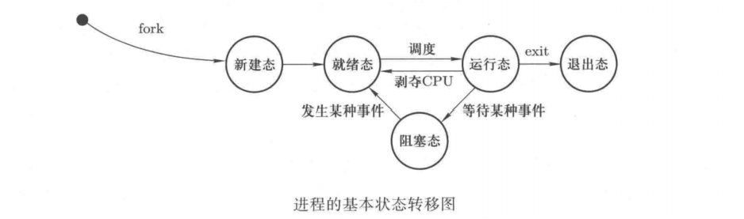
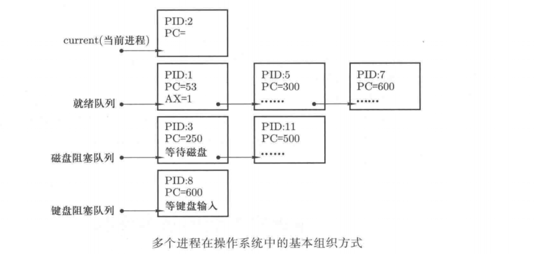
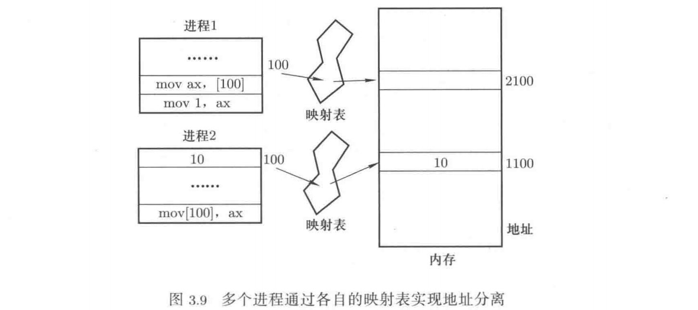

## 多进程——操作系统的核心视图

### 1 进程与程序

将 PC指针设置为一段程序的起始地址以后 CPU就可以开始工作了，而采用了并发思想以后，PC会在多段程序之间来回切换，提高执行效率。因此操作系统高效管理 CPU就具体实现为要在多段程序之间来回切换。在切换时，除了要保存原来执行程序的 PC指针外，还要保存一些重要的执行信息，如寄存器的值等，并且要将这些信息和那段程序关联起来。这样就会产生一种结构：一个程序要附带着一个数据结构，这个数据结构保存这个程序的当前执行位置、执行现场等重要信息。

这样程序加记录当前执行情况的结构是并发造成的一个必然的结果，这是操作系统中最著名的概念：进程。进程用来描述一个程序及其执行过程中的信息，即描述一个处于执行中的程序。更具体的：进程描述的是程序以及反映程序执行信息的数据结构的总和。这个数据结构定义为进程控制块(process control block，PCB)。

### 2 多进程视图

操作系统通过 PCB感知、了解、控制各个进程，操作系统对进程管理的关键在于对 PCB的管理。多进程视图是操作系统的核心视图，对于操作系统的进程管理模块，从上层用户的角度来看，操作系统里有多个进程，每个进程负责不同的内容；从下层系统内核的角度来感知和控制系统中的多个进程，操作系统通过 PCB来实现。

### 3 进程的组织和状态

CPU管理就是进程管理，进程管理的关键是管理进程对应的PCB数据结构。进程的组织就是用合适的数据结构来管理这些PCB。

操作系统中的进程状态主要包括：运行态——当前占用CPU，正在执行；就绪态——一个进程具备了所以可以执行的条件，只要获得CPU就能开始执行；阻塞态——一个进程缺少某些条件，即使分配了CPU也无法执行，也称睡眠态或等待态。

linux-0.11是以单CPU为背景的，因此只有一个处于运行态的进程。处于就绪态的进程都是等待CPU，因此只有一个就绪态队列。导致进程阻塞的原因有很多，因此有多个阻塞队列。

### 4 进程的调度和切换

多进程工作的核心是多个进程之间的来回切换，这也是并发的基本含义。CPU在空闲时应该引起切换，导致CPU空闲的原因有很多，如当前进程执行了需要CPU等待的指令、当前进程执行了exit()函数等。这些空闲点通常被称为调度点，调度点可以是当前进程在执行过程中产生的，也可以是操作系统硬性加入的（如给进程分配的时间片用完操作系统会硬性的加入一个调度点进行切换）。

操作系统通过调用schedule()函数实现进程切换，这个函数的实现原理是，将CPU里面的当前进程执行现场保存在当前进程的PCB结构中，然后从就绪队列中选出下一个进程的PCB，用下一进程的PCB结构中存放的执行现场去替换CPU当前的执行现场内容。

### 5 进程间的影响分离

多个进程同时在内存中交替执行可以提高执行效率，但同时在内存中的多个进程也会相互影响，如一个用户态进程修改另一个用户态进程在内存中的数据从而导致其发生错误，这两个进程的代码都属于用户态内存区域，其CPL=DPL=3，修改完全合法。

解决这个问题的办法是地址隔离，其基本思想如下图。每个进程直接操作的地址不是真实的物理地址，而是虚拟地址。对这个虚拟地址需要通过一个映射表才能对应到一个真实的物理地址。这就是需要GDT表和页表来翻译CS:EIP的原因。

地址空间隔离是操作系统内存管理的核心概念。

### 6 进程间的通信与合作

多个进程同时在内存中，需要隔离相互之间的影响，但有时也需要相互合作，这就产生了进程间的通信和合作问题。最基本的进程间合作模型有“生产者-消费者模型”：一个进程要往一个缓存区写数据，另外一个进程要从缓存区中读数据。此时就需要一个合适的进程间通信机制与合作机制。

进程间的通信方式有很多，如读写同一个数据库、读写同一个文件、读写一段共享内存、读写同一段内核态内存等都是进程间通信的方式。

操作系统中多个进程交替执行，调度顺序不可控，每条指令执行多长时间、调度前执行了多少指令、什么时间进行I/O操作完全不可预料，因此提供合适的进程间合作机制是重要的。
