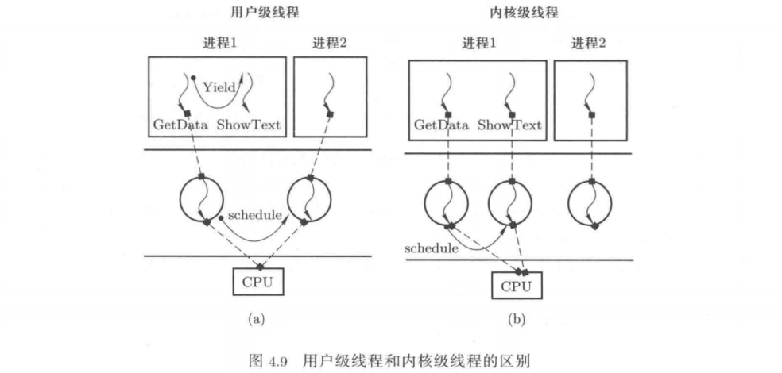
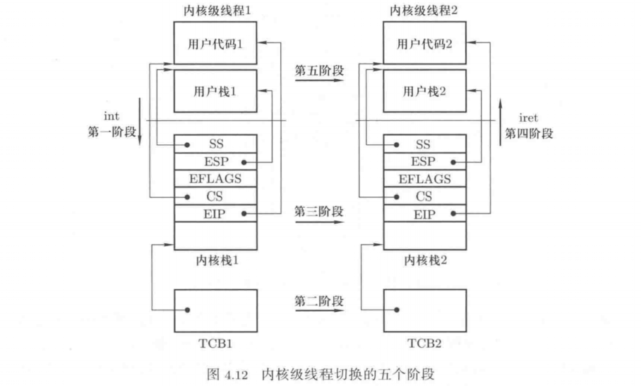

## 线程切换与调度——操作系统的发动机

### 1 线程与进程

并发的基本含义是多段程序交替执行，对应在内存中，多个进程来回切换，交替执行，这便是多进程并发结构。而在某一段程序里，其中有两个函数也可以交替执行，这样的交替执行产生了线程的概念。

线程切换是进程切换的核心，进程切换由资源切换和指令流切换两部分组成，其中资源切换是将分配给进程的非CPU资源进行切换，如对当前地址空间的切换；而指令流切换就是CPU切换，即线程切换。

### 2 用户级线程的切换和创建

线程是在一个地址空间下启动并交替执行多个程序（子程序），交替执行的多个线程可以由操作系统管理，也可以由用户程序自己管理。由用户程序自己管理的线程对操作系统透明，操作系统不知道这些线程的存在，这样的线程被称为用户级线程。相应的，由操作系统管理的线程是内核级线程。

1. 用户级线程之间的切换

用户级线程的切换就是在切换位置上调用`Yield()`函数。Yield()函数完成的基本工作是找到下一个线程的TCB，完成线程TCB的切换，然后根据当前线程的TCB和下一个线程的TCB完成用户栈的切换。具体来说，就是将寄存器ESP中的值保存在当前线程的TCB中，然后从下一线程的TCB中取出保存的esp值赋给ESP寄存器。

在切换到新栈以后用Yield()函数中的`}`将PC指针切换到下一个线程要执行的指令处。当然还需要在线程切换时保存和恢复一些执行现场，如将一些通用寄存器的值保存在线程各自的栈中，在栈切换完成以后弹栈恢复下一个线程的执行现场。

2. 用户级线程的创建

和进程一样，线程也是一段执行起来的程序，所以创建线程的目的就是让一段程序执行起来。如果能将一段程序做成可以让CPU切入执行的样子，并且CPU的切入点是这段程序的首地址，显然这段程序就可以执行了。

创建用户级线程的函数`thread_create()`就是创建一个可以让CPU切换进去的初始模样。此外，除了传递新建线程要执行的函数入口地址外，还要给这个函数传递必要的参数，方法是在栈中依次放入第...个参数、第一个参数、返回地址，并将ESP寄存器设置指向存放返回地址的那个内存单元。

### 3 内核级线程

一个用户级线程在执行过程中可能会进入内核态，用户级线程借助系统调用进入操作系统内核以后，很可能会因为某些事情造成等待，此时会进行CPU切换去执行其它程序。

发生CPU切换时，希望可以切换到相同进程的其它线程去执行，但由于操作系统无法感知用户级线程的存在，这个切换无法进行。也就是说，如果一个用户级线程在内核中阻塞，则这个进程的所以用户级线程将全部阻塞，这就限制了用户级线程的并发程度。

和用户级线程对应的是内核级线程。用户级线程是完全在用户态内存中创建的一个指令执行序列，即用户级线程的TCB、栈等内容都是创建在用户态中的，操作系统完全不知道。而内核级线程就是让内核态内存和用户态内存合作创建一个指令执行序列，内核级线程的TCB等信息创建在操作系统内核中，操作系统通过这些数据结构感知和操作内核级线程。

在操作系统中，用户级线程、内核级线程、进程这三个概念往往是同时存在并实现的，这三者的内在关系如下：

* 引出进程的目的是为了管理CPU，级通过执行程序来使用CPU。进程、内核级线程、用户级线程都是执行一个指令序列，所以这三者都属于CPU管理的范畴。
* 要执行一个指令序列，除了通过分配栈、创建数据结构记录执行位置等信息之外，还要分配内存等资源，这就是进程的概念。
* 将进程中的资源和执行序列分离以后引出了线程的概念，进程必须在操作系统内核中创建，因为进程的创建要涉及计算机硬件资源的分配。因此进程中的那个执行序列实际上就是一个内核级线程。
* 内核级线程是操作系统在一套进程资源下创建的、可以并发执行的多个执行序列，操作系统为每个这样的执行序列创建了相应的数据结构来实现对这些内核级线程的控制。
* 同样的，上层应用程序也可以创建并交替执行多个指令序列，因为执行程序所需要的资源已经在创建进程时分配好了。此时启动多个执行序列所需要的TCB和用户栈等信息完全可以由应用程序自己编程实现，由应用程序负责控制多个执行序列，对操作系统而言完全透明。

### 4 内核级线程之间的切换

用户级线程的切换主要分为三步：TCB切换，根据TCB中存储的栈指针完成用户栈的切换，根据用户栈中压入函数返回地址完成PC指针的切换。内核级线程的切换也要完成这三件事，与用户级线程切换不同的是：内核级线程的TCB存储在操作系统内核中，因此完成TCB切换的程序在操作系统内核中执行，即用户级线程通过调用用户态函数`Yield()`完成切换，而内核级线程必须进入内核后才能切换。此外，进入内核才能完成内核级线程的切换，所以要在内核中的某个地方完成PC指针的切换，对于内核级线程，这个栈是内核栈，即首先切换内核栈，然后引发PC指针的切换。因此内核级线程切换栈要同时切换内核栈和用户栈。

内核级线程切换仍然完成三个工作：切换TCB、切换栈、切换PC指针，但这些切换动作分散在中断入口、中断处理、线程调度、上下文切换和中断返回等多个地方。不像用户级线程所以切换动作都在Yield()函数中。内核级线程的切换归纳为如下五个阶段：

第一阶段：中断进入，就是`int`指令或其它中断的中断处理入口，核心工作是记录当前程序在用户态执行时的信息，如当前程序的执行位置（CS:EIP）、目前使用的用户栈（SS:ESP）、当前执行的现场信息等。

第二阶段：调用schedule()，引起TCB切换。在中断处理程序中，如果发现当前线程让出了CPU，系统内核就会调用schedule()函数来完成TCB的切换。具体做法是，将当前线程（定义一个全局变量`current`来指向当前线程的TCB）的状态修改为阻塞，并将current添加到一个等待队列上，接下来调用schedule()函数实现TCB的切换。为了完成TCB的切换，schedule()函数从就绪队列中选取下一个要执行线程的TCB（用next指向这个TCB），根据next和current指向的TCB开始内核级线程切换的第三阶段。

第三阶段：内核栈的切换，具体来说，就是将当前的ESP寄存器存放在current指向的TCB中，再从next指向的TCB中取出esp字段赋给ESP寄存器。由于现在执行在内核态，所以当前寄存器ESP指向的就是当前线程的内核栈，且放在TCB中的esp也是线程的内核栈地址。

第四阶段：中断返回，为内核级线程切换的最后一个阶段“用户栈切换”做准备，同时和第一阶段的中断进入对应。在这一阶段，将存放在下一个线程的内核栈中的用户态程序的执行现场恢复出来，这个现场是这个线程在切换出去时由中断入口程序保存的。当前用户程序执行的位置和当前用户栈的位置记录在内核栈中。

第五阶段：用户栈切换，实际上就是切换用户态程序的PC指针以及相应的用户栈，即将CS:EIP寄存器设置为当前用户程序执行地址，将SS:ESP寄存器设置为当前用户栈地址，而这两个信息现在就在下一个线程的内核栈中，只要执行`iret`指令就可以完成这个切换。

### 5 内核级线程的创建

内核级线程的创建就是将一个线程初始化成能切换进去，且切换进去会从其入口函数开始执行。内核级线程的创建主要由四个切花构成：切换TCB，切换内核栈，切换用户栈，切换用户程序PC指针。相应的，创建内核级线程的关键是初始化TCB、内核栈（其中存放用户程序的PC指针）和用户栈。

首先，创建一个TCB，主要存放内核转中的esp指针。然后，申请一段内核态内存作为内核栈，并在初始化内核栈内容后将栈顶位置写到新创建的TCB中。最后，分配用户栈，主要存放进入用户态函数时用到的参数等内容。

### 6 创建0/1号进程——多进程视图的起点

多进程视图是操作系统的核心视图，而多进程视图得以不断延续演变的核心是创建进程的系统调用`fork()`。fork()的核心是通过复制父进程来创建子进程，这样系统中的所有进程都是从0号进程和1号进程继承而来的。

0号进程是不能用fork()创建的，因为fork()是一个只能工作在用户态应用程序中的系统调用，而且0号进程是操作系统中的第一个进程，没有父进程。所有创建0号进程需要手动设置进程信息，包括PCB、内核栈、用户栈以及用户程序等。

通过直接初始化PCB数据结构来产生0号进程的PCB。`tack_struct`是Linux操作系统定义PCB的数据结构名称。在PCB初始化设置中，LDT部分用来设置进程使用的地址空间。当0号进程在用户态执行时就会根据这个表中给出的表项找到代码段和数据段。

PCB初始化中另一个重要的设置是关于tss的设置，通过PCB找到内核栈就是依靠其中的tss结构。当需要使用进程的内核栈时，CPU会找到进程的tss数据结构，根据其中的内容设置内核栈段寄存器SS和内核段栈顶寄存器ESP。

完成0号进程的PCB和内核栈的初始化以及完成PCB和内核栈的关联之后，下一步是创建0号进程的用户栈（即用户栈SS:EIP），找到0号进程要执行的用户态程序（即用户程序CS:EIP），然后将这些信息放置到0号进程的内核栈中。

0号进程在移动到用户态之后，接下来调用fork()创建1号进程。分支后，0号进程执行一个死循环，通过系统调用`pause()`将自己暂停让出CPU。1号进程执行`init()`函数，在init()函数里面执行`execve`系统调用，从而在1号进程的“壳子”里执行可执行程序`/bin/sh`，即shell程序，现在1号进程就变成shell进程了。

shell的工作是不断的等待用户输入命令，并用fork()创建一个进程，用exec()执行用户命令对应的可执行程序。现在，操作系统的多进程视图构建完成。

### 7 CPU调度
