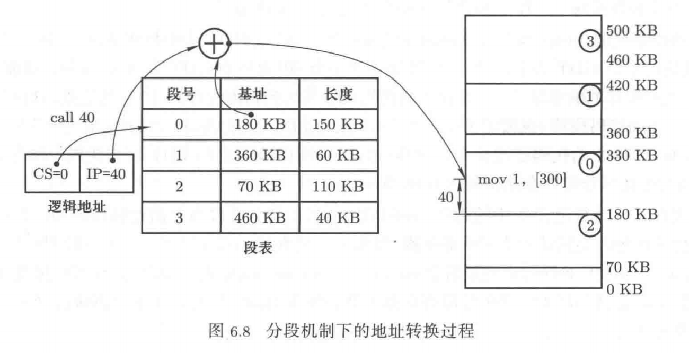
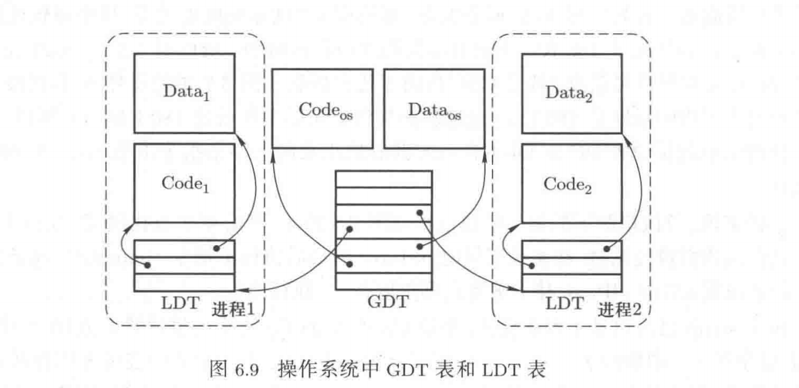
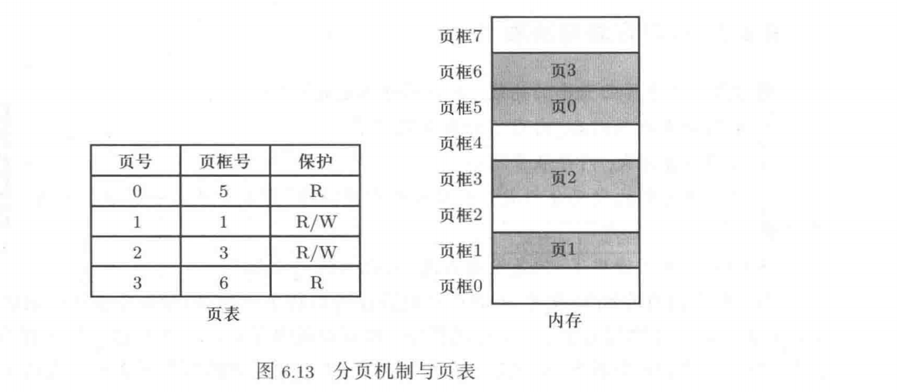
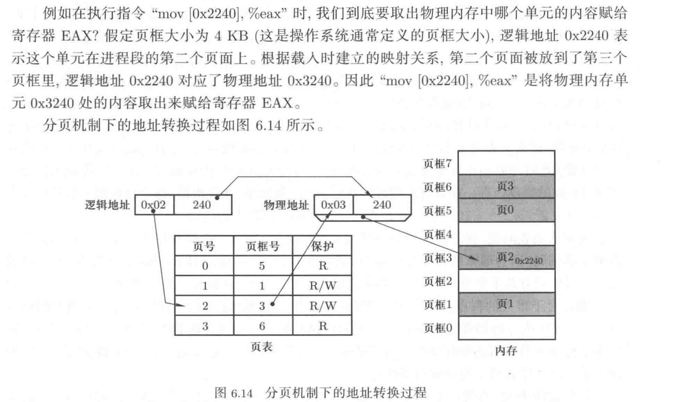
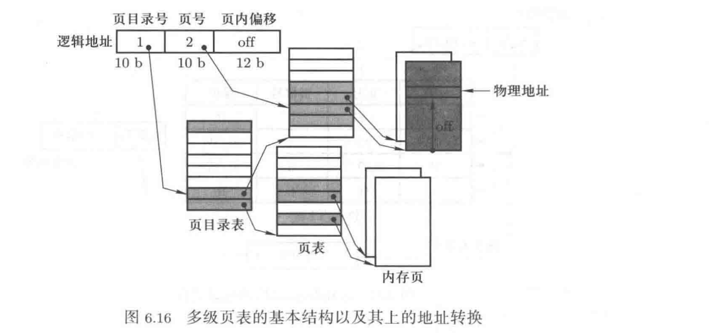
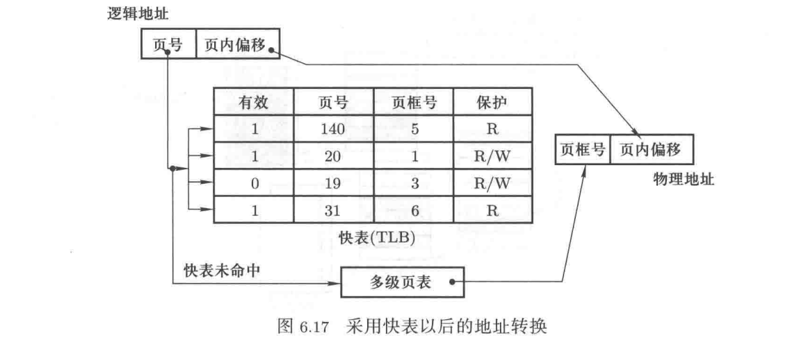
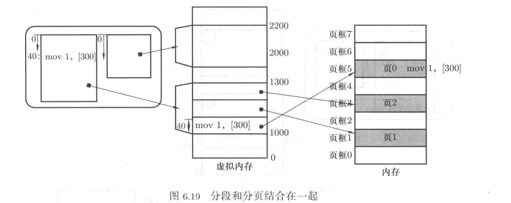

## 内存管理——给程序执行提供一个舞台

### 1 内存使用与程序重定位

1. 从取值-执行到内存使用

计算机工作的基本过程是：CPU从内存中不断地取出并执行指令。假设现在有一个只包含main()函数的基本C语言程序，首先经过编译变成一个带地址的机器指令序列，现在这个指令序列放在磁盘上，接下来将这段机器指令从磁盘读入到内存中，设置PC指针开始执行这段程序。将PC指针初始化为这段程序的入口地址，即这段程序第一条指令所在的地址。

现在开始执行指令`call 40`，解释执行这条指令的结果是设置PC=40，接下来到内存地址40处取出指令，执行指令，从地址40处取出的指令应该是`mov 1, [300]`。

要确保内存地址40处取出的指令是`mov 1,[300]`，那么需要将上图所示的程序放置在从0开始的内存位置上，但是操作系统已经占用了这一段内存。在物理内存中找一段空闲区域，假设找到从地址1000开始的一段内存，然后将可执行文件读入到从地址1000开始的这段内存区域，设置PC=1000开始执行。但在执行指令`call 40`时实际要执行的指令应该是`call 1040`。现在的核心工作就是将`call 40`修改成`call 1040`，这一过程就是——程序重定位。

2. 程序重定位

在编译形成可执行程序时，用到的地址都是从0开始的逻辑地址。当程序被载入到物理内存中时，可能使用任意一段空闲物理内存，为了保持程序的顺利执行，需要进行程序重定位，将程序中的逻辑地址对应到实际使用的物理地址。

假设上面给出的程序被载入到1000开始的空闲物理内存处，那么重定位过程可以表述为：40+1000=1040，即逻辑地址加上基址1000。

如果选择编译时修改地址，那就是编译时重定位。在编译产生可执行代码时，要将程序中出现的逻辑地址全部加上1000以后再写入可执行文件。但编译时重定位显然不能用于任务不断“启动-退出”的通用计算系统。

第二种重定位方法是载入时重定位，在程序被载入到内存时根据载入的物理内存地址区域来修改程序中的逻辑地址。但是使用载入时重定位，程序一旦被载入到物理内存以后就不能在内存中移动了。在进程的执行过程中，进程的换入/换出是很有必要的。

如果在指令执行时才将`call 40`中的逻辑地址40变成物理地址，那么在内存中存放的指令就一直都是`call 40`，这样的`call 40`与其存放的物理内存位置无关，进程就可以在物理内存中移动了。这就是运行时重定位，即在指令执行时才将指令的逻辑地址转换成物理地址。具体做法是程序被载入到内存中执行时，寻找一段空闲内存区域将程序放入，并记录下这段内存区域的基址，每执行一条指令，都先将指令中的逻辑地址加上基址以后才放在地址总线上。

由于每条指令都需要这样的地址计算，为了提高指令执行效率，涉及硬件来快速完成这个地址计算，这个硬件就是存储管理部件（MMU）。只要将那个基址放在一个约定的寄存器中，每条指令执行时MMU就会自动的将指令中取出的逻辑地址和这个寄存器中的基址相加，形成物理地址后送到地址总线上。这个逻辑地址到物理地址的换算过程被称为地址转换。

多进程视图下，系统中有多个进程，每个进程被载入到不同的物理内存区域，相应的有多个基址，但MMU进行重定位的CPU寄存器只有一个。多进程视图的核心是切换，每个进程的重定位基址都要存放在其PCB中，进程切换时将其PCB中存放的基址取出来赋给这个寄存器。

前面论述的进程切换：操作系统首先找到进程的PCB，然后根据其中的信息进行内核栈切换、用户栈切换、PC指针切换等，此外还要完成内存地址空间的切换，实际上指的就是重定位基址寄存器的切换。基址对应一段以该基址为起始地址的内存空间，所以基址寄存器的切换实际上就是一段地址空间的切换

至此，进程切换的两个部分：指令执行序列的切换和地址空间的切换都阐述清楚了。

### 2 分段

1. 段的概念

将一段程序载入内存区域，将基址写到一个寄存器中，接下来的“取指-执行”会不断使用内存。程序由若干段组成：代码段是程序指令形成的段，代码段只读；数据段中存放程序使用的数据，数据段可读可写；栈段用来实现函数调用，栈通常只能向下增长。每个段单独处理，都从地址0开始单独编址。一个程序的基本结构如图：

程序分段以后，不会将程序作为一个整体载入内存，而是分别处理程序中的各个段，程序中的多个段会被分别载入内存。如果是将整个程序载入内存，需要记录一个基址，现在将组成程序的多个段分别载入内存，就需要记录每个段的基址，多个基址就会形成一个表，这就是段表。

2. 分段机制下的地址转换

采用分段机制后，程序中的逻辑地址就变成“段号：段内偏移”的形式。对于分段来说，逻辑地址实际上是段内偏移，而每个段都从地址0开始编写，如果不明确的标识出是哪个段只是给出段内偏移地址是无法确定具体地址的。因此分段机制下的地址转换过程的核心就是查找段表。

GDT表是操作系统分段机制的一种具体实现方式，GDT表背后的操作系统概念就是分段机制。GDT只有一个，但每个进程都有自己的段表，所以每个进程的段表实际上是局部描述符表LDT。GDT表描述的是操作系统的代码段、数据段等信息，LDT表才用来描述每个进程的代码段、数据段等。为了让操作系统找到每个进程的段信息，GDT表中还有指向各个进程LDT表的表项。

### 3 分页

1. 分页机制

内存分区与适配算法在处理程序对内存的申请使用时，会造成内存碎片的产生。为解决内存碎片问题，提高内存的空间使用率，操作系统支持使用分页机制。

分页机制首先将物理内存分割成大小相等的页框，然后再将请求放入物理内存的内容（如代码段）也分割成同样大小的页面，最后将所有的页面都映射到页框上，完成对物理内存页框的使用。页面和页框的大小通常为4KB。

这个载入过程只完成了内存使用的第一步，要真正让内存中的程序可以被取指-执行、让内存中的数据可被寻址读写，还需要解决重定位问题。

2. 多级页表和快表

页表由页表项组成，页表项记录逻辑页放到了哪个物理页框里，所以每个逻辑页都需要一个页表项来记录信息。理论上，32位程序使用的逻辑地址是32位的，所以最大逻辑地址是2^32^，每个页面的大小为4KB（2^12^），因此32位逻辑地址空间总共包含2^20^个逻辑页，每个逻辑页对应一个页表项，因此总共有2^20^ = 1M个表项，一个页表项信息需要4B，所以32位环境下每个进程的页表都要占4MB内存。每个进程都有自己的页表，系统中有n个进程，就需要4n MB的内存。如果是64位机器，每个进程的需要存放页表的内存大小为2^54^ = 16PB。

实际上，32位程序下的1M个逻辑页很少能被全部用到，因为大部分程序通常都很小，只需用到几个逻辑页，64位程序也是如此。即使是很大的程序，当前访问的逻辑页往往也不多，因为程序执行具有典型的局部性。

总的来说，当前真正使用的只是4GB线性内存空间中的少数几个逻辑页，相应的也只需要在内存中存放少量页表项即可。因此一个降低存放页表的内存空间开销的方法 是：对于没有被存放到物理页框中的逻辑页，将其对应的页表项从内存页表中去掉。但这会造成页表中的逻辑页号不再连续，导致根据给定的逻辑页号查找对应的物理页框号的时间代价增大。

多级页表解决：既不用在内存中存储没有映射的页表项，又能保证页表中的逻辑页号连续的问题。类似于书籍目录中章和节的概念，节目录相当于页表，多级目录是在节的基础上建立章，多级页表就是在页表项的基础上建立一个称为页目录的高层结构。每个页目录中包含多个页表项，通常为2^10^个，即4MB为一章，4KB为一节。

两级页表的基本结构是引入页目录项，一个页目录项包含多个页号连续的页表项，页表项映射一页内存，页目录项映射一块内存。此时有两个表：由页目录项组成的页目录表和由页表项组成的页表。查找一个逻辑页号对应的物理页框号时，先查找页目录表找到页目录项，再根据页目录项中存放的指针找到页表，最后查找页表得到逻辑页号对应的物理页框号。

多级页表引入页目录可以降低存储页表造成的空间代价，同时导致查表次数增加导致地址转换时间变长。根据程序的局部性规律：最近使用的是常用的，常用的不会总是连续。因此借助变换旁查缓冲器（translation lookaside buffer，TLB）来实现一次完成整个缓存页表的查找，即快表，快表中会缓存那些常用逻辑页的映射关系。

现在地址转换的过程是：先查快表，如果命中则迅速得到物理页框号；如果未命中则查找页目录表、查找页表，得到物理页框号并更新快表。

最后总结分页机制：1）将物理内存划分为页，并以页为单位进行内存分配，解决内存碎片问题；2）分页后需要存放页表来完成地址转换过程；3）采用多级页表可以降低存放页表造成空间开销；4）采用快表降低多级页表造成的时间开销；5）最终形成综合多级页表和快表的分页机制。

### 4 段页式内存管理与虚拟内存

1. 虚拟内存

用户希望将程序分成若干段，每个段分开单独处理、独立连续编址。物理内存希望将自己等分成若干页，在接到用户内存使用的申请时，以页为单位进行分配。

抽象出虚拟内存作为中间结构将分段机制和分页机制结合在一起：将程序分成多个段，并从中间结构分割出一些区域与每个段建立映射，完成分段机制；将中间结构分割成页，将这些页放到物理内存的页框中，并建立这个页和页框的映射，完成分页机制。

这个中间结构能分割成区域（段）和页，因此中间结构是一个地址空间，但中间结构里的地址没有对应真实的存储单元，这些地址都是虚假的。中间结构是一个看起来和物理内存一样，但没有对应物理存储单元的虚拟内存。

2. 段页结合时进程对内存的使用

当磁盘上的一个程序要放入内存时：

1）在虚拟内存中分割出一些分区，将程序的各个段“放入”（虚拟内存没有对应真实的存储单元，这里不是真的放入，而是建立映射关系）。
2）建立段表来记录这个映射关系--记录各个程序段和虚拟内存分区之间的映射关系。
3）将虚拟内存分割成页，选择物理内存中的空闲页框，将虚拟内存中的“页内容”放到物理页框中。
4）建立页表来记录虚拟内存页和物理内存页框之间的映射关系。

因此，基于虚拟内存的段页结合效果是将程序段分割成页以后载入物理页框中，但是这个载入是通过虚拟内存才完成的。一旦经过了虚拟内存，从用户出发看到的视图是程序段被放到一个连续的内存区域上，即用户看到的是分段效果。在背后，操作系统再将这个内存区域按照分页方式真正的放到物理内存中，实现分页机制。

放到内存中的指令如何正确执行。

以指令`call 40`为例，执行该指令时要进行地址转换，逻辑地址是`CS:40`。假定代码段是第0段，第0段的段基址是1000。先查找段表取出基址，可以算出CS:40在虚拟内存中的位置为1000+40=1040，这个地址被称为虚拟地址。因为虚拟内存分割成页框映射到物理页框，再根据虚拟地址查找页表找到物理地址。假设1040/100=10...40，虚拟地址对应的虚拟页号是10，页内偏移是40。假设虚拟页号10对应的物理页框号是5。接下来查找页表得到物理页框号5，得到最终的物理地址540，在地址总线上放入地址540后进行取值得到指令。

3. 一个真实的段页式内存机制

......
