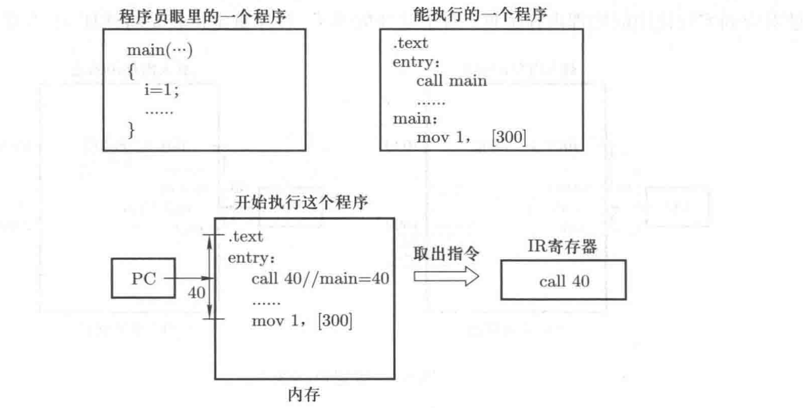
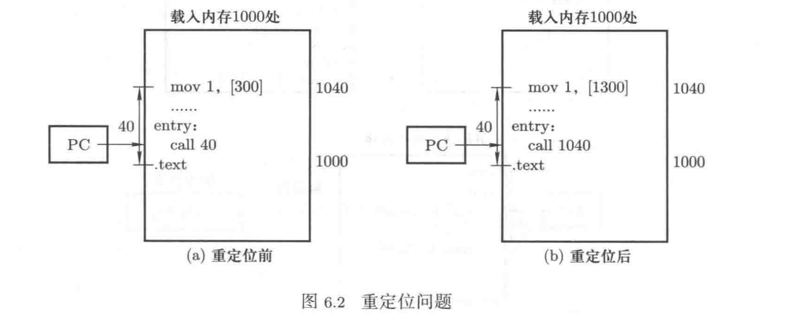
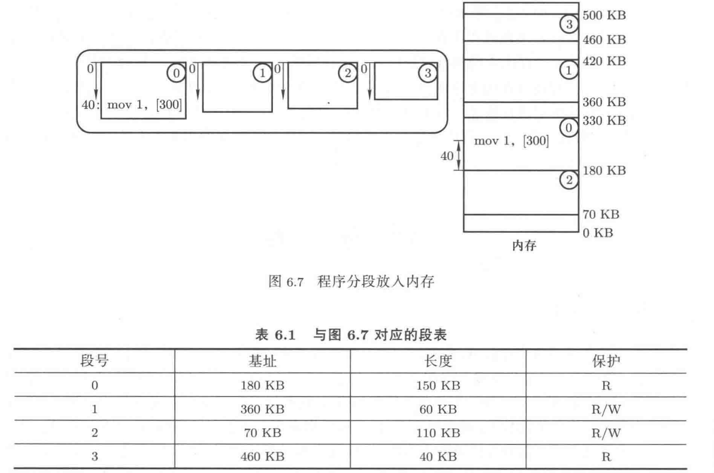

## 内存管理——给程序执行提供一个舞台

### 1 内存使用与程序重定位

1. 从取值-执行到内存使用

计算机工作的基本过程是：CPU从内存中不断地取出并执行指令。假设现在有一个只包含main()函数的基本C语言程序，首先经过编译变成一个带地址的机器指令序列，现在这个指令序列放在磁盘上，接下来将这段机器指令从磁盘读入到内存中，设置PC指针开始执行这段程序。将PC指针初始化为这段程序的入口地址，即这段程序第一条指令所在的地址。

现在开始执行指令`call 40`，解释执行这条指令的结果是设置PC=40，接下来到内存地址40处取出指令，执行指令，从地址40处取出的指令应该是`mov 1, [300]`。

要确保内存地址40处取出的指令是`mov 1,[300]`，那么需要将上图所示的程序放置在从0开始的内存位置上，但是操作系统已经占用了这一段内存。在物理内存中找一段空闲区域，假设找到从地址1000开始的一段内存，然后将可执行文件读入到从地址1000开始的这段内存区域，设置PC=1000开始执行。但在执行指令`call 40`时实际要执行的指令应该是`call 1040`。现在的核心工作就是将`call 40`修改成`call 1040`，这一过程就是——程序重定位。

2. 程序重定位

在编译形成可执行程序时，用到的地址都是从0开始的逻辑地址。当程序被载入到物理内存中时，可能使用任意一段空闲物理内存，为了保持程序的顺利执行，需要进行程序重定位，将程序中的逻辑地址对应到实际使用的物理地址。

假设上面给出的程序被载入到1000开始的空闲物理内存处，那么重定位过程可以表述为：40+1000=1040，即逻辑地址加上基址1000。

如果选择编译时修改地址，那就是编译时重定位。在编译产生可执行代码时，要将程序中出现的逻辑地址全部加上1000以后再写入可执行文件。但编译时重定位显然不能用于任务不断“启动-退出”的通用计算系统。

第二种重定位方法是载入时重定位，在程序被载入到内存时根据载入的物理内存地址区域来修改程序中的逻辑地址。但是使用载入时重定位，程序一旦被载入到物理内存以后就不能在内存中移动了。在进程的执行过程中，进程的换入/换出是很有必要的。

如果在指令执行时才将`call 40`中的逻辑地址40变成物理地址，那么在内存中存放的指令就一直都是`call 40`，这样的`call 40`与其存放的物理内存位置无关，进程就可以在物理内存中移动了。这就是运行时重定位，即在指令执行时才将指令的逻辑地址转换成物理地址。具体做法是程序被载入到内存中执行时，寻找一段空闲内存区域将程序放入，并记录下这段内存区域的基址，每执行一条指令，都先将指令中的逻辑地址加上基址以后才放在地址总线上。

由于每条指令都需要这样的地址计算，为了提高指令执行效率，涉及硬件来快速完成这个地址计算，这个硬件就是存储管理部件（MMU）。只要将那个基址放在一个约定的寄存器中，每条指令执行时MMU就会自动的将指令中取出的逻辑地址和这个寄存器中的基址相加，形成物理地址后送到地址总线上。这个逻辑地址到物理地址的换算过程被称为地址转换。

多进程视图下，系统中有多个进程，每个进程被载入到不同的物理内存区域，相应的有多个基址，但MMU进行重定位的CPU寄存器只有一个。多进程视图的核心是切换，每个进程的重定位基址都要存放在其PCB中，进程切换时将其PCB中存放的基址取出来赋给这个寄存器。

前面论述的进程切换：操作系统首先找到进程的PCB，然后根据其中的信息进行内核栈切换、用户栈切换、PC指针切换等，此外还要完成内存地址空间的切换，实际上指的就是重定位基址寄存器的切换。基址对应一段以该基址为起始地址的内存空间，所以基址寄存器的切换实际上就是一段地址空间的切换

至此，进程切换的两个部分：指令执行序列的切换和地址空间的切换都阐述清楚了。

### 2 分段

1. 段的概念

将一段程序载入内存区域，将基址写到一个寄存器中，接下来的“取指-执行”会不断使用内存。程序由若干段组成：代码段是程序指令形成的段，代码段只读；数据段中存放程序使用的数据，数据段可读可写；栈段用来实现函数调用，栈通常只能向下增长。每个段单独处理，都从地址0开始单独编址。一个程序的基本结构如图：

程序分段以后，不会将程序作为一个整体载入内存，而是分别处理程序中的各个段，程序中的多个段会被分别载入内存。如果是将整个程序载入内存，需要记录一个基址，现在将组成程序的多个段分别载入内存，就需要记录每个段的基址，多个基址就会形成一个表，这就是段表。

2. 分段机制下的地址转换

采用分段机制后，程序中的逻辑地址就变成“段号：段内偏移”的形式，

### 3

### 4

### 5
