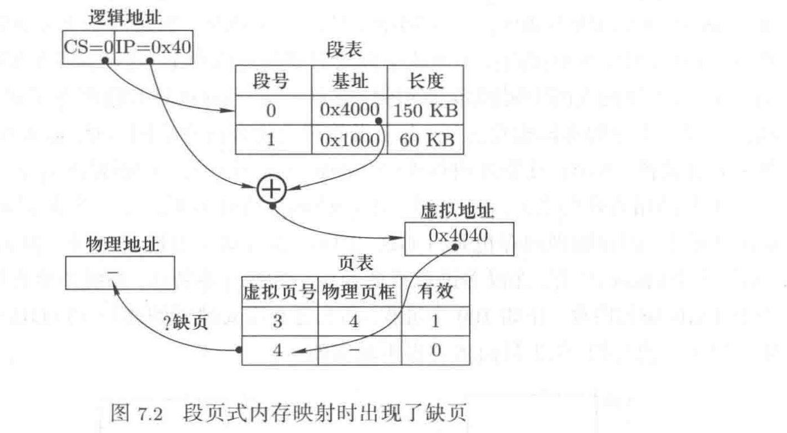
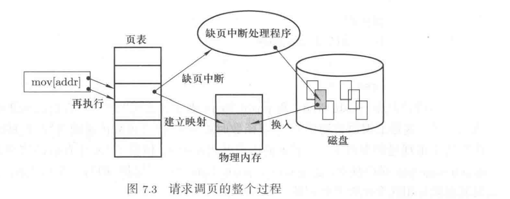

## 换入/换出——用磁盘和时间来换取一个规整的虚拟内存

### 1 规整的虚拟内存

1. 虚拟内存与换入/换出

程序直接使用的地址是逻辑地址，逻辑地址和段基址组合得到虚拟地址，32位逻辑地址意味着虚拟地址空间是0-4GB。虚拟内存就是操作系统提供给进程的一个规整的、总长度为4GB的地址空间，用户可以访问这个虚拟地址空间的任何一个地址。但有时实际的物理内存可能比4GB的虚拟内存要小，所以4GB的虚拟内存不可能全部映射到物理内存上，这时就会出现换入/换出场景。

如果要访问的某部分虚拟内存区域不在内存中，没有和物理内存关联，从磁盘上读入这部分内容并建立关联，这就是换入；物理内存是有限的，不能只是换入，空间不足时要把物理内存中长时间未使用的部分内容移出到磁盘，并和虚拟内存区域解除关联，这就是换出。

正是使用这样的换入/换出，用一个小的物理内存来制造出一个大而规则的虚拟内存用户视图。即使物理内存不太小，也应该进行换入/换出，因为每个进程都要有一个4GB大小的虚拟内存（即使进程没有使用全部的4GB）。但无论实际的物理内存有多大，用户程序只能“看到”虚拟内存，虚拟内存到物理内存的映射被操作系统屏蔽了。

2. 请求调页

对于虚拟内存的实现而言，要想在系统中真正的实现换入/换出，还需要从段页式内存管理机制入手进行分析。假设有如下图的情况：



段页式内存机制下的地址转换过程为：首先根据段表从逻辑地址`0x40`算出虚拟地址，由于假定虚拟内存的4GB空间都可以使用，所以这一步一定可以正常完成：从段表中取出段基址`0x4000`后和段内偏移相加得到虚拟地址`0x4040`。现在开始地址转换的第二步，根据虚拟地址和页表获得物理地址，一页的大小是4KB，`0x4040`的虚拟页号是4，查页表后没有找到该虚拟页对应的物理页，出现了缺页的情况。

因为这一页虚拟内存区域还没有和物理内存建立关联（映射），具体实现时，MMU会查看页表项的有效位，如果该页表项的有效位为0，说明该虚拟页还没有映射到物理页框上。没有映射才要换入，内存换入的核心就是在缺失虚拟页的时候请求调页，操作系统实现换入就是实现请求调页。

请求调页的整个过程从MMU发现虚拟页面在页表项中的有效位为0开始，此时MMU向CPU发出缺页中断，对应的中断处理过程就是操作系统从磁盘上找到这个虚拟页，然后在内存上找到一个空闲的物理内存页框，并将这个虚拟页读到空闲页框之后上，虚拟页面就和物理页框建立关联了，最后更新页表来记录这个映射关系。中断返回后会重新执行那条引起中断的指令，此时这条指令可以正常执行了。



3. 页面调入的具体实现

页面调入的具体实现从缺页中断处理程序开始：

```C++
// 页错误中断处理函数的设置
void trap_init(void){
    set_trap_gate(14, &page_fault);
}
```

`14`号中断就是缺页中断，`page_fault`是一段汇编代码，该代码首先取出导致页面错误的类型，判断页面是没有映射还是越权读写，从而决定要调用`do_no_page`还是`do_wp_page`。页面换入的核心工作由函数`do_no_page()`完成：

```C++
void do_no_page(unsigned long error_code, unsigned long address){
    address &= 0xfffff000;  // 第一行
    page = get_free_page(); // 第二行
    bread_page(page, current->executable->i_dev, nr);   // 第三行
    put_page(page, address);    // 第四行
}
```

参数`address`是`page_fault`用栈传进来的出现缺页的虚拟地址。第一行用来算出虚拟页号；第二行用来获取空闲的物理内存页框，具体是在`mem_map`数组中找到一个值为0的项；第三行用来启动磁盘读写来读取虚拟页面的内容；第四行用来填写页目录项和页表项，完成映射。

### 2 页面换出

由于物理内存是有限的，相比虚拟内存要小，实际情况下不可以一直换入页面。从磁盘换入虚拟页面时，需要在物理内存中找到一个空闲页框，但这个空闲内存页框不一定总能找到，更符合实际的做法是：如果能找到空闲物理内存页框就直接进行页面换入，否则就要从现有已映射的物理内存页框中换出一页，腾出空闲页框以后再进行页面换入。

1. 页面换出算法

先进先出(FIFO)页面置换算法。

最优置换(optimal replacement, OPT)算法：淘汰未来最远使用的页面。

最近最少使用(least recently used, LRU)页面置换算法：淘汰历史上最近很长时间没被访问的页面。

clock算法，也称第二次机会置换(second chance replacement, SCR)算法。

2. 页框个数分配与全局置换

在分配给进程的所有物理页框都被用完后，当发生缺页时才会调用clock算法进行页面淘汰，所以操作系统需要确定应该给进程分配多少给物理页框。分配物理页框个数方法，加上页面置换算法，再加上页面换入和页面换出，换入/换出机制才算完整。

为了避免分配给进程的物理页框个数过小导致进程频繁的进行页面换入，同时为了避免分配给进程的物理页框个数过大导致内存利用率低下，操作系统采用全局置换策略解决物理页框个数的分配：如果某个进程需要物理页框时，操作系统从一个全局空闲物理页框链表中取出一个空闲物理页框进行分配，同时操作系统会定期的对分配给所有进程的所有页面进行clock算法扫描，发现有最近一段时间内没有被访问的页面，就将其换出到磁盘上，并将对应的物理页框释放到空闲页框链表中。
