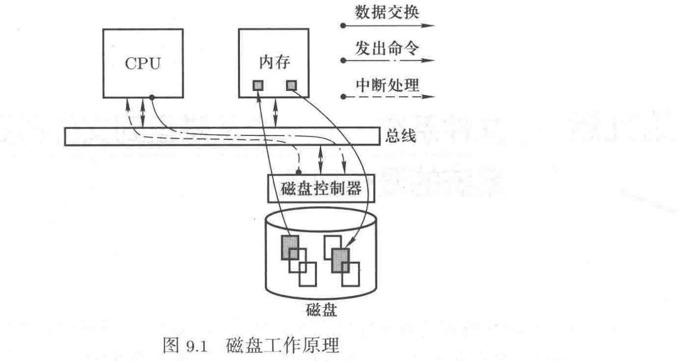
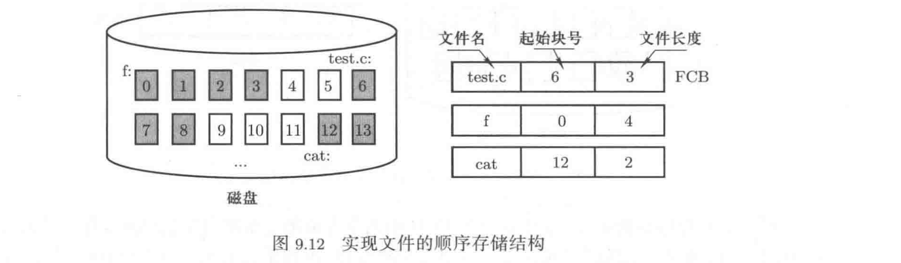
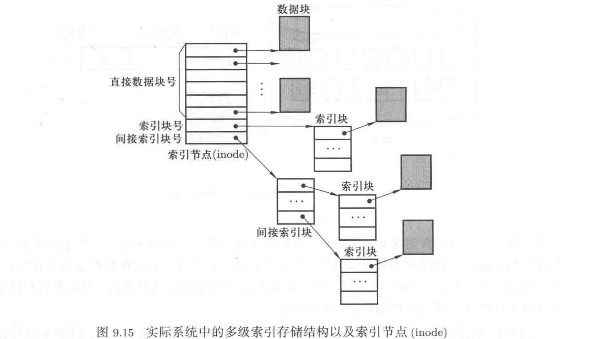
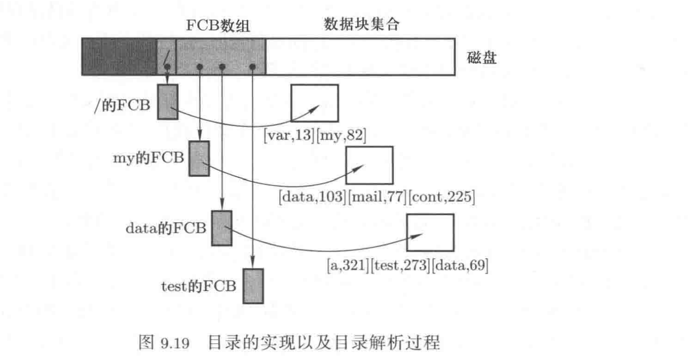
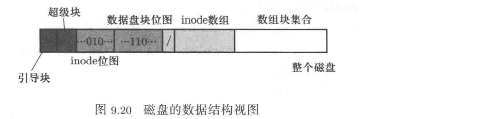

## 文件系统——一个从磁盘到文件再到文件系统的漫长抽象

### 五层抽象

CPU管理和内存管理是操作系统的核心，接下来是外设管理，一个完整操作系统的最后一部分是——文件系统。用户对操作系统的使用都是以文件为基础的，用户使用软件、执行命令、使用外设等对操作系统而言都是使用文件，所以文件系统是构成操作系统的必要组成部分。

虽然是文件系统，但归根结底是对磁盘的驱动，为了在磁盘驱动过程中简化对磁盘的使用，引入了五层抽象机制：1）从扇区到磁盘块的抽象；2）从单个盘块请求到多个进程的磁盘请求队列；3）从磁盘请求到高速缓存；4）从盘块集合到文件的抽象；5）从多个文件到构建文件系统。

通过这五层抽象，最终操作系统将整个磁盘变成了用户眼里的一系列文件，并将这些文件组织成树状结构，形成操作系统的第二个基本视图——文件视图。

### 1 磁盘工作的基本原理

1. 磁盘工作的原理

磁盘的工作原理包含两条主线：1）从CPU开始，用户想要使用磁盘，由CPU发送命令给磁盘设备，最终通过`out ax, 端口号`指令告诉磁盘具体的动作细节。2：从磁盘开始，即磁盘在工作完成后用中断告诉CPU，CPU在中断处理中完成后续工作，如将从磁盘读入的内容复制到用户态内存中等。



2. 磁盘工作的过程

磁盘由多个圆形盘面形成盘面组，每个盘面上有多个同心圆环，每个同心圆环被称为一个**磁道()**。多个盘面的同一磁道合在一起形成一个圆柱面，简称**柱面(cylinder)**。每个磁道再被分割为多个**扇区(sector)**，扇区是磁盘读写的基本单位。

磁盘读写的具体过程是：1）磁头(magnetic head)移动，找到要读的那个柱面，2）从柱面中选择具体要读写哪个磁道，给对应的磁头上电，3）旋转磁盘，将对应磁盘中要读写的那个扇区转到磁头的下方，4：读写开始，将扇区中的内容读入内存缓存区中，或将内存缓存区中的内容写出到该扇区中。

3. 使用磁盘的直观方法

让CPU给磁盘控制器发出读写命令，告诉磁盘控制器读写哪个柱面C、哪个磁头H、哪个扇区S、以及要读写的内存缓存区的位置和读写长度。

### 2 生磁盘的使用

1. 第一层抽象：从扇区到磁盘块的请求

对上层用户来说，通过直接操作柱面C、磁头H、扇区S来读写磁盘扇区太繁琐。为了简化上层用户的使用，抹去C、H、S等具体细节，让上层用户感觉所有的扇区是排成一排的，所有扇区从0开始依次编号，用户请求访问第0、1、...、100、...、1001、...个扇区，这种访问请求显然方便得多。

实现这种访问的核心是建立从C、H、S扇区地址到扇区号的映射，实际上就是建立一个在C、H、S基础之上的编址方案。这个编址方案就是文件系统第一层抽象的中心任务。

完成从C、H、S到扇区号的映射之后，用户通过扇区号来访问磁盘扇区，而不再需要使用繁琐的C、H、S地址。

多个连续扇区就是一个磁盘块，引入磁盘块的概念后用户读写磁盘的基本单位不再是扇区，而是磁盘块。因为数据传输花费的时间比寻道/旋转花费的时间要小很多，所以寻道/旋转一次读写多个扇区的策略比只读写一个扇区的策略可以显著提高读写速度。

有了磁盘块之后，用户发出磁盘读写请求的基本单位就是盘块号，由于磁盘块是连续的多个扇区，可以很容易的根据盘块号算出扇区号。

2. 第二层抽象：多个进程产生的磁盘请求队列

现在可以处理一个磁盘块读写请求了，但操作系统中有多个进程，每个进程都会提出磁盘块访问请求，所以在操作系统中实际上是多个进程产生多个磁盘块读写请求的情形。多个磁盘块读写请求，需要用队列来组织这些请求，这就是操作系统对磁盘管理的第二层抽象。

经过第一层抽象以后，只需要告诉操作系统要读写的盘块号就可以完成磁盘读写。经过第二层抽象以后，磁盘读写会变成：需要进行磁盘读写的进程首先建立一个磁盘请求数据结构，并在这个数据结构中填上要读写的盘块号，然后将这个数据结构放入磁盘请求队列中就完成了“磁盘读写”。剩下的工作交给操作系统完成，对用户进程完全透明。

经过该层抽象后，操作系统处理磁盘读写要完成如下工作；1）从队列中选择一个磁盘请求；2）取出请求读写的盘块号；3）根据盘块号计算出C、H、S，4）用`out`语句向磁盘控制器发出具体指令。其中第2-4步前面已经论述过，此处主要论述第一步，即如何从多个请求中选择出一个合适的请求来分配资源，这是典型的调度算法，所以第二层抽象的核心就是选择磁盘调度算法。

- 先来先服务(FCFS)算法。
- 最短寻道时间优先(shortest seek time first, SSTF)算法。
- 扫描(SCAN)算法。
- 循环扫描(CSCAN)算法。

现在具体实现多进程对磁盘的访问是：1）进程提出磁盘读写请求就是新建一个磁盘请求数据结构`req`，可以用`make_request()函数`来产生req，并在req中填入请求盘块号等信息；2）将请求req加入到操作系统中的磁盘请求队列中，当然加入时应进行临界区保护，因为多个进程都要往这个全局队列中放入请求，所以该全局队列是一个共享结构，修改时需要进行临界区保护；3）在磁盘中断处理时，通常是上一个磁盘请求处理完成时发出的中断，从请求队列中取出一个磁盘请求进行处理；4）取出磁盘读写请求以后再取出请求数据结构中的盘块号，接下来就是第三层抽象的工作了。

3. 第三层抽象：从磁盘请求到高速缓存

到目前为止的磁盘处理过程是：操作系统处理各个进程提出的磁盘请求，根据请求中的磁盘块号在磁盘上找到相应的扇区位置，将这些扇区读入到内核态内存中，然后再由系统调用将存放在内核态内存中的磁盘数据复制到用户态内存中，用户态程序操作用户态内存中的数据。

用户想要从磁盘上读100B的内容，由于磁盘的读写单位是磁盘块，所以虽然用户只需要100B，但实际读入的数据内容会大于100B，假设一个磁盘块有两个扇区，则实际读入的磁盘数据大小是1024B。同时，用户在处理完100B后，遵循程序的局部性，很可能会处理这100B后面的数据，这时就不必再去读磁盘了，因为刚才读入的1024B仍然在内核态内存中。（预读机制？）

这种机制会大幅减少磁盘读写次数，从而提高磁盘的使用效率。这个机制的核心内容就是：磁盘高速缓存。磁盘高速缓存是磁盘管理的第三层抽象，即操作系统将磁盘数据“变成”一系列位于内核态内存中的缓存区内容。对用户来说，磁盘读写变成了高速缓存读写，用户向高速缓存发出读写请求，如果请求的数据在高速缓存中，则直接将请求的信息返回；如果不在，才发出磁盘读写请求去读写磁盘。

实现高速缓存需要提供一种机制来快速查找一个磁盘块的数据是否在高速缓存中。同时，将高速缓存划分成若干个小的缓存块用于分别缓存载入的不同磁盘块的数据。用散列表组织以盘块号为关键字的缓存块，用空闲链表组织空闲的缓存块（没有载入磁盘块数据的缓存块）。

现在，用户读磁盘实际上是读缓存区，对应的函数`bread(设备号 dev, 盘块号 block)`(buffer read)的工作是：首先查找高速缓存散列表，看其中是否已经存在块号为block的磁盘块数据，找到则直接返回，没有找到则说明该磁盘块还没有从物理磁盘上读入，接下来从空闲链表中分配一个空闲缓存块，用来缓存从磁盘上读入的数据。

用户请求读磁盘时，先建立磁盘请求req，将其放入请求队列中。对上层应用来说，磁盘读写请求放入请求队列以后磁盘读写工作就完成了，真正什么时候开始磁盘读写由磁盘中断处理程序调度。所以用户进程在将磁盘读写请求放入请求队列后就开始睡眠等待，磁盘数据读写完成后磁盘中断处理程序会唤醒该进程。

### 3 基于文件的磁盘使用

1. 第四层抽象：引出文件

抽象到现在，用户通过盘块号调用bread函数来使用磁盘，但这仍不太方便，例如要将一块很大的内容写到多个磁盘时，用户需要记住这块内容中的哪一段被写入到哪一个磁盘块中，因为将来要根据这个对应关系再从磁盘的相应块中取出这些数据内容。

为了让磁盘上的数据访问更符合人们的习惯，操作系统引出了磁盘使用的第四层抽象——文件，文件是一个连续的字符流。不管什么数据，也不管这个数据内容有多大，都将其看成是一个字符流，通过在这个字符流上读取、写入、插入、删除某个或某些字符来操作数据内容。

操作系统的这一层抽象就是要将磁盘块抽象为一个字符流，经过抽象以后：1）用户看到并访问的是一个文件，一个字符流，和磁盘块没有关系；2）从磁盘物理设备出发，磁盘中只有磁盘块，所以字符流最终还是要存放在磁盘块上；3）操作系统要将字符流读写映射为对磁盘块的读写。显然，实现文件抽象的关键就在于能根据字符流位置找到对应的盘块号，即建立字符流和盘块号之间的映射关系。操作系统根据这个映射关系找到和字符流位置对应的磁盘块号。映射关系描述一个文件全部字符流在磁盘块上的存放位置就是映射表。

将字符流存放在磁盘上有几种方式：

- 磁盘块连续存放，这种存放/映射结构称为顺序存储结构。建立顺序存储结构后，操作系统只需要存放起始块号和长度这两个信息就能描述这个映射关系。完成这个映射核心信息是文件名、起始块号、文件长度，这些信息可以用一个核心数据结构——文件控制块(FCB)来组织和保存。优点：访问任何一个字符流位置都能快速计算出对应的磁盘块号；缺点：对文件进行修改操作需要大量的磁盘读写操作，非常耗时。



- 磁盘块不需要连续，只要每个磁盘块中存放下一个字符流片段所在的盘块号，即链式存储结构。操作系统在FCB中需要存放的主要映射信息仍然是第一个磁盘块的盘块号，利用这个信息找到文件的第一个盘块号，再利用每个磁盘块中存放的下一个盘块号找到后面所有的磁盘块。优点：文件在动态修改时不需要进行大量的磁盘块移动，只需要修改前面的磁盘块使其指向正确的下一盘块号即可；缺点：读写效率很低。

- 顺序存储结构和链式存储结构的折中：索引存储结构。文件字符流被分割成多个逻辑块，在物理磁盘上寻找一些空闲物理盘块（无须连续），存放这些逻辑块的内容，再找一个磁盘块作为索引块，按序存放各个逻辑块对应的物理磁盘块号。
- - 为了解决索引存储结构下文件过大和过小的问题，实际操作系统使用多级索引存储结构：索引节点（即文件的FCB）中存放直接数据块号、索引块号和间接索引块号三部分。直接数据块直接指向文件内容，这6个逻辑块对应的磁盘块号可以用直接数据块号中的直接块信息获得。
- - 利用索引节点中的索引块号可以读出索引块，然后根据索引块中存放的物理盘块号可以找到文件的内容，只用读入一次索引块的被称为一阶索引。
- - 如果是间接索引：先读入间接索引块，其中存放的是下一阶索引的索引块号，下一阶索引块中存放的才是对应于逻辑块的物理盘块号，这是二阶索引。



2. 第四层抽象：文件的实现

文件抽象的基本过程是：给定一个索引节点(inode)，给出一个字符流读写位置，操作系统通过索引节点中存放的索引信息找到文件读写位置所在的物理盘块号，然后利用这个盘块号去调用`bread()`函数。

文件的代码实现可以从写文件的系统调用入口函数`sys_write`开始，进入`sys_write`后，会根据`inode->i_mode`进行分支判断，此时inode对应的不是字符设备，而是常规文件，会跳转到`file_write()`去执行。

```C++
// sys_write()函数的部分实现（普通文件分支）
int sys_write(int fd, const char* buf, int count){
    struct file *file=current->filp[fd];
    struct m_inode *inod=file->inode;
    if(S_ISREG(inode->i_mode)){
        return file_write(inode, file, buf, count);
    }
}
```

`file_write()`首先找到文件读写对应的字符流位置，即起始位置，这个读写起始位置无需显式的告诉文件系统，而是通过文件读写指针隐式的告诉`file_write`，文件读写指针是文件的当前读写位置，更确切地说，是文件最近一次读写结束时停留的读写位置。文件读写位置记录在打开文件对应的`file`数据结构中，由`f_pos`字段指示。

```C++
// file_write()函数代码实现
int  file_write(struct m_inode *inode, struct file *filp, char *buf, int count){
    off_t pos;
    if(filp->f_flags & O_APPEND){
        pos=inode->i_size;
    }
    else{
        pos=filp->f_pos;
    }
    while(i<count){
        block=create_block(inode, pos/BLOCK_SIZE);
        bh=bread(inode->i_dev, block);
        int c=pos%BLOCK_SIZE;
        char *p=c + bh->data;
        bh->b_dirt=1;
        c=BLOCK_SIZE-c;
        pos+=c;
        while(c-->0){
            *(p++)=get_fs_byte(buf++);
        }
        brelse(bh);
    }
    filp->f_pos=pos;
}
```

有了字符流上的读写位置`pos`，接下来需要根据`pos`和索引节点中的索引信息来计算物理盘块号，在函数`create_block()`中调用`bmap(inode, pos/BLOCK_SIZE)`函数来完成这项工作。其中`pos/BLOCK_SIZE`算出来的就是逻辑块号，用这个数值去查找`inode`中的直接数据块、一阶索引或二阶索引就是这项工作的核心内容。

找到物理盘块号后，就可以利用物理盘块号去真正写磁盘了。根据前三层抽象，写磁盘实际上就是写高速缓存，`bh=bread(inode->dev, blokc)`用来获得一个缓存块`bh`（无论是获得一个空闲缓存块还是从磁盘中读入）。从用户的角度而要，操作`bh`等同于操作磁盘。

接下来的工作是实现用户缓存`buf`和内核磁盘高速缓存`bh->b_data`之间的数据交换。在`char *p=c+bh->data`获得内核缓存指针以后，循环`while(c-->0)*(p++)=get_fs_byte(buf++)`实现数据交换，将用户缓存中的字符逐个写入到磁盘高速缓存中。在适当的时候操作系统将这个磁盘写请求放到请求队列中。此次文件读写完成以后需要修改`pos`，因为读写指针已经移动，下一次文件访问时应该从新的字符流位置开始。

3. 第五层抽象：将整个磁盘抽象成一个文件系统

引入文件抽象以后，对磁盘的使用变成了对文件的访问。磁盘是很大的，不可能用一个文件完成对磁盘上所有物理盘块的抽象，同时整个磁盘上不可能只有一个文件。第五层抽象的核心是操作系统如何管理磁盘，即如何组织和管理一堆文件。

组织一堆文件的方式是分类组织，这样检索和管理都很方便。磁盘里的多个文件按这种分类的方式进行组织，就是文件目录树的概念。实现磁盘的抽象就是实现目录树，目录树由文件和目录两部分组成。

目录是一个文件集合，实现目录就是通过数据结构来表达“目录包含了一些文件”这一概念，所以要对文件所在的路径沿着目录树进行目录解析，最终找到具体的文件。文件的基本信息都存放在数据结构FCB（文件控制块）中，目录内容不存放文件的FCB，而是存放文件的FCB地址。文件（包括目录文件）和FCB地址组成一个目录项，目录的内容就是一个目录项数组。



通常使用位图来描述磁盘上物理盘块和FCB数组的使用情况，1表示被占用，0表示空闲。



### 4 五层抽象

至此已经完成了对磁盘使用的五层抽象，将这五层抽象倒过来就是从用户出发、操作系统封装起来的磁盘使用的全过程。

1. 安装操作系统时，将整个磁盘格式化成上图9.20所示的样子。
2. 系统启动时，将整个磁盘的根目录文件找到，将根目录文件的索引节点读入到内存中，作为1号进程的一个资源。
3. 用户创建的任何一个进程都会继承这个根目录的FCB。
4. 用户在程序（一旦执行就变成进程）中打开（open()）一个文件，会启动目录解析，最终得到目标文件的索引节点`inode`并将其读入内存，返回一个文件句柄`fd`。
5. 用户利用这个文件句柄`fd`操作文件，操作系统根据这个句柄`fd`找到当前的文件字符流位置`pos`，根据`pos`和`inode`中存储的索引信息找到`pos`对应的物理盘块的盘块号`block`。
6. 调用`bread(block)`读磁盘高速缓存，如果内容已在缓存中，直接复制它并送回用户态缓存`buf`中，如果不在高速缓存中，则获取一个空闲的高速缓存`bh`，并将`block`等信息填写到`bh`中。
7. 发起读写磁盘请求`req`，根据磁盘块和扇区之间的关系算出`block`对应的扇区号，利用扇区号信息将`req`加入请求队列中，发起读进程进行睡眠等待。
8. 当磁盘控制器处理完上一个磁盘读写请求后产生磁盘中断，在磁盘中断处理函数中，操作系统会从请求队列中取出这个请求`req`，根据其中的读写扇区号换算出要读的柱面号、磁头号和扇区号，利用`out`指令将它们发出到磁盘控制器上，现在磁盘控制器开始真正读磁盘了。
9. 磁盘控制器完成该磁盘请求后会再次产生磁盘中断，中断处理程序会唤醒那个睡眠的进程，当被唤醒的进程再次执行时，磁盘高速缓存`bh`中已经存放目标文件的字符流位置信息了，将这个内容复制到用户缓存`buf`中，这个磁盘使用的工作到此全部完成。
