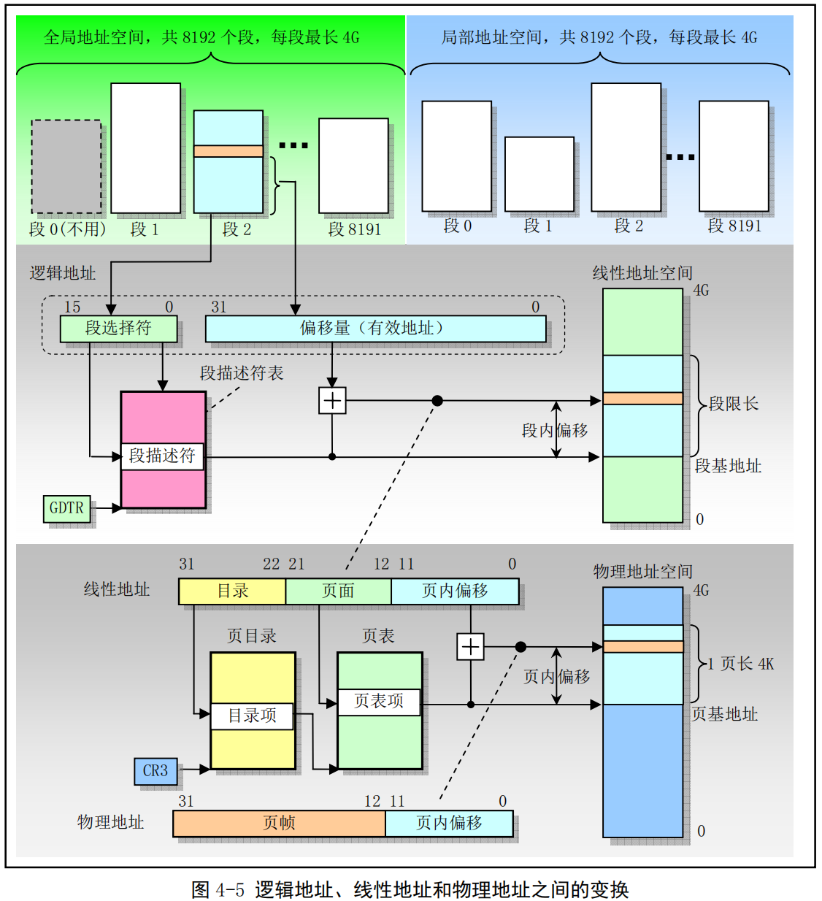

## 保护模式内存管理

### 1 内存寻址

80X86 CPU使用一种称为段(segment)的寻址技术，这种寻址技术把内存空间分成一个或多个称为段的线性区域，因此寻址时需要一个段的起始地址和一个段内偏移地址两部分内容。

80X86 为段提供了6个存放段基址/段选择子的段寄存器：CS、DS、ES、SS、FS和GS。其中CS段寄存器总是用于寻址代码段，在任何时刻由CS寻址的段称为当前代码段。而堆栈段专门使用SS段寄存器，由SS寻址寻址的段称为当前堆栈段，栈顶由ESP寄存器的内容指定。另外4个段寄存器是通用段寄存器，当指令中没有指定所操作数据的段时，DS是默认的数据段寄存器。

1. 16位实模式

在16位实模式下，CPU的寻址方式为：`段基址：段内偏移`。段基址的值由段寄存器提供，段内偏移地址的值由通用寄存器来提供，这两个值都是16位的。为将两个16位的值组合成一个20位的地址，CPU将段基址先左移4位，变成一个20位的值，再与段偏移量相加，得到真正的物理地址。

2. 32位保护模式

32位CPU 内存空间最大为4GB，寄存器的位数也扩展为 32位。为了兼容性，内存寻址的表现形式与 16位相同，但更为准确的是：`段寄存器的值：段内偏移`。

段寄存器此时解释为段选择器，其中存放的内容不再解释为段基址。段寄存器存放的是段选择子，类似于索引，用于在GDT中选择指定的段描述符，段基址信息存放在段描述符中。段选择子是段描述符在段描述符表中的索引号。段内偏移的含义不变，只是变成了32位，因此一个段的最大长度可达4GB。

程序中由16位的段和32位的偏移构成的48位地址称为一个逻辑地址（虚拟地址），它唯一确定一个数据对象的段地址和段内偏移地址，而仅由32位偏移地址指定的地址是基于当前段的地址。

### 2 地址变换

程序中的地址是由两部分构成的逻辑地址，这种逻辑地址不能直接用于访问物理内存，需要使用地址变换机制将它映射到物理内存地址上。80X86在从逻辑地址到物理地址变换的过程中使用了分段机制和分页机制。第一阶段使用分段机制把程序的逻辑地址变换成处理器可寻址内存空间（称为线性地址空间）中的线性地址。第二阶段使用分页机制把线性地址转换为物理地址。

1. 分段机制

分段提供了隔绝各个代码区、数据区和堆栈区的机制，因此多个程序可以运行在同一个处理器上而不会相互干扰。

分段提供一种机制，用于把处理器可寻址的线性地址空间划分成一些较小的称为段的地址空间区域。段可以用来存放程序的代码、数据和堆栈，也可以存放系统数据结构（如TSS和LDT）。

一个系统中所有使用的段都包含在处理器的线性地址空间中，为了定位指定段中的一个字节，程序必须提供一个逻辑地址。逻辑地址包括一个段选择符和一个偏移量，段选择符是一个段的唯一标识。段选择符指明段基址，加上偏移量就形成了处理器线性地址空间中的线性地址。

线性地址空间和物理地址空间具有相同的结构。虚拟地址空间可包含最多16K个段，每个段最长可达4GB，使得虚拟地址空间的容量达到64TB。线性地址空间的容量是4GB。

2. 分页机制

因为多任务系统定义的线性地址空间（4GB）要比实际的物理内存容量大得多（仅需16MB内存即可运行Linux0.11），所以需要使用某种“虚拟化”线性地址空间的方法，即使用虚拟存储技术，使用这种技术可以编写占用需求比实际物理内存大得多的程序。

分页机制支持虚拟存储技术，在使用虚拟存储的环境中，大容量的线性地址空间需要使用小块的物理内存以及部分外部存储空间来模拟。当使用分页时，每个段被划分成一些页面（通常每页为4KB大小），页面会被存储在物理内存中或硬盘上。操作系统通过维护一个页目录和一些页表来标记这些页面。当程序试图访问线性地址空间中的一个地址位置时，处理器就会使用页目录和页表把线性地址转换成一个物理地址。如果当前访问的页面不在物理内存上，处理器会产生一个页错误异常，然后从硬盘上把该页面读入物理内存。

分段机制使用大小可变的块来管理内存，适合处理复杂系统的逻辑分区；分页机制使用大小固定的内存块，适合管理物理内存的使用。在地址变换过程中，分段和分页是两个独立的阶段。虽然二者都使用存储在内存中的变换表，但段表存储在线性地址空间，页表则保存在物理地址空间。分段变换机制把虚拟地址（逻辑地址）变换成线性地址，在线性地址空间中访问段表；分页机制把线性地址转换成物理地址，在物理内存中访问页表。
