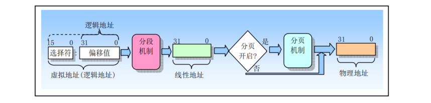

## 保护模式内存管理

### 1 内存寻址

80X86 CPU使用一种称为段(segment)的寻址技术，将物理内存空间分成一个或多个称为段的线性区域，内存的寻址方式需要一个段的起始地址和一个段内偏移地址两部分。

80X86 为段提供了6个存放段基址/段选择子的段寄存器：CS、DS、ES、SS、FS和GS。其中CS段寄存器总是用于寻址代码段，在任何时刻由CS寻址的段称为当前代码段。而堆栈段专门使用SS段寄存器，由SS寻址寻址的段称为当前堆栈段，栈顶由ESP寄存器的内容指定。另外4个段寄存器是通用段寄存器，当指令中没有指定所操作数据的段时，DS是默认的数据段寄存器。

1. 16位实模式

在16位实模式下，CPU的寻址方式为：`段基址：段内偏移`。段基址的值由段寄存器提供，段内偏移地址的值由通用寄存器来提供，这两个值都是16位的。为将两个16位的值组合成一个20位的地址，CPU将段基址先左移4位，变成一个20位的值，再与段偏移量相加，得到真正的物理地址。

2. 32位保护模式

32位CPU 内存空间最大为4GB，寄存器的位数也扩展为 32位。为了兼容性，内存寻址的表现形式与 16位相同，但更为准确的是：`段寄存器的值：段内偏移`。

段寄存器此时解释为段选择器，其中存放的内容不再解释为段基址。段寄存器存放的是段选择子，类似于索引，用于在GDT中选择指定的段描述符，段基址信息存放在段描述符中。段选择子是段描述符在段描述符表中的索引号。段内偏移的含义不变，只是变成了32位，因此一个段最大长度可达4G。

### 2 地址变换

程序中的地址是由两部分构成的逻辑地址，这种逻辑地址不能直接访问物理内存，需要使用地址变换机制将它映射到物理内存地址上。80X86在从逻辑地址到物理地址变换的过程中使用了分段机制和分页机制。第一阶段使用分段机制把程序的逻辑地址变换成处理器可寻址内存空间（称为线性地址空间）中的地址。第二阶段使用分页机制把线性地址转换为物理地址。

### 3 保护
