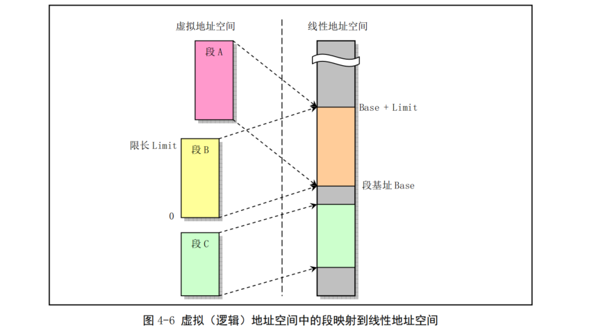
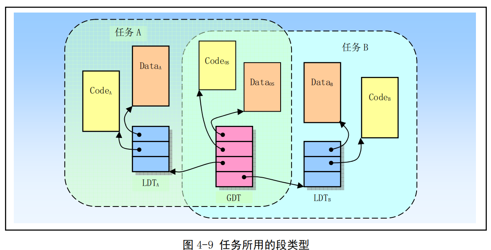

## 分段机制

### 1 段的定义

分段机制是把虚拟地址空间中的虚拟内存组织成一些长度可变的称为段的内存块单元。32位保护模式下的虚拟地址空间中的虚拟地址（逻辑地址）由一个段部分和一个偏移部分组成。

每个段由三部分组成：段基地址(Base Address)、段限长(Limit)和段属性(Attributes)组成。

多个段映射到线性地址中的范围可以部分重叠或覆盖，甚至完全重叠。在Linux 0.1x中，一个任务的代码段和数据段的段限长相同，并被映射到线性地址完全相同而重叠的区域上。

段的基本信息存放在段描述符(Segment Descriptor)中。每个段描述符占8个字节。

### 2 段描述符表

段描述符表是由连续存放的段描述符组成的，段描述符表的长度可变，最多包含8K个段描述符。

有两种描述符表：全局描述符表(Global descriptor table，GDT)和局部描述符表(Local descriptor table，LDT)。它们的区别是：LDT表存放在LDT类型的段之中，此时GDT必须含有LDT的段描述符；LDT本身是一个段，而GDT不是。

查找GDT在线性地址中的基地址，需要借助GDTR，而查找LDT相应的基地址，需要的是GDT中的段描述符。访问LDT需要使用段选择符，为了减少访问LDT时的段转换次数，LDT的段选择符、段基址、段限长都要放在LDTR寄存器中。

虚拟地址空间被分割为大小相等的两部分，一半由GDT来映射变换到线性地址，另一半由LDT来映射。当发生任务切换时，LDT会更新成新任务的LDT，但GDT不会。GDT所映射的一半虚拟地址空间是系统中所有任务共有的。

### 3 段选择符（段选择子）

段选择符（或称段选择子）是段的一个16位的标识符，段选择符并不直接指向段，则是指向GDT中定义段的段描述符。段选择符由三个字段构成：描述符索引(Index)、请求特权级RPL(Requested Privilege Level)和表指示标识TI(Table Index)

请求特权级字段RPL提供了段保护信息，表索引字段TI用来指出包含指定段描述符的段描述符表（GDT或LDT），TI=0 表示描述符在GDT中，TI=1 表示描述符在GDT中。索引字段给出了描述符在GDT或LDT表中的索引项号。可见，选择符通过定位段表中的一个描述符来指定一个段，并且描述符中包含了访问一个段的所有信息，如段的基地址、段长度和段属性。

对应用程序来说段选择符是作为指针变量的一部分可见，但选择符的值通常是由链接编辑器或链接加载程序进行设置或修改，并非应用程序。

为了减少地址转换的时间和编程复杂性，处理器提供可存放最多6个段选择符的寄存器，即段寄存器。每个段寄存器支持特定类型的内存引用。原则上执行每个程序都起码需要把有效的段选择符加载到代码段(CS)、数据段(DS)和堆栈段(SS)寄存器中。处理器还另外提供三个辅助的数据段寄存器(ES，FS，GS)，可被用于让当前执行程序（或任务）能够访问其它几个数据段。

### 4 段描述符

使用段选择符来定位描述符表中的一个描述符。段描述符是GDT和LDT表中的一个数据结构项，用于向处理器提供有关一个段的位置和大小信息以及访问控制的状态信息。每个段描述符长度是 8字节，含有三个主要字段：段基地址、段限长和段属性。段描述符通常由编译器、链接器、加载器或操作系统来创建，不是应用程序。

一个段描述符中各字段和标志的含义如下：

### 5 代码和数据段描述符类型

当段描述符中的 S（描述符类型）标志被置位，则该描述符用于代码或数据段。此时类型字段中最高比特位（第2个双字的位11）用于确定是数据段的描述符（复位）还是代码段的描述符（置位）。

### 6 系统描述符类型
