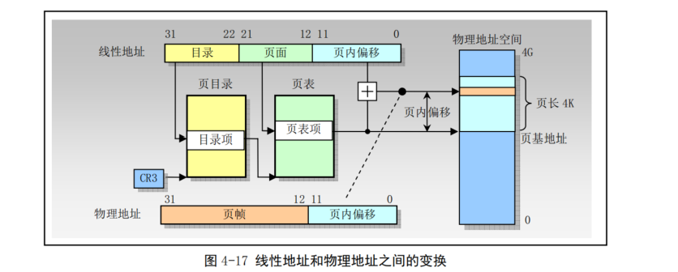
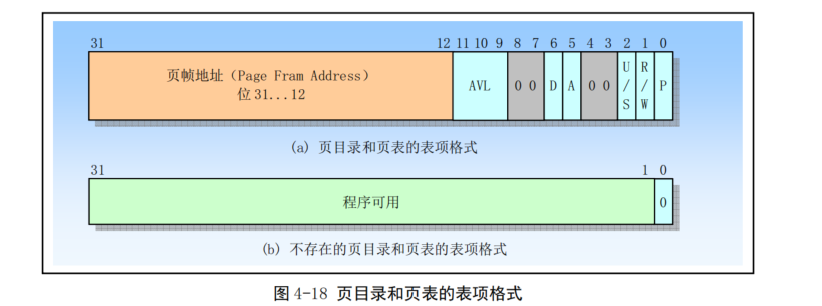

## 分页机制

分页机制是80X86内存管理机制的第二部分，它在分段机制的基础上完成虚拟地址（逻辑地址）到物理地址的转换过程，分段机制把逻辑地址转换成线性地址，而分页机制则把线性地址转换成物理地址。处理器分页机制把线性地址空间（段已映射到其中）划分成页面，然后这些线性地址空间页面被映射到物理地址空间的页面上。

分段机制在各种长度可变的内存区域上操作，而分页机制对固定大小的内存块（称为页面）进行操作。分页机制把线性地址空间和物理地址空间都划分成页面。线性地址空间中的任何页面可以被映射到物理地址空间的页面上。

80X86使用4K字节固定大小的页面，每个页面均是4KB，这表示分页机制把4GB的线性地址空间划分为1M个页面。分页机制通过把线性地址空间中的页面重新定位到物理地址空间中进行操作。由于4K大小的页面作为一个单元进行映射，并且对齐于4K边界，因此线性地址的低12比特位可作为页内偏移量直接作为物理地址的低12位，分页机制执行的重定位功能可以看作是把线性地址的高20位转换到对应物理地址的高20位。

线性地址到物理地址的转换功能被扩展成允许一个线性地址被标注为无效，而并非让其产生一个物理地址。在两种情况下一个页面可以被标注为无效：1-操作系统不支持的线性地址；2-对应在虚拟内存系统中的页面在磁盘上而非在物理内存中。第一种情况产生无效地址的程序必须被终止；第二种情况下该无效地址实际上是请求操作系统虚拟内存管理器把对应页面从磁盘上加载到物理内存中，以供程序访问。

在保护模式中，80X86允许线性地址空间直接映射到大容量的物理内存上，或者（使用分页）间接映射到较小容量的物理内存和磁盘存储空间中。后一种映射线性地址空间的方法被称为虚拟存储技术或者需求页虚拟存储技术(Demand-paged)。

当使用分页时，处理器会把线性地址空间划分成固定大小的页面，这些页面可以映射到物理内存中和/或磁盘存储空间中。当一个程序（或任务）引用内存中的逻辑地址时，处理器会把该逻辑地址转换成一个线性地址，然后使用分页机制把该线性地址转换成对应的物理地址。如果包含线性地址的页面目前不在物理内存中，处理器会产生一个页错误异常，页错误异常的处理程序通常会让操作系统从磁盘中把相应页面加载到物理内存中。当页面加载到物理内存中之后，从异常处理过程的返回操作会使得异常指令被重新执行。处理器把用于线性地址转换成物理地址和用于产生错误异常的信息包含在存储于内存中的页目录和页面中。

分页和分段最大的不同之处在于分页使用了固定长度的页面。段的长度通常与存放在其中的代码或数据结构具有相同的长度。与段不同，页面具有固定的长度。如果仅使用分段地址转换，那么存储在物理内存中的一个数据结构将包含其所有的部分。如果使用了分页，那么一个数据结构就可以一部分存储与物理内存中，而另一部分保存在磁盘中。

为了减少地址转换所要求的总线周期数量，最近访问的页目录和页表会被存放在处理器的缓冲器件中，该缓冲器件被称为转换查找缓冲区TLB（Translation Lookaside Buffer）。

### 1 页表结构

分页转换功能由驻留在内存中的表来描述，该表称为页表(page table)，存放在物理地址空间中。页表可以看作是简单的1M个物理地址数组。线性到物理地址的映射功能可以简单的看作是进行数组查找。线性地址的高20位构成这个数组的索引值，用于选择对应页面的物理（基）地址。线性地址的低12位给出了页面中的偏移量，加上页面的基地址最终形成对应的物理地址。由于页面基地址对齐在4K边界上，因此页面基地址的低12位肯定是0，这意味着高20位的页面基地址和12位偏移量连接组合在一起就能得到对应的物理地址。

页表中每个页表项大小为32位，由于只需要其中的20位来存放页面的物理基地址，因此剩下的12位可用于存放诸如页面是否存在等属性信息。如果线性地址索引的页表项被标注为存在，则可以从中取得页面的物理地址。如果项中表明不存在，那么当访问对应物理页面时就会产生一个异常。

1. 两级页表结构

页表含有1M个表项，每个表项占用4字节。如果作为一个表来存放的话，将占用4MB的内存。为了减少内存占用量，80X86使用两级表结构。因此，高20位线性地址到物理地址的转换也被分成两步来进行，每步使用其中10个比特。

第一级表称为页目录（page directory），它被存放在1页4KB大小的页面中，具有1K个4字节长度的表项，这些表项指向对应的二级表。线性地址的高10位用作一级表（页目录）中的索引值来选择1K个二级表之一。

第二级表称为页表（page table），它的长度也是一个页面，最多含有1K个4字节的表项。每个4字节表项含有相关页面的20位物理基地址。二级页表使用线性地址中间10位作为表项索引值，以获取含有页面20位物理基地址的表项。该20位页面物理基地址和线性地址中的低12位（页内偏移）组合在一起得到分页转换过程的输出值，即对应的最终物理地址。

下图是二级页表的查找过程，其中CR3寄存器指定页目录表的基地址，线性地址的高10位用于索引这个页目录表，以获得指向相关第二级页表的指针，线性地址中间10位用于索引二级页表，以获得物理地址的高20位，线性地址的低12位直接作为物理地址的低12位，从而组成一个完整的32位物理地址。

2. 不存在的页表

通过使用二级表结构，允许页表被分散在内存的各个页面中，而不需要保存在连续的4MB内存块中。另外，不需要为不存在的或者线性地址空间未使用的部分分配二级页表。虽然目录表页面必须总是存在于物理内存中，但是二级页表可以在需要时再分配，这使得页表结构的大小对应于实际使用的线性地址空间的大小。

页目录表中每个表项也有一个存在(present)属性，类似于页表中的属性，页目录表项中的存在属性指明对应的二级页表是否存在。如果目录表项指明对应的二级页表存在，那么通过访问二级页表，页面查找不受影响。如果对应的二级页表不存在，那么处理器将产生一个异常来通知操作系统。页目录表项中的存在属性使得操作系统可以根据实际使用的线性地址范围来分配二级页表页面。

目录表项中的存在位还可以用于在虚拟内存中存放二级页表，此时只有部分二级页表需要存在在物理内存中，其余部分保存在磁盘上。处于物理内存中页表对应的页目录项将被标注为存在，表明可用它们进行分页转换。处于磁盘上的页表对应的页目录项被标注为不存在。由于二级页表不存在而引发的异常会通过操作系统把缺少的页表从磁盘上加载到物理内存，这种把页表存储在虚拟内存的方式减少了保存分页转换表所需要的物理内存量。

### 2 页表项格式

页目录和页表的表项格式如下图。其中位31-12含有物理地址的高20位，用于定位物理地址空间中一个页面（也称为页帧）的物理基地址。表项的低12位含有页属性信息。

### 3 虚拟存储

页目录和页表表项中的存在位标志P为使用分页技术的虚拟存储提供了必要的支持。若线性地址空间中的页面存在于物理内存中，则对应表项中的标志P=1，并且该表项中含有相应物理地址。页面不在物理内存中的表项其标志P=0。如果程序访问物理内存中不存在的页面，处理器会产生一个缺页异常，此时操作系统对应的异常处理程序把缺少的页面从磁盘上调入物理内存中，并把相应物理地址存放在表项中。最后返回程序重新执行引起异常的指令之前设置标志P=1。

已访问标志A和已修改标志D可用有效的实现虚拟存储技术。通过周期性的检查和复位所有A标志，操作系统能够确定哪些页面最近没有被访问过。这些页面可以成为移出到磁盘上的候选者。假设当一个页面从磁盘读入内存时，其已修改标志D=0，那么当页表再次被移出到磁盘上时，若D标志还是为0，则该页面就无需被写入到磁盘中。若标志D=1，则说明页面内容已被修改，必须将该页面写道磁盘上。
