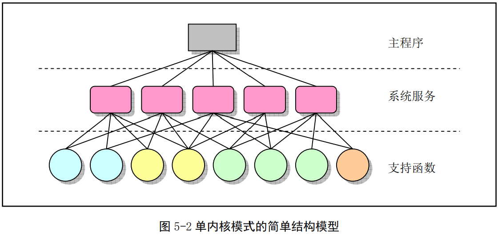
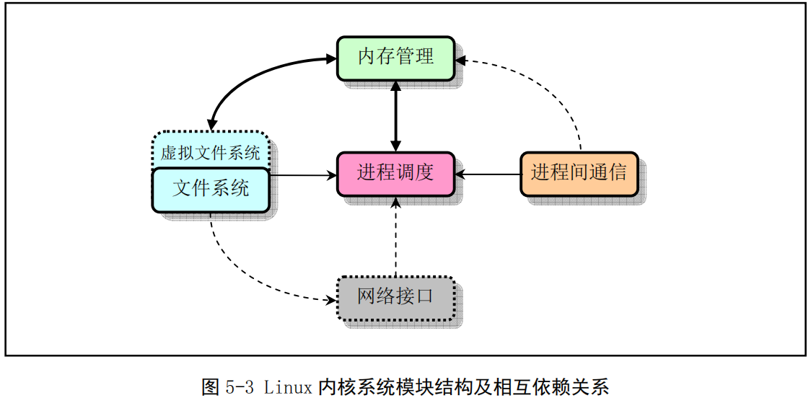
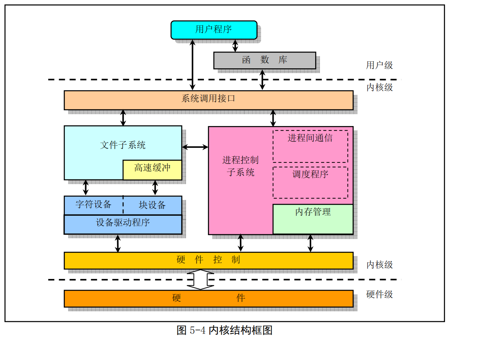

## Linux内核模式和体系结构

一个完整可用的操作系统主要由4部分组成：硬件、操作系统内核、操作系统服务、用户应用程序。其中操作系统服务程序是指向用户提供的被看作是操作系统部分功能的服务程序。Linux内核的主要作用是为了与计算机硬件进行交互，实现对硬件部件的编程控制和接口操作，调度对硬件资源的访问，并为计算机上的用户程序提供一个高级的执行环境和对硬件的虚拟接口。

### 1 Linux内核模式

操作系统内核的结构模式主要分为整体式的单内核模式和层次式的微内核模式。在单内核模式的系统中（Linux0.11），操作系统提供服务的流程是：应用主程序使用指定的参数值执行系统调用指令（`int 0x80`），使CPU从用户态（User Mode）切换到内核态（Kernel Mode），然后操作系统根据具体的参数调用特定的系统调用服务程序，这些服务程序则根据需要再调用底层的一些支持函数完成特定的功能。在完成应用程序所要求的服务后，操作系统使CPU从内核态切换回用户态，从而返回到应用程序中继续执行后面的指令。

概要的讲，单内核模式的内核可粗略的分为三个层次：调用服务的主程序层、执行系统调用的服务层和支持系统调用的底层函数。

### 2 Linux内核体系结构

Linux内核主要由5个模块构成：进程调度模块、内存管理模块、文件系统模块、进程间通信模块、网络接口模块。进程调度模块负责控制进程对CPU资源的使用。内存管理模块用于确保所有进程能够安全的共享机器的主内存区，同时还支持虚拟内存管理方式。文件系统模块用于支持对外部设备的驱动和存储，虚拟文件系统模块通过向所有的外部存储设备提供一个通用的文件接口，隐藏各种硬件设备的不同细节。进程间通信模块子系统用于支持多种进程间的信息支持方式。网络接口模块提供对多种网络通信标准的访问并支持许多网络硬件。

下图是这五个模块之间的依赖关系，其中的连线代表它们之间的依赖关系，虚线和虚框部分表示Linux0.11还未实现。

从单内核模式的结构模型出发，Linux0.11内核结构的主要模块的框图结构如图：

