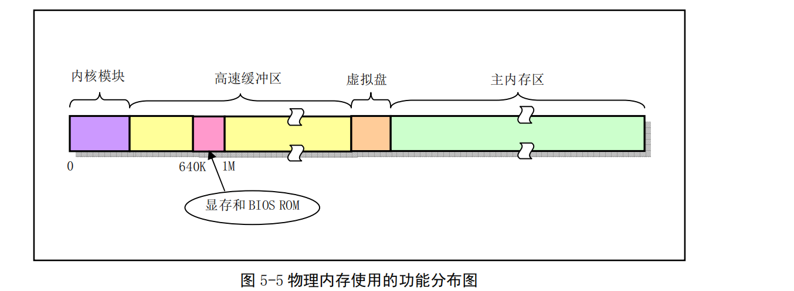
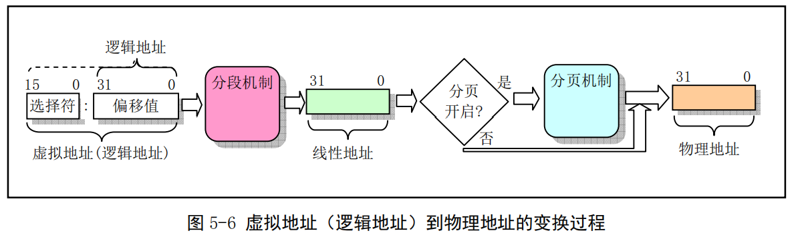
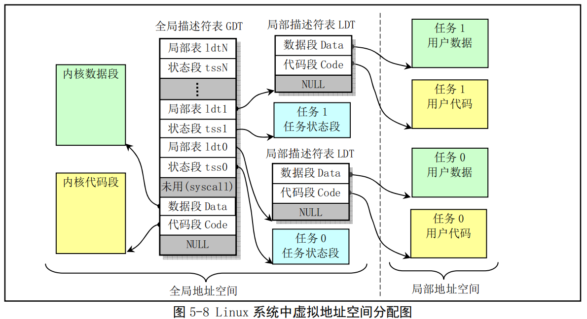
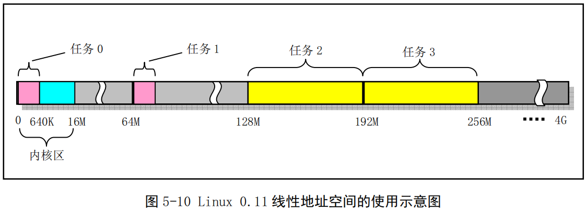
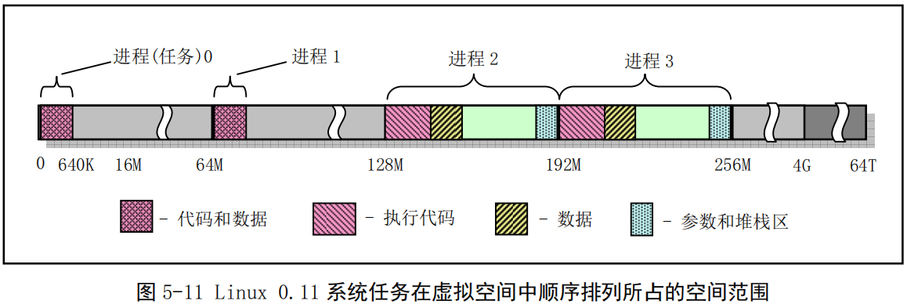
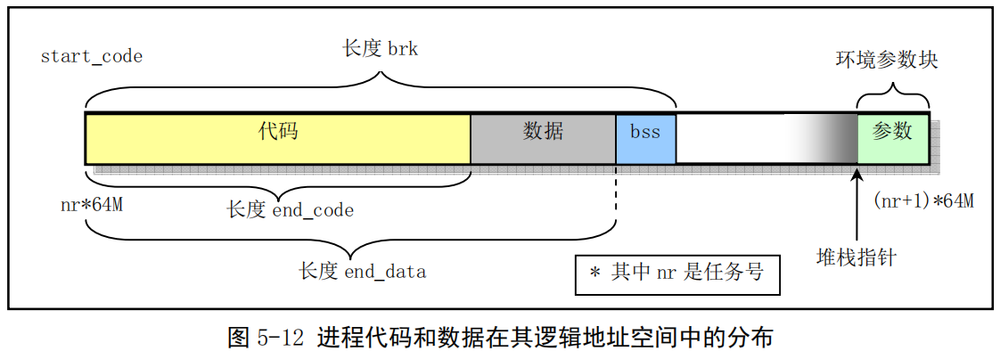

## Linux内核对内存的管理使用

### 1 物理内存

在Linux0.11内核中，为了有效的使用机器中的物理内存，在系统初始化阶段将内存划分为如下几个功能区域：

其中，Linux内核程序占据在物理内存的开始部分，接下来是供硬盘或软盘等块设备使用的高速缓冲区部分（其中要扣除显示卡内存和ROM BIOS占用的内存地址范围640K-1MB）。当一个进程需要读取块设备中的数据时，系统会首先把数据读到高速缓冲区中，当有数据需要写到块设备上去时，系统也是先将数据放到高速缓冲区中，然后由块设备驱动程序写到相应的设备上。

内存的最后部分是供所有程序随时申请和使用的主内存区，内核程序在使用主内存区时，同样也要先向内核内存管理模块提出申请，在申请成功后才能使用。对于含有RAM虚拟盘的系统，主内存区头部要划出一部分供虚拟盘存放数据。

### 2 内存地址空间概念

Linux0.11内核中在进行地址映射操作时，会有三种地址：程序的虚拟地址和逻辑地址、CPU的线性地址、实际物理内存地址。

虚拟地址(Virtual Address)是指由程序产生的由段选择符和段内偏移地址两部分组成的地址。虚拟地址需要通过分段地址变换机制处理后才对应到物理内存地址上。虚拟地址空间由GDT映射的全局地址空间和由LDT映射的局部地址空间组成。

逻辑地址(Logical Address)是指由程序产生的与段相关的偏移地址部分。在Intel保护模式下即是指程序执行代码段限长内的偏移地址。应用程序员仅需处理逻辑地址，分段和分页对其来说是透明的。（有些资料不区分逻辑地址和虚拟地址，而是统称为逻辑地址）

线性地址(Linear Address)是虚拟地址到物理地址变换的中间层，是处理器可寻址的内存空间（称为线性地址空间）中的地址。程序代码会产生逻辑地址，即段中的偏移地址，加上相应段的基地址就生成了一个线性地址。Intel 80386的线性地址空间为4GB。

物理地址(Physical Address)是指出现在CPU外部地址总线上的寻址物理内存的地址，是地址变换的最终结果地址。如果没有启用分页机制，线性地址直接就是物理地址，如果启用了分页机制，那么线性地址会使用页目录和页表中的项变换成物理地址。

虚拟内存(Virtual Memory)是指计算机呈现出的比实际拥有的物理内存大得多的内存量，（通过借用一部分磁盘空间来充当虚拟内存？），因此它允许编制并运行比系统实际拥有的内存大得多的程序。Linux0.11内核给每个程序（进程）划分总容量为64MB的虚拟内存空间，因此程序的逻辑地址范围是0x0000000到0x4000000。

### 3 内存分段机制

在内存分段系统中，一个程序的逻辑地址通过分段机制自动映射（变换）到中间层的4GB线性地址空间中。当程序引用一个内存地址时，通过把程序员能看到的逻辑地址加上相应段的基地址就形成一个对应的线性地址。若没有启用分页机制，则该线性地址直接被送到CPU的外部地址总线上，用于寻址对应的物理内存。

CPU进行地址变换的主要目的是为了解决虚拟内存空间到物理内存空间的映射问题。虚拟内存空间是指一种利用二级或外部存储空间，使程序能不受实际物理内存容量的限制而使用内存的一种方法。通常虚拟内存空间要比实际物理内存容量大得多。

虚拟内存管理的实现方式是：当一个进程引用一个页面中不存在的内存地址时，CPU会产生缺页异常中断，并把引起中断的线性地址放到CR2控制寄存器中，中断处理过程就能得知发生页异常的地址，从而把进程要求的页面从二级存储空间（如硬盘上）加载到物理内存中。如果此时物理内存已被全部占用，可以借助二级存储空间的一部分作为交换缓冲区把内存中暂时不使用的页面交换到二级缓冲区中，然后把要求的页面调入内存中。

CPU使用段的概念来对程序进行寻址，在保护模式下，段的信息存放在段描述符中。全局描述符表（GDT）可被所有程序用于引用访问一个内存段。中断描述符表（IDT）保存有定义中断或异常处理过程的段描述符。局部描述符表（LDT）应用于多任务系统中，通常每个任务使用一个LDT表，作为对GDT表的扩充，每个LDT表为对应任务提供了更多的可用描述符项，因此也为每个任务提供了可寻址内存空间的范围。

每个程序由若干个内存段组成，程序的逻辑地址用于寻址这些段和段中的地址。Linux0.11中程序逻辑地址到线性地址的变换过程使用GDT表和LDT表。由GDT映射的地址空间称为全局地址空间，由LDT映射的地址空间称为局部地址空间，二者构成虚拟地址空间。

由于在Linux0.11中，内核和各任务的代码段和数据段都分别被映射到线性地址空间的相同基址出，且段限长也一样，因此内核的代码段和数据段是重叠的，各任务的代码段和数据段分别也是重叠的。任务状态段TSS（Task State Segment）用于在任务切换时保存或恢复相关任务的当前执行上下文，每个任务的TSS段内容被保存在该任务的任务数据结构中。每个任务的LDT和TSS都是由GDT中描述符定义的一个内存段。

### 4 内存分页管理

若开启了分页机制，则此时线性地址还只是一个中间结构，还需要使用分页机制进行变换，最终映射到实际物理内存地址上。使用分页机制最普遍的场合是当系统内存实际上被分成很多凌乱的块时，它可以建立一个大而连续的内存空间映像，让程序不必管理这些分散的内存块，交由操作系统管理。

内存分页管理机制的基本原理是将整个内存区域划分为4KB大小的内存页面，程序申请使用内存时，系统以内存页为单位进行分配。使用内存分页管理方法时，每个进程可以使用比实际物理内存容量大得多的连续地址空间，分页机制使用页目录表和页表完成从线性地址到物理地址的映射。

Intel 80386的CPU提供多达4GB的线性地址空间，一个任务的虚拟地址首先要借助其局部段描述符的信息变成为CPU整个线性地址空间中的地址，然后再使用页目录表PDT和页表PT映射到实际物理地址页上。为了使用实际物理内存，每个进程的线性地址通过二级内存页表动态的映射到主内存区域的不同物理页中。

Linux0.11内核给每个程序（进程）划分总容量为64MB的虚拟内存空间，因此程序的逻辑地址范围是0x0000000到0x4000000。Linux0.11中所有任务的指令空间I和数据空间D都合用一块内存，即一个进程的所有代码、数据和堆栈部分都处于同一内存段中。

如果也按照线性地址空间中任务的排列顺序排列虚拟地址空间中的任务，下图是系统同时可拥有所有任务在虚拟地址空间中的示意图。

注意：进程逻辑地址空间中代码段和数据段的概念与CPU分段机制中的代码段和数据段的概念不同。CPU分段机制中段的概念确定了在线性地址空间中一个段的用途以及被执行或访问的约束限制，每个段可以设置在4GB线性地址空间中的任何地方，它们可以相互独立或是重叠。而进程在其逻辑地址空间中的代码段和数据段则是指由编译器在编译程序和操作系统在加载程序时规定的在进程逻辑空间中顺序排列的代码区域、初始化和未初始化的数据区域、以及堆栈区域。

### ~~5 任务的段在地址空间中的对应关系~~
