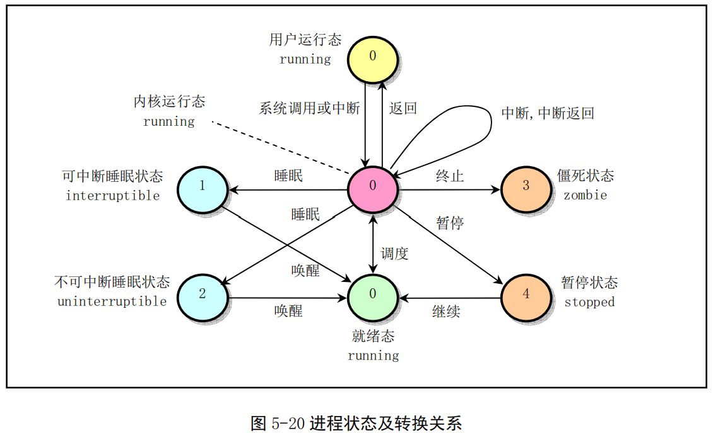
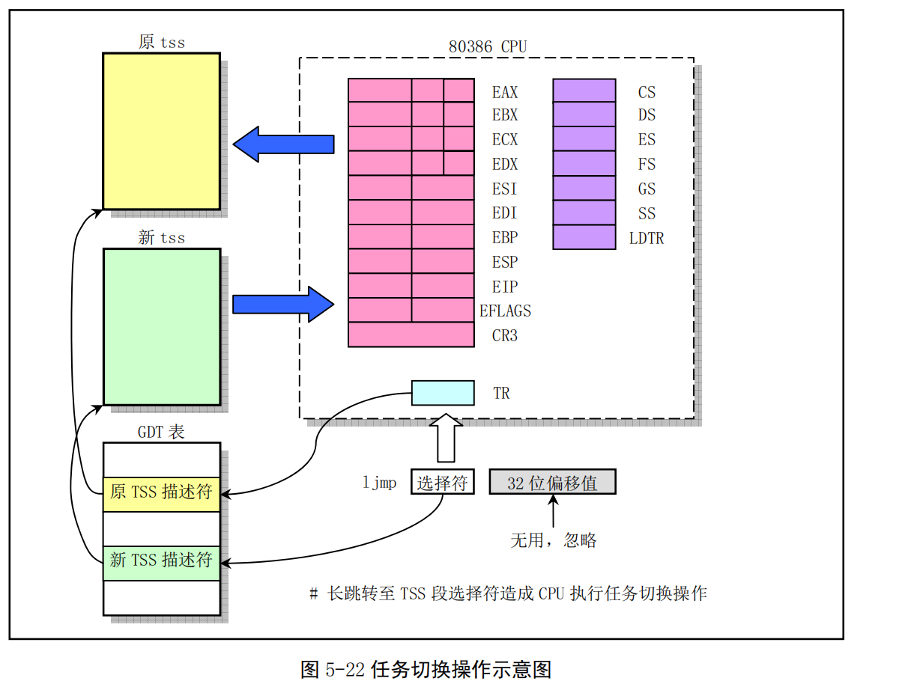

## Linux进程控制

程序是一个可执行的文件，而进程(process)是一个执行中的程序实例。内核程序使用进程标识号(process ID，pid)来标识每个进程。进程由可执行的指令代码、数据和堆栈区组成。进程中的代码和数据部分分别对应一个执行文件中的代码段和数据段。每个进程只能执行自己的代码和访问自己的数据及堆栈区。进程之间通过调度程序来调度各个进程运行。

Linux中一个进程可以在内核态(kernel mode)或用户态(user mode)下执行，并且分别使用各自独立的内核态堆栈和用户态堆栈。用户堆栈用于进程在用户态下临时保存调用函数的参数、局部变量的数据；内核堆栈则含有内核程序执行函数调用时的信息。

（在Linux内核中，进程通常被称作任务(task)，而把运行在用户空间的程序称作进程。）

### 1 任务数据结构

内核程序通过进程表对进程进行管理，每个进程在进程表中占有一项。在Linux系统中，进程表项是一个`task_struct`任务结构指针。任务数据结构定义在 include/linux/sched.h中。其又称为进程控制块PCB(Process Control Block)或进程描述符(Process Descriptor)。其中保存着用于进程控制和管理进程的所有信息。

### 2 进程运行状态

### 3 进程初始化

在执行系统初始化程序init/main.c完成对系统的初始化之后，系统各部分已经处于可运行状态。此后init/main.c程序把自己移动到任务0（进程0）中运行，并使用fork()调用创建出进程1。在进程1中程序将继续运行应用环境的初始化并执行shell登录程序。而原进程0则会在系统空闲时被调度执行，此时任务0仅执行pause()系统调用，其中又会去执行调度函数。

“移动到任务0中运行”这个过程由宏`move_to_user_mode`完成（在include/asm/system.h中）。它把main.c程序的指令执行流从内核态（特权级0）移动到用户态（特权级3）的任务0中继续运行。在移动之前，系统在对调度程序的初始化过程（sched_init()）中，首先对任务0的运行环境进行了设置，包括人工预先设置好任务0各字段的值（include/linux/sched.h）、在全局描述符表中加入任务0的任务状态段（TSS）描述符和局部描述符表（LDT）的段描述符。

### 4 创建新进程

Linux系统中创建新进程使用fork()系统调用，所有进程都是通过复制进程0得到的，都是进程0的子进程。在创建新进程的过程中，系统首先在任务数组中找出一个还没有被任何进程使用的空项，然后系统为新建进程在主内存区中申请一页内存来存放其任务数据结构信息，并复制当前进程任务数据结构中所有内容作为新进程任务数据结构的模板。

随后对复制的任务数据结构进行修改，把当前进程设置为新建进程的父进程，清除新进程的各项统计值并设置初始运行时间片值。接着根据当前进程设置任务状态段（TSS）中各寄存器的值。此后系统设置新任务的代码和数据段基址、限长，并复制当前进程内存分页管理的页表。此时系统并不为新的进程分配实际的物理内存页面，而是使用写时复制技术，让它共享其父进程的内存页面。只有当父进程或新进程中任意一个有写内存操作时，系统才会为执行写操作的进程分配相关的独自使用的内存页面。

随后如果父进程中有文件是打开的，则将对应文件的打开次数加1。接着在GDT中设置新任务的TSS和LDT描述符，其中基地址信息指向新进程任务结构中的tss和ldt。最后将新任务设置为可运行状态并返回新进程号。

注意：创建一个新的子进程和加载运行一个执行程序文件是不同的概念。当创建子进程时，它完全复制了父进程的代码和数据区，并会在其中执行子进程部分的代码。而执行块设备上的一个程序时，一般是在子进程中运行`exec()`系统调用来操作，进入`exec()`后，子进程原来的代码和数据区就会被清理掉。待该子进程开始运行新程序时，由于此时内核还没有从块设备上加载该新程序的代码，CPU会立刻产生代码页面不存在的异常，此时内存管理程序就会从块设备上加载相应的代码页面，然后CPU重新执行引起异常的指令。此时新程序的代码才真正开始被执行。

### 5 进程调度

内核中的调度程序用于选择系统中下一个要运行的程序，调度程序是为在所有处于运行状态的进程之间分配CPU运行时间的管理代码。Linux进程是抢占式的，进程的抢占发生在进程处于用户态执行阶段，在内核态执行时是不能被抢占的。

1. 调度程序

schedule()函数首先扫描任务数组，通过比较每个就绪态（TASK_RUNNING）任务的运行时间递减滴答计数`counter`的值来确定当前哪个进程运行的时间最少。值大则说明运行时间少，于是选中该进程，并使用任务切换宏函数切换到该进程运行。

如果此时所有处于就绪态的进程的时间片都已经用完，系统会根据每个进程的优先权值`priority`对系统中所有的进程重新计算每个任务需要运行的时间片值`counter=counter/2 + priority`。如果此时没有其它进程可运行，系统就会选择进程0运行。

2. 进程切换

每当选择出一个新的可运行进程时，schedule()函数就会调用定义在include/asm/system.h中的`switch_to()`宏执行实际进程切换操作。该宏会把CPU的当前进程状态（上下文信息）替换成新进程的状态。在进程切换之前，switch_to()首先检查切换到的进程是否就是当前进程，如果是则什么都不做直接退出。否则就首先把内核全局变量`current`置为新任务的指针，然后长跳转到新任务的任务状态段TSS组成的地址处，造成CPU执行任务切换操作。此时CPU会把其所有寄存器的状态信息保存到当前任务寄存器TR中TSS段选择符所指向的当前进程任务数据结构的tss结构中，然后把新任务状态段选择符所指向的新任务数据结构中tss结构中的寄存器信息恢复到CPU中，系统就正式开始运行新切换的任务了。

### 6 终止进程

当一个进程结束了运行或在中途终止了运行，那么内核就需要释放该进程所占用的系统资源，包括进程运行时打开的文件、申请的内存等。当一个用户程序调用`exit()`系统调用时，就会执行内核函数`do_exit()`，该函数首先释放进程代码段和数据段占用的内存页面，关闭进程打开的所有文件，对进程使用的当前工作目录、根目录和运行程序的`i节点`进程同步操作。

如果进程有子进程，则让`init进程`作为其所拥有的子进程的父进程。如果进程是一个会话头进程并且有控制终端，则释放控制终端，并向属于该会话的所有进程发送挂断信号`SIGHUP`，这通常会终止该会话中的所有进程。然后把进程状态设置为僵死状态`TASK_ZOMBIE`，并向其原父进程发送`SIGCHLD`信号，通知其某个子进程已经终止，最后`do_exit()`调用调度函数去执行其它进程。由此可见，在进程被终止时，它的任务数据结构仍被保留着，因为其父进程还需要使用其中的信息。

在子进程执行期间，父进程通常使用`wait()`或`waitpdi()`函数等待其某个子进程终止。当等待的子进程被终止并处于僵死状态时，父进程会把子进程运行所使用的时间累加到自己身上。最终释放已终止子进程任务数据结构所占用的内存页面，并置空子进程在任务数组中占用的指针项。
