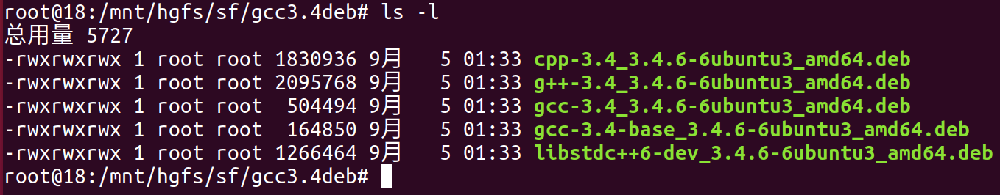
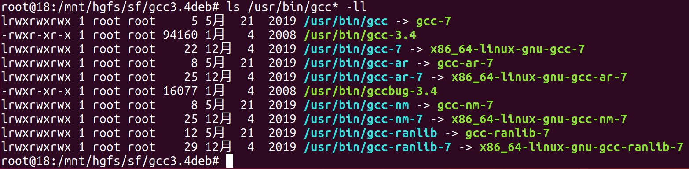
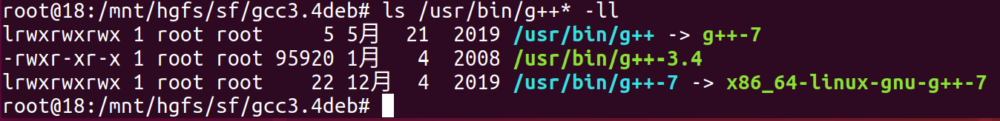
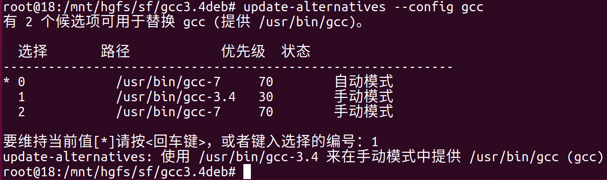
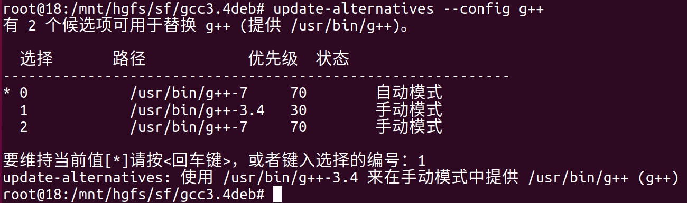
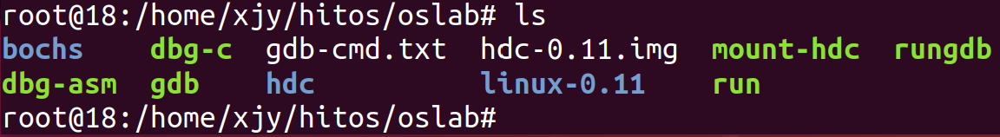
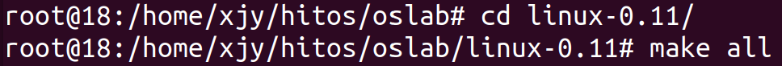
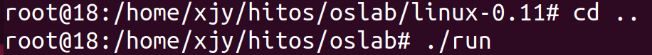
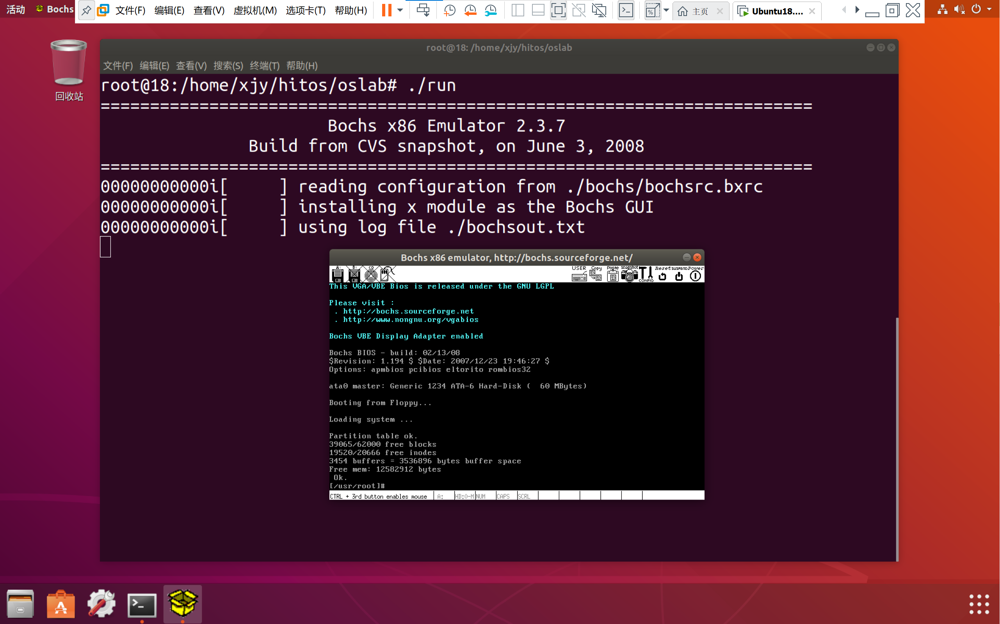

# 环境设置

进行实验的Linux环境是Ubuntu18.04.6

该课程的实验环境为:

- gcc3.4
- bin86
- gcc-multilib
- build-essential
- bochs bochs-x bochs-sdl

## 1. 安装gcc3.4

1. 下载gcc3.4的[deb软件包](http://old-releases.ubuntu.com/ubuntu/pool/universe/g/gcc-3.4/)
下载之后的[gcc3.4deb](./gcc3.4deb/)如下:


2. 安装gcc3.4的deb软件包

```bash
sudo dpkg --force-depends -i gcc-3.4-base_3.4.6-6ubuntu3_amd64.deb
sudo dpkg --force-depends -i gcc-3.4_3.4.6-6ubuntu3_amd64.deb 
sudo dpkg --force-depends -i cpp-3.4_3.4.6-6ubuntu3_amd64.deb 
sudo dpkg --force-depends -i g++-3.4_3.4.6-6ubuntu3_amd64.deb
sudo dpkg --force-depends -i libstdc++6-dev_3.4.6-6ubuntu3_amd64.deb
```

3. 检查gcc3.4的安装情况

3.1. 检查gcc：出现gcc3.4则表示安装成功

```bash
ls /usr/bin/gcc* -ll
```


3.2. 检查g++：出现g++3.4则表示安装成功

```bash
ls /usr/bin/g++* -ll
```


3.3. 设置新旧版本的gcc的优先级
设置gcc3.4和g++3.4的优先级为30，gcc7.5和g++7.5(原有版本)的优先级为70。(我也不知道为什么是这个数)

```bash
sudo update-alternatives --install /usr/bin/gcc gcc /usr/bin/gcc-3.4 30
sudo update-alternatives --install /usr/bin/gcc gcc /usr/bin/gcc-7 70

sudo update-alternatives --install /usr/bin/g++ g++ /usr/bin/g++-3.4 30
sudo update-alternatives --install /usr/bin/g++ g++ /usr/bin/g++-7 70
```

4. 切换gcc版本

4.1. 切换gcc版本为3.4

```bash
sudo update-alternatives --config gcc
```


4.2. 切换g++的版本为3.4

```bash
sudo update-alternatives --config g++
```



4.3. 检查gcc和g++的版本

```bash
gcc -v
g++ -c
```

结果为3.4版本就OK。
gcc和g++的版本最好保持一致。

## 2. 安装其它工具

1. as86和ld86的安装

用于编译和链接linux-0.11/boot目录下bootsect.s和setup.s，它们采用as86语法；而linux-0.11下其它汇编文件采用gas的语法AT&T。

```bash
# 搜索包含as86和ld86的包：
apt-cache search as86 ld86
#执行结果
bin86 - 16-bit x86 assembler and loader
#安装bin86
apt-get install bin86
```

2. 64位系统需要安装32位兼容库

```bash
sudo apt-get install libc6-dev-i386
```

3. 安装gcc-multilib build-essential(C语言编译环境)

```bash
sudo apt-get install gcc-multilib
sudo apt-get install build-essential
```

4. 安装bochs bochs-x bochs-sdl

```bash
sudo apt-get install bochs bochs-x bochs-sdl
```

5. 安装IDE

```bash
sudo apt-get install vim cscope exuberant-ctags
```

## 3. 内核编译及运行

1. 解压`hit-labos-linux-20110823.tar.gz`文件，解压结果得到一个名为`oslab`的文件夹


2. 切换到内核目录，编译内核


如果构建的时候报错：

```bash
./bochs/bochs-gdb: error while loading shared libraries: libSM.so.6: cannot open shared object file: No such file or directory
```

需要安装对应的32位库：

```bash
sudo apt-get install libsm6:i386
```

编译的时候只会对内核代码更改的部分进行重新编译，如果需要清空之前的编译内容可使用`make clean`命令。

3. 切换到运行目录，并运行文件`run`


如果运行的时候报错：

```bash
./bochs/bochs-gdb: error while loading shared libraries: libSX11.so.6: cannot open shared object file: No such file or directory
```

需要安装对应的32位库：

```bash
sudo apt-get install libx11-6:i386
```

如果运行时报错：

```bash
./bochs/bochs-gdb: error while loading shared libraries: libXpm.so.4: cannot open shared object file: No such file or directory
```

同样的安装对应的32位库，不过这里用另一个工具(不会就Google)：

```bash
dpkg-query -S libXpm.so.4
# 不行就运行这条命令
sudo apt-get install libxpm4:i386
```

4. 重新运行命令`./run`。经过两年半的努力，我们成功运行了！

