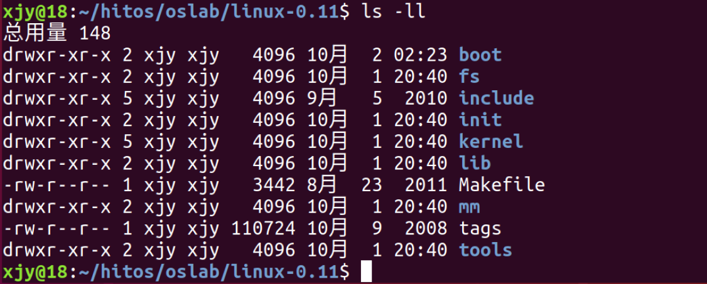

# 概要

## 1. 主要平台和工具

本操作系统实验的硬件环境是 IA-32(x86) 架构的 PC 机，主要软件环境是 Bochs + gcc + 编辑器/IDE + 操作系统 + Linux0.11源码。

实验的基本流程是根据实验要求编写应用程序、修改 Linux0.11 的源代码，用 gcc 编译后，在 Bochs 的虚拟环境中运行、调试目标代码。

上述实验环境涉及到的软件都是免费且开源的，具有较强的可移植性，可以在多种计算机的多种操作系统上搭建。为方便实验者，我们在最常见的平台 Ubuntu(最流行的 GNU/Linux 发行版之一)——上制作了 hit-oslab 集成环境，它基本包含了实验所需的所有软件，安装过程非常简单，基本上是直接解压就可以使用。

### 1.1 x86模拟器Bochs

Bochs 是一个免费且开放源代码的 IA-32（x86）架构 PC 机模拟器。在它模拟出的环境中可以运行 Linux、DOS 和各种版本的 Windows 等多种操作系统。而 Bochs 本身具有很高的移植性，可以运行在多种软硬件平台之上，这也是我们选择它做为本书的指定模拟器的主要原因。

如果您想拥抱自由的 Linux，那么 Bochs 几乎是您的不二选择。如果您想继续把自己绑定在 Windows 平台上，那么除了 Bochs，您还可以选用 VMware 或者 Microsoft Virtual PC。它们是最著名虚拟机软件，而且都可以免费使用。因为 Bochs 的是模拟器，其原理决定了它的运行效率会低于虚拟机。

但对于本书所设计的实验来说，效率上的差别很不明显。而且，Bochs 有虚拟机无可比拟的调试操作系统的能力，所以我们更建议您选用 Bochs。hit-oslab 已经内置了 bochs，本实验后文假定的缺省环境也是 Bochs。

关于 Bochs 的更详细的介绍请访问它的[主页](https://bochs.sourceforge.io/)及 Bochs 使用手册。

### 1.2 GCC 编译器 和 GDB 调试器

GCC 是和 Linux 一起成长起来的编译器，Linux 最初的版本就是由 GCC 编译的，现在的 GCC 也是自由软件领域应用最广泛的编译器。

GDB 调试器是 GCC 编译器的兄弟，作为自由软件领域几乎唯一的调试器，它秉承了 Unix 操作系统的一贯风格，采用纯命令行操作，类似于 dos 下的 debug 。

## 2. 实验环境和内容

hit-oslab 的实验环境是一个压缩文件(名为 hit-oslab-linux-20110823.tar.gz，解压之后是一个名为 oslab 的文件夹)。文件夹包括：

其中文件夹Linux-0.11包括：


### 2.1 bochs 目录

bochs 目录下是与 bochs 相关的执行文件、数据文件和配置文件。

### 2.2 run 脚本

run 是运行 bochs 的脚本命令。
运行之后 bochs 会自动在它的虚拟软驱 A 和虚拟硬盘上各挂载一个镜像文件，软驱上挂载的是 linux-0.11/Image，硬盘上挂载的是 hdc-0.11.img。

因为 bochs 配置文件中的设置是从软驱 A 启动，所以 Linux-0.11 会被自动加载。
而 Linux0.11 会驱动硬盘，并 mount 硬盘上的文件系统，也就是将 hdc-0.11.img 内镜像的文件系统挂载到 0.11 系统内的根目录(/)。在 0.11 下访问文件系统，访问的就是 hdc-0.11.img 文件内虚拟的文件系统。

### 2.3 hdc-0.11.img 文件

hdc-0.11.img 文件的格式是 Minix 文件系统的镜像。
Linux 所有版本都支持这种格式的文件系统，所有可以直接在宿主 Linux 上通过 mount 命令访问此文件内的文件，达到宿主系统和 bochs 内运行的 Linux 0.11 之间交换文件的效果。

Windows 下目前没有直接访问 Minix 文件系统的办法，所有要借助于 fdb.img，这是一个 1.44M 软盘的镜像文件，内部是 FAT12 文件系统。将它挂载到 bochs 的软驱 B，就可以在 0.11 中访问它。而通过 filedisk 或者 WinImage，可以在 Windows 下访问它内部的文件。

hdc-0.11.img 包含有：

- Bash shell
- 一些基本的 Linux 命令、工具，比如 cp、rm、mv、tar等
- vi 编辑器
- gcc1.4 编译器，可以用来编译标准 C 程序
- as86 和 ld86
- Linux0.11 的源代码，可在 0.11 下编译，然后覆盖现有的二进制内核。
  
### 2.4 Image 文件

oslab 工作在宿主操作系统(Ubuntu 18.04)之上，我们使用的 Linux，在宿主操作系统之上完成对 Linux 0.11 的开发、修改和编译之后，在 linux-0.11 目录下会生产一个名为 Image 的文件，它就是编译之后的目标文件。

该文件内已经包含引导和所有内核的二进制代码。如果拿来一张软盘，从它的 0 扇区开始，逐字节写入 Image 文件的内容，就可以用这张软盘启动一台真正的计算机，并进入 Linux 0.11 内核。

oslab 采用 bochs 模拟器加载这个 Image 文件，模拟执行 Linux 0.11，这样省却了重新启动计算机的麻烦。

## 3. 使用方法

确认当前目录在`.../oslab/`下，本实验的所有内容跟都在该目录获取下级目录下完成。

### 3.1 编译内核

进入 linux-0.11 目录，然后执行 make 命令：

```bash
cd linux-0.11
make all    # all 是最常见的参数，可以省略，只用 make 效果一样
```

在多处理器的系统上，可以用`-j`参数进行并行编译加快速度。如双 CPU 的系统可以：

```bash
make -j 2
```

make 命令会显示很多信息，可以尽量看懂，如果不行，只要最后几行中没有 ‘error’ 就说明编译成功。

**最后生成的目标文件是一个软盘镜像文件 `linux-0.11/Image`。如果将此镜像文件写到一张 1.44MB 的软盘上，就可以启动一台真正的计算机了。**


linux-0.11 目录下是全部的源代码，很多实验内容都要靠修改这些代码完成。修改后需要重新编译内核。
make 命令会自动跳过未被修改的文件，链接时直接用上上次编译生成的目标文件，从而节约编译时间。如果重新编译后，修改未生效，可以试试先`make clean`，再`make all`。删除上一次编译生成的所有中间文件和目标文件，确保实在全新的状态下编译整个工程。

### 3.2 运行

在 bochs 中运行最新编译的内核，在 oslab 目录下执行`run`脚本:

```bash
# 确认在 oslab 目录下
# 执行 run 脚本
./run
```

如果出现 Bochs 的窗口，里面显示 linux 的引导过程，最后停止在`[/usr/root/]#`，表示运行成功，如图：


在输入`./run`运行的过程中，Bochs 首先将 Image 目标文件写入到 0 扇区，这样才可以引导系统启动，系统启动后 linux0.11 驱动加载 hdc-0.11.img 文件系统

### 3.3 调试

内核调试分为两种模式：汇编级调试和 C语言级调试。

(1) 汇编级调试
汇编级调试需要执行命令：
**运行脚本前确定已经关闭刚刚运行的Bochs**

```bash
# 确认在 oslab 目录下
./dbg-asm
```

**汇编级调试启动之后 Bochs 黑屏是正常的**


可以使用`help`命令来查看调试系统的基本命令。更详细的查看 Bochs 使用手册。

(2) C语言级调试
C语言级调试稍微复杂一些。先执行如下：

```bash
# 确认在 oslab 目录下
./dbg-c
```

再打开一个终端窗口，执行：

```bash
# 确认在 oslab 目录下
./rungdb
```

**启动顺序不能交换，否则 gdb 无法连接。**

如果运行时报错

```bash
./gdb: error while loading shared libraries: libncurses.so.5: cannot open shared object file: No such file or directory
```

安装对应的 32 位库：

```bash
sudo apt-get install libncurses5:i386   # for 32-bit
#sudo apt-get install libncurses5       # for 64-bit
```

如果报错：

```bash
./gdb: error while loading shared libraries: libexpat.so.1: cannot open shared object file: No such file or directory
```

则安装对应的 32 位库或者创建软链接

```bash
# 安装对应的 32 位库
sudo apt-get install libexpat1-dev:i386
# 结果就是有了 /lib/i386-linux-gnu/libexpat.so.1
# 实际上 /lib/i386-linux-gnu/libexpat.so.1 是个软链接，它
#   指向 /lib/i386-linux-gun/libexpat.so.1.6.0

# 搜索名称包含 libexpat.so 的文件，创建对应的文件的软链接
# 略
```

出现如下内容则说明连接成功：


注：第一个终端窗口在相应命令执行完毕后会出现黑屏的 Bochs，在第二个终端窗口执行相应的命令之后才会出现上图内容。第二个终端窗口运行的是 GDB 调试器。

### 3.4 文件交换

在 Ubuntu (宿主系统) 和 Linux 0.11 之间进行文件交换。

**在开始设置文件交换之前，务必关闭所有的 Bochs 进程。**

oslab 目录下的 hdc-0.11.img 是 0.11 内核启动后的根文件系统镜像文件，相当于在 bochs 虚拟机里装载的硬盘。在 Ubuntu 上访问其内容的方法如下：

在挂载之前，`~/oslab/hdc`目录下的内容是：


```bash
# 确认在 oslab 目录下
# 启动挂载脚本
sudo ./mount-hdc
```

挂载之后，`hdc`目录下就是和 0.11 内核一样的文件系统了，可以读写任何文件(有些文件可能需要用`sudo`才能访问)。

挂载之后，`~hdc/oslab/hdc`目录下的内容是：


**读写完毕后，需要卸载这个文件系统。**

```bash
# 确认在 oslab 目录下
# 卸载
sudo umount hdc
```

文件`mount-hdc`是一个 shell 脚本


第1行 指明脚本使用的 shell

第2行 将调用本脚本的目录设置为 oslab 的目录

第3行 根据 mount 的 manual 手册：

- -t minix 表示要挂载的文件系统类型为minix
- -o [ption] 可以有3个参数（参考losetup的manual）：
    loop：可以指定文件所映射的回环设备；若不指定，则由mount自动搜寻
    offset：指定文件或设备中数据起始位置在该文件或设备中的偏移
    sizelimit：从 offset 开始算起文件或设备的最大大小

故此行将`./OSLAB_PATH/hdc-0.11.img`映射到`mount`搜寻到的设备中，文件系统为`minix`，数据起始偏移为`1024byte`，再挂载到`./OSLAB_PATH/hdc`目录下。

**注意1：不要在 0.11 内核运行的时候`mount`镜像文件，否则可能会损坏文件系统。同理，也不要在已经`mount`的时候运行 0.11 内核。**

**注意2：在关闭 Bochs 之前，需要先在 0.11 的命令行运行`sync`，确保所有缓存数据都存盘后，再关闭 Bochs。**
